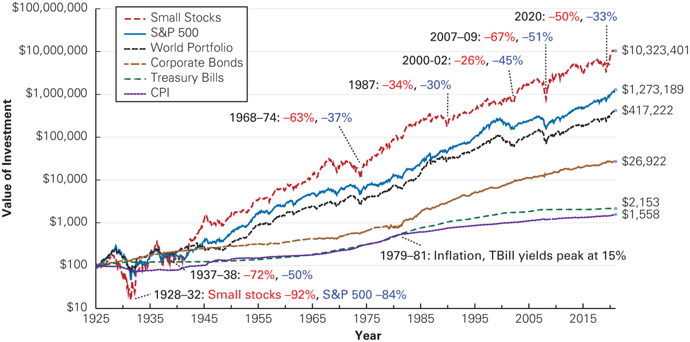
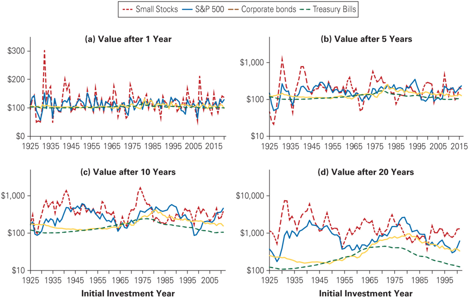
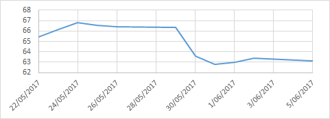
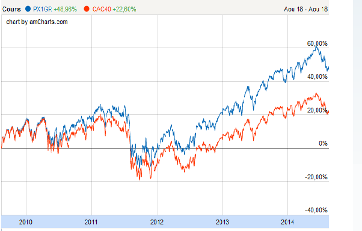
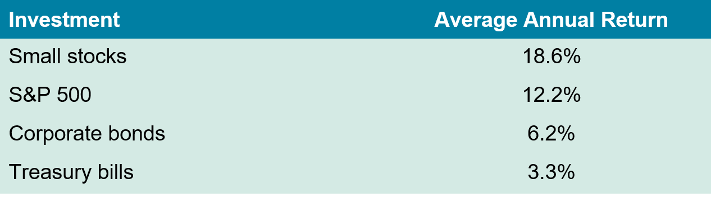
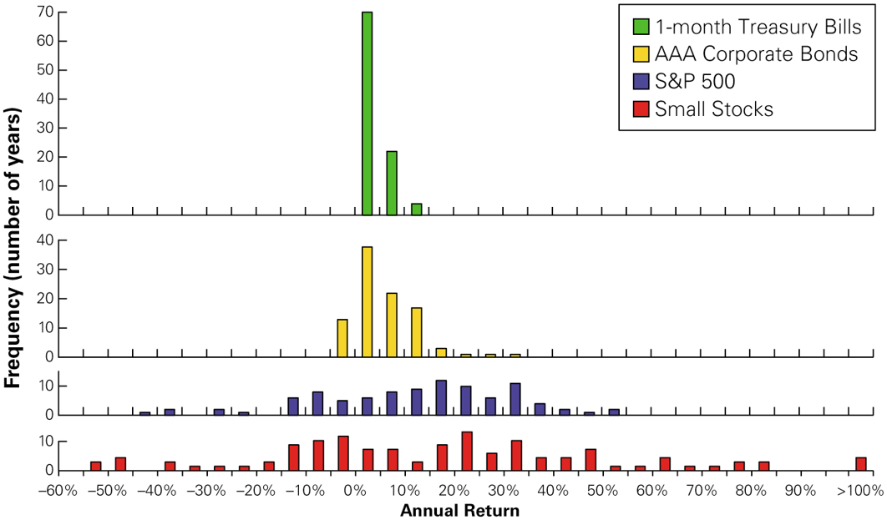
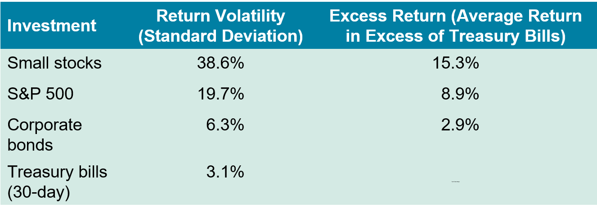
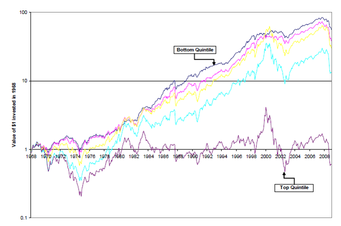
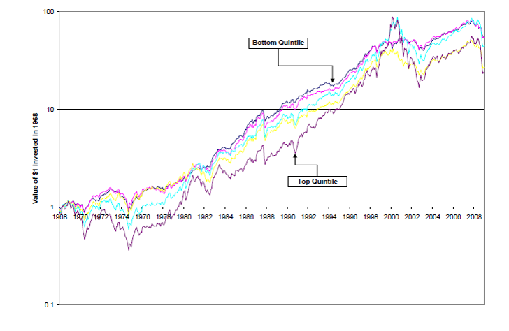

## Key concepts

- Compute/estimate returns and risk

- Risk-return relationship of assets

## Outline

A.  Risk and return: a first glimpse (Chap. 10.1)

B.  Common return measures (Chap. 10.2)

C.  Historical returns of stocks and bonds (Chap. 10.3)

D.  Common measures of risk (Chap. 10.2)

E.  The historical risk-return trade-off (Chap. 10.4)

F.  Risk and returns of individual stocks (Chap. 10.4)

## A. Risk and return: a first glimpse {.smaller}

- Standard & Poor's 500: 90 U.S. stocks up to 1957 and 500 after that.
  Leaders in their industries and among the largest firms traded on U.S.
  Markets.

- Small stocks: securities traded on the NYSE with market
  capitalizations in the bottom 20%.

- MSCI World Index (World portfolio)

- Corporate Bonds: long-term, AAA-rated U.S. corporate bonds with
  maturities of approximately 20 years.

- Treasury Bills: an investment in three-month Treasury bills.

- CPI (consumer price index)

$\Rightarrow$ We ignore transaction costs and assume that interest and
dividends are reinvested.

## Value of \$100 invested at the end of 1925

::: {.center}
{fig-align="center"}
:::

::: {.tiny}

Source: Chicago Center for Research in Security Prices, Standard and
Poor's, MSCI, and Global Financial Data.

:::

## Value of \$100 invested in different years and for differing horizons

::: {.center}
{fig-align="center"}
:::

::: {.tiny}

Source: Chicago Center for Research in Security Prices, Standard and
Poor's, MSCI, and Global Financial Data.

:::

## B. Common return measures

How to determine the return of a financial asset?

- Returns from dividends and capital gains

- Calculations with reinvested dividends

- Stock market indices

- Histograms of historical returns

- Historical volatility

- Arithmetic mean versus geometric mean

## Dividend return and capital gains {.smaller}

- The realized return of a stock between two dates consists of:

  - capital gains [and]{.underline}

  - dividends

  $$\begin{aligned}
  R_{t+1} & = \frac{\text{Wealth at period end}}{\text{Initial investment}} - 1 \\
  & = \frac{P_{t+1} + Div_{t+1} - P_{t}}{P_{t}} \\
  & = \underbrace{\frac{P_{t+1} - P_{t}}{P_{t}}}_{\text{Capital Gain Rate}} + \underbrace{\frac{Div_{t+1}}{P_{t}}}_{\text{Dividend Yield}}
  \end{aligned}$$

## Stock prices and dividend payment: the example of BNP Paribas

A dividend of EUR 2.7 is detached from the share price on May 30th, 2017

{fig-align="center"}

::: {.tiny}

Source: Yahoo Finance

:::

## How to calculate the average return on an investment? {.smaller .dense}

- What is the better investment (Investment at the end of year N until
  year N+2)?

  +:-------+:----:+:----:+:-----:+--------:+
  | Investment 1                           |
  +--------+------+------+-------+---------+
  | Value  | 100  | 50   | 100   | Average |
  +--------+------+------+-------+---------+
  | Return |      | -50% | +100% | +25 %   |
  +--------+------+------+-------+---------+
  |        |      |      |       |         |
  +--------+------+------+-------+---------+
  | Investment 2                           |
  +--------+------+------+-------+---------+
  | Value  | 100  | 110  | 121   |         |
  +--------+------+------+-------+---------+
  | Return |      | +10% | +10%  | +10%    |
  +--------+------+------+-------+---------+

  . . .

- The arithmetic average is misleading ...

## Geometric mean (annualized) or ``compound annual growth rate'' (CAGR)

- The geometric mean is calculated as
  $\operatorname{Geometric \ mean} = \left(\frac{\operatorname{Wealth \ at \ the \ end \ of \ n \ years}}{\operatorname{Initial \ investment}}\right)^{\frac{1}{n}} - 1$

- or
  $\operatorname{Geometric \ mean } = \left(\left(1+R_{1}\right) \left(1+R_{2}\right)\dots \left(1+R_{n}\right)\right)^{\frac{1}{n}} - 1$

## To sum up: calculation of returns {.smaller}

- Depending on the situation, it is best to calculate mean returns
  differently. In general:

  - Intertemporal average or realized returns: geometric mean (=IRR of
    the investment, or "compound annual return")

  - Mean return of multiple investments or expected return: arithmetic
    mean

- The two means are equal if annual returns are constant. Otherwise the
  arithmetic mean is always larger than the geometric mean.

- The geometric mean is approximately equal to the arithmetic mean -
  $\frac{1}{2}$ variance.

## Compounding returns {.smaller}

- The returns over multiple periods need to be compounded to obtain the
  return over a longer horizon.

- Example: Over 4 consecutive periods an investment generates the
  returns: 6.1%, -5.32%, 6.72% and 8.93%. The overall return is:
  $$\begin{aligned}
  R_{1 \to 4} & = \left(1+R_{1}\right) \left(1+R_{2}\right) \left(1+R_{3}\right) \left(1+R_{4}\right) - 1  \\
  & = \left(1+0.061\right) \left(1-0.0532\right) \left(1+0.0672\right) \left(1+0.0893\right) - 1  \\
  & = 16.7\%
  \end{aligned}$$

- Remarks:

  - You must not take the sum of the returns!

  - The length of the periods does not matter here.

## Example: accounting for reinvested dividends to compute the returns on Total {.smaller}

What was the total return of the Total stock in 2016 (rounded to 4
decimal points)?

::: {.center}
|            |          |          |        |
|:----------:|---------:|---------:|-------:|
|    Date    |    Price | Dividend | Return |
|            | (in EUR) | (in EUR) |        |
| 01/01/2016 |    40.89 |          |        |
| 21/03/2016 |    41.33 |     0.61 |  2.57% |
| 06/06/2016 |    42.47 |     0.61 |  4.23% |
| 27/09/2016 |    40.77 |     0.61 | -2.57% |
| 21/12/2016 |    47.60 |     0.61 | 18.25% |
| 31/12/2016 |    48.72 |          |  2.35% |
:::

## Returns and ``stock splits'' {.smaller}

- Companies sometimes decide to do "stock splits", or "reverse stock
  splits", which need to be taken into account when returns are
  calculated.

- Example:

- You bought 100 stocks of CIGNA Corp. on August 5th, 2006 for a price
  of \$155.59. One year later, the stock is worth \$50.18, but the
  company has done a "3:1 stock split" so you now own 300 stocks. Over
  this period, you received a total amount of dividends of \$8.5 (on all
  your stocks). Your total return is
  $$\frac{300 \times 50.18+8.5-100 \times  155.59}{100 \times  155.59} = -3.2\%.$$

## Value of a stock and performance index {.smaller}

- The previous figures don't correspond to the evolution of a specific
  stock price.

  - They represent the evolution of an investment in the stock.

- They are a "performance index" and/or use "adjusted prices".

- The adjusted stock price accounts for dividends and stock splits. They
  are calculated such that

  - The last value corresponds to the stock price.

  - The previous values mirror the evolution of an investment in the
    stock.

## Example: the long-term return on a stock {.smaller}

- On January 2nd, 1970, the Coca Cola stock price was worth \$82.25. On
  June 30th, 2017, the stock price was worth \$44.85. Good or bad
  investment?

- Coca Cola has done 5 stock splits and made many dividend payments, the
  "adjusted close" on 2.1.1970 was 0.85.

- Hence, the return on the overall period 1970-2017 is
  $44.85/0.85-1=5176\%$.

- The geometric annual mean is $(44.85/0.85)^{1/47}-1=8.80\%$.

## Stock price indices {.smaller}

- The stock price indices aggregate the information about the evolution
  of a stock exchange by depicting the evolution of a portfolio of
  stocks.

- Example: CAC 40, DAX, S&P 500, FTSE100 (Footsie), Nasdaq 100, Dow
  Jones Industrial average, Hang Seng, Nikkei 225 etc.

- Some of these indices are very old!

  - Dow Jones has published its index since 1896 in New-York

- **Attention**: These indices can be calculated as "total return index"
  including dividends or "price index" without dividends! Some indices
  exist in different versions.

## CAC40 and CAC40 GR (gross return)

{fig-align="center"}

## C. Historical returns of stocks and bonds

Annual mean return\
$$\overline{R}  = \frac{1}{T} \sum^{T}_{t=1} R_{t} = \frac{1}{T}\left(R_{1} + \dots + R_{T} \right)$$

{fig-align="center"}

## Return histograms of different US portfolios (1926-2021)

::: {.center}
{fig-align="center"}
:::

## D. Common measures of risk {.smaller}

- There is no perfect and generally accepted risk measure.

- In finance, risk is measured by volatility.

- Volatility = standard deviation of the returns

  After the calculation of the variance $$\begin{aligned}
  Var\left[ R \right] = \frac{1}{T-1} \sum^{T}_{t=1} \left(R_{t} - \overline{R}\right)^{2},
  \end{aligned}$$ we get the volatility $$\begin{equation*}
  \sigma_{R} = \sqrt{Var\left[ R \right]}.
  \end{equation*}$$

- Attention:

  - The volatility is a symmetric risk measure. It takes into account
    the risk to win as well as the risk to lose!

  - Other risk measures exist to quantify the risk of losses (downside
    risk) $\Rightarrow$ Example: VaR ("value at risk")

## E. The historical risk and return trade-off

::: {.center}
{fig-align="center"}
:::

$$\begin{aligned}
\operatorname{Excess \ return} & = \operatorname{return \ in \ excess \ of \ the \ risk-free \ rate} \\
& = \operatorname{risk \ premium}
\end{aligned}$$

## Return/risk of different US portfolios

::: {.center}
{fig-align="center"}
:::

::: {.tiny}

Source: CRSP, Morgan Stanley Capital International

:::

## F. Risk and returns of individual stocks

Volatility and realized returns on S&P 500 stocks

::: {.center}
{fig-align="center"}
:::

::: {.tiny}

Source: CRSP, Morgan Stanley Capital International

:::

## What's ``new''?  The low-risk anomaly

All stocks: {fig-align="center"}

::: {.tiny}

Wurgler, Jeffrey, Brendan Bradley, and Malcolm Baker. "Benchmarks as
limits to arbitrage: Understanding the low volatility anomaly.\" (2011).

:::

## What's ``new''?  The low-risk anomaly (con't)

Top 1000 stocks by MktCap {fig-align="center"}

::: {.tiny}

Wurgler, Jeffrey, Brendan Bradley, and Malcolm Baker. "Benchmarks as
limits to arbitrage: Understanding the low volatility anomaly.\" (2011).

:::

## Quiz {.smaller}

- A stock is worth \$1 at the beginning of the year. At the end of the
  year and after a reverse stock split of 1:10 and a dividend of \$0.03
  (before the split), the stock is worth \$11. What is the return on the
  investment?

- The value of a stock is halved over six month (without stock split and
  dividends).

  - What is the return on the investment over the six months?

  - What is the annualized return?

- The value of a stock loses 20% and then gains 20% (without stock split
  and dividends).

  - What is the average arithmetic return?

  - What is the average geometric return?

## Quiz

- Your banker explains to you that stocks always offer a better return
  than your investment in treasury bills.

  - Is this true?

  - Is it a reason to invest in stocks?

- Can volatility become negative?

- Is the return on a stock with more risk always higher than the return
  on a stock with less risk?

## Critical thinking

- A bond is worth \$97 (for a nominal value of \$100) at the beginning
  of the year. The bond pays an annual coupon of 4.5%, and is worth
  \$102 at the end of the year. What is the return on the investment?

- A company's stock price increases by 10% over the year, but the return
  on equity (ROE) of the company is -30%. Is there a contradiction?
