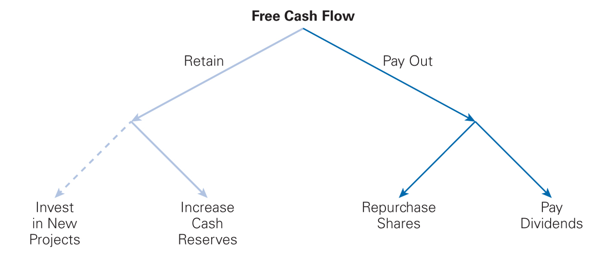
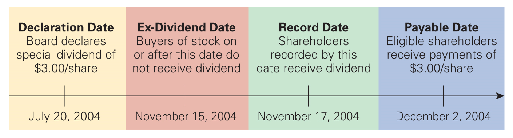
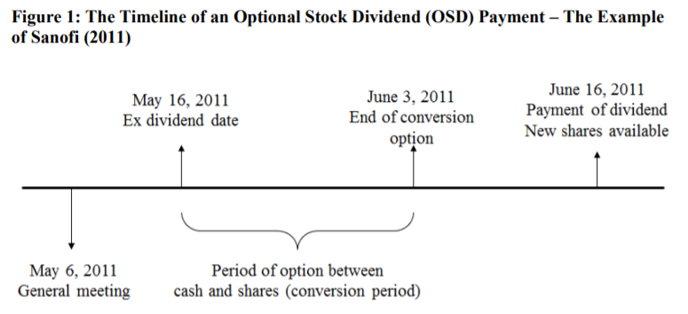
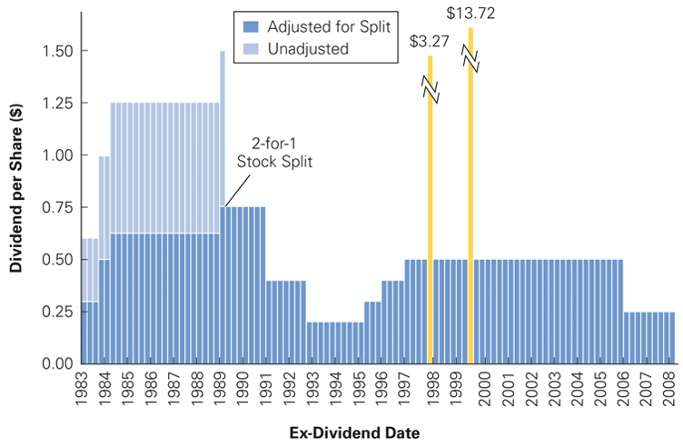
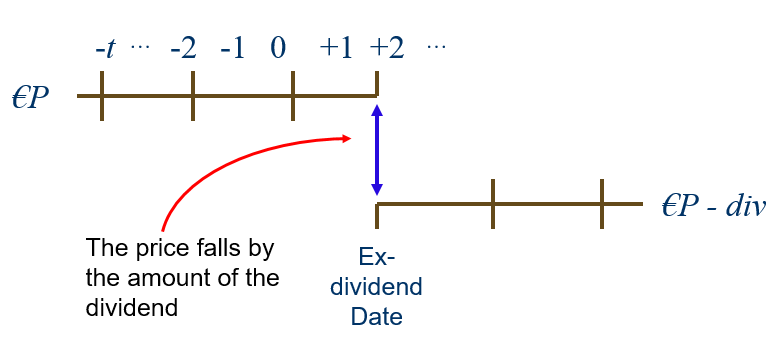
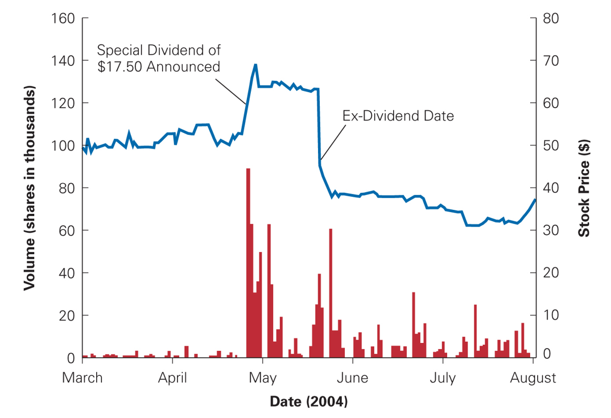
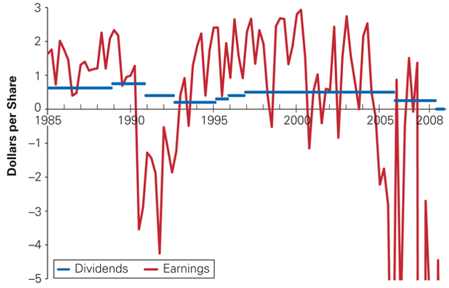

## Plan

A.  Distributions to shareholders (Chap. 17.1)

B.  Comparison of dividends and share repurchases (Chap. 17.2)

C.  Payout policy in practice (Chap 17.3, 17.5-6)

## A. Distributions to shareholders

Uses of free cash flow:

::: {.center}
{fig-align="center"}
:::

## Types of dividends {.smaller}

- "True" dividends:

  - Cash Div: cash payment.

    - Regular Cash Div: quarterly (US) or annually (France)

    - Special Cash Div: one-time dividend payment, usually much larger
      than a regular dividend

  - Optional stock dividends (in France)/ Scrip dividend (UK)

- "Fake" dividends:

  - Stock Div: issue of dividends in shares.

  - Stock Splits: division of a stock in multiple stocks.

- Financial ratios:

  - Dividend yield: Annual dividend / Stock price

  - Payout ratio: Cash dividends / Earnings per share

## Payment of a dividend: procedure

::: {.center}
{fig-align="center"}
:::

- Declaration Date: board authorizes the dividend and makes it public.

- Record Date: dividend is paid to all shareholders of record on a
  specific date (it takes three days for shares to be registered).

- Ex-Dividend Date: anyone who purchases the stock on or after the
  ex-dividend date will not receive a dividend.

## Payment of an optional stock dividend (only in France)

{fig-align="center"}

::: {.center}
::: {.footnotesize}

Source: David and Ginglinger, "When cutting dividends is not bad news:
The case of optional stock dividends," Journal of Corporate Finance 40,
pp. 174-191, 2016.

:::
:::

## Example of a dividend payment: Sodexo (dividend for 2016) {.smaller}

| Declaration date | Ex-Dividend date | Record date | Payable date |
|:--:|:--:|:--:|:--:|
| Annual general meeting | Buyers of the | Shareholders | Eligible shareholders |
| of shareholders decides | the stock after this | recorded by this | receive payment |
| to pay a dividend of | date do not receive | date receive | of 1 EUR |
| 1 EUR | dividend | dividend | per share held |
| 24 January 2017 | 6 February 2017 | 7 February 2017 | 8 February 2017 |

## Dividend history for GM

{fig-align="center"}

## Price reaction when a stock goes ex-dividend

- In a perfect market, the price should fall exactly by the amount of
  dividend paid

  ::: {.center}
  {fig-align="center"}
  :::

- With taxes on dividends, it becomes a bit more complicated.
  Empirically, the stock price falls by less then dividend paid.

## Share repurchases (or buyback)

- Same result as dividends: company pays cash to investors.

- In both cases the cash and equity of the firm are reduced.

- Differences between dividends and share repurchases

  - A dividend reduces the stock prices but not the number of stocks.

  - A share repurchase reduces the number but not the price of stocks.

- Share repurchases can have fiscal benefits.

## Share repurchases in France {.smaller}

- Annual general meeting approves a share repurchase plan and states

  - the percentage of capital targeted ($<$ 10%)

  - length of the operation ($<$ 18 months)

  - financing of the buyback (cash or debt)

- The repurchased shares can be cancelled or held by the company

- Share repurchase procedures:

  - Fixed price tender: company issues bid to repurchase a defined
    quantity of shares at a premium during a defined period.

  - Open market repurchase: purchase of shares at the current price on
    the stock exchange

## Share repurchase procedures abroad {.smaller}

- Open Market Repurchase (similar to French case) is the most widely
  used form. Other forms are:

- Tender Offer

- Dutch auction / uniform price auction (e.g., in the US)

  - Firm lists different prices at which it is prepared to buy shares
    and shareholders in turn indicate how many shares they are willing
    to sell at each price.

  - Firm pays lowest prices at which it can buy back desired number of
    shares.

- Targeted repurchase / Block purchase (prohibited in France)

  - The company repurchases a block of stocks held by a major
    shareholder

  - Attention: if large price premium is paid, for example in the case
    of a greenmail (buying out shareholder who threatens to take over
    firm), the other shareholders suffer from a wealth transfer.

## B. Comparison of dividends and share repurchases {.smaller}

- A firm wants to distribute \$100,000.

- Initial situation

  +--------------------------+-----------------------------+
  | **Assets**               | **Liabilities & Equity**    |
  +:=============+==========:+:=============+=============:+
  | Cash         | 150,000   | Debt         | 0            |
  +--------------+-----------+--------------+--------------+
  | Other assets | 850,000   | Equity       | 1,000,000    |
  +--------------+-----------+--------------+--------------+
  | Total        | 1,000,000 | Total        | 1,000,000    |
  +--------------+-----------+--------------+--------------+

  Number of stocks: 100,000. Share price: \$1,000,000 / 100,000 = \$10.

## Comparison of dividends and share repurchases (con't) {.smaller}

- After the distribution of the dividend of \$100,000 or \$1 per share,
  the balance sheet is

  +------------------------+-----------------------------+
  | **Assets**             | **Liabilities & Equity**    |
  +:=============+========:+:=============+=============:+
  | Cash         | 50,000  | Debt         | 0            |
  +--------------+---------+--------------+--------------+
  | Other assets | 850,000 | Equity       | 900,000      |
  +--------------+---------+--------------+--------------+
  | Total        | 900,000 | Total        | 900,000      |
  +--------------+---------+--------------+--------------+

  Number of stocks: 100,000. Stock price: \$900,000 / 100,000 = \$9.

## Comparison of dividends and share repurchases (con't 2) {.smaller}

- If the company repurchases stocks for \$100,000, that is
  \$100,000/\$10=10,000 stocks, and cancels the repurchased stocks, the
  balance sheet is:

  +------------------------+-----------------------------+
  | **Assets**             | **Liabilities & Equity**    |
  +:=============+========:+:=============+=============:+
  | Cash         | 50,000  | Debt         | 0            |
  +--------------+---------+--------------+--------------+
  | Other assets | 850,000 | Equity       | 900,000      |
  +--------------+---------+--------------+--------------+
  | Total        | 900,000 | Total        | 900,000      |
  +--------------+---------+--------------+--------------+

  Number of stocks: 90,000. Stock price: \$ 900,000 / 90,000 = \$ 10.

## Exercise: share repurchase and DCF evaluation {.smaller}

- Firm X has 100 000 stocks and a constant cash flow of \$10 per stock.
  The equity cost of capital / discount rate is 10%. It considers two
  distribution policies for its cash received at the end of this year:

  - Policy 1: Pay a dividend of \$10 each year.

  - Policy 2: Repurchase shares with the cash at the end of year 1 and
    distribute a regular dividend thereafter.

- The firm thinks Policy 2 will increase the dividends per share and
  therefore the share price. Show that this reasoning is wrong.

## Solution: share repurchase and DCF evaluation {.smaller}

- Policy 1: Share price \$10/0.1=\$100

- Policy 2: Share repurchase with the cash at the end of year 1 and
  distribution of a regular dividend thereafter:

  - Share price at the end of year 1: \$110[^1]

  - Cash \$1,000,000, which can be used to repurchase
    \$1,000,000/\$110=9,091 shares

  - 90,909 stocks remain in the market. If the cash of \$1,000,000/per
    year is entirely distributed, the dividend is
    \$1,000,000/90,909=\$11

- The value today is then \$11/(0.1x1.1)=\$100.

[^1]: See the Appendix for a proof.

## Modigliani-Miller and payout policy

- When a firm decides on the level of dividends, it usually takes two
  decisions:

  - What fraction of my earnings should be paid out to shareholders?

  - What amount should be reinvested in the firm?

- Modigliani and Miller have tried to analyze the dividend payout policy
  independently from the investment decision.

- They have obtained the famous dividend irrelevance theorem.

## Modigliani-Miller and payout policy (con't) {.smaller}

- Modigliani-Miller (1961): In perfect capital markets, holding fixed
  the investment policy of a firm, the firm's choice of dividend policy
  is irrelevant and does not affect the initial share price.

- Intuition:

  - Dividend payments diminish the value of the stocks exactly by the
    amount paid out but do not influence the wealth of the shareholders.

  - Dividends must be paid with cash flows. These cash flows are
    determined by the investment policy of the firm. A dividend policy
    that does not change the firm's investment policy will only change
    the moment at which the shareholders receive their money but not the
    present value of the future dividends.

## C. Dividend payout policy in practice {.smaller}

- Reasons for the low dividends

  - Income tax

  - Cost of raising capital are high

- Reasons for high dividends

  - Asymmetric information: dividends can be used to signal performance.

  - Clientele effects: some investors pay less dividends on dividends.

    - In the US: 1. Stocks in retirement accounts 2. Pension Funds 3.
      Companies (70% deductible)

- What do we observe?

  - Firms try to pay regular dividends: the level of dividends is more
    stable than earnings (also referred to as dividend smoothing ).

  - Firms try to maintain a constant "payout ratio"

## Clientele effects: price and volume around special dividends

::: {.center}
{fig-align="center"}
:::

## Dividend smoothing: GM's earnings and dividends per share

::: {.center}
{fig-align="center"}
:::

## Signalling with payout policy {.smaller}

- Dividends:

  - A policy to pay high dividends can be costly if the firm's finances
    are not solid.

  - Hence, an increase in dividends signals that the managers are
    confident that they can generate high cash flows in the future.

  - Conversely, a decrease in dividends is a bad signal about the
    managers' confidence on the ability of the firm to generate high
    cash flows in the future.

- Share repurchases:

  - Managers can increase the value of the firm by repurchasing
    undervalued shares $\Rightarrow$ positive signal.

## Appendix: ``Exercise: share repurchase and DCF evaluation";  Calculation with general $P$ in Policy 2 {.smaller}

In the solution of the "Exercise: share repurchase and DCF evaluation"
(Section B of this lecture), I assume that the price at the end of year
1 under Policy 2 equals 110. Below I provide the proof for this claim:

- Let $P$ denote the share price at the end of year 1.

- Cash of \$ 1,000,000 can be used to repurchase $1,000,000/P$ shares.

- $100,000 - \frac{1,000,000}{P}$ stocks remain in the market. If the
  cash is entirely distributed, the dividend is
  $\frac{1,000,000}{100,000 - \frac{1,000,000}{P}}$ per year, which
  simplifies to $\frac{10P}{P-10}$.

## Appendix: ``Exercise: share repurchase and DCF evaluation";  Calculation with general $P$ in Policy 2 (con't)

- The dividend discount model (Gordon growth formula) then implies that
  $$
  P = \frac{\frac{10P}{P- 10}}{0.1}.
  $$ Solving this equation gives $P$ equal to \$ 110.
