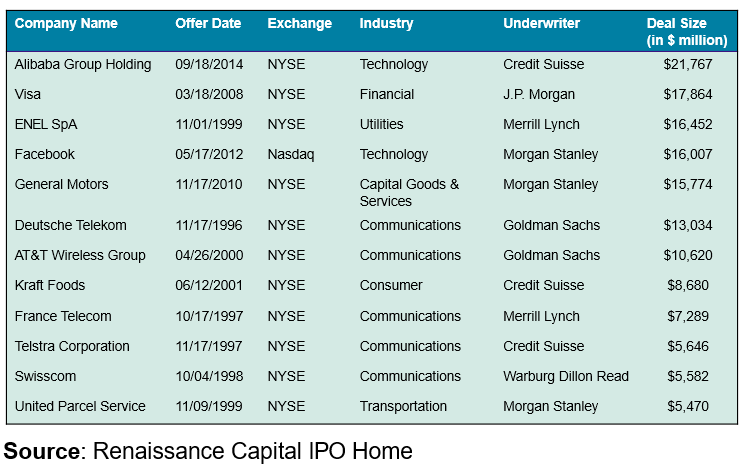
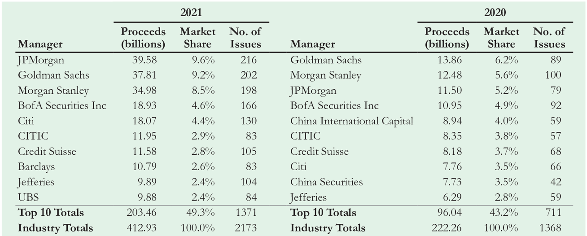
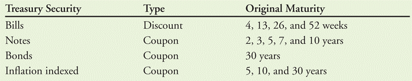
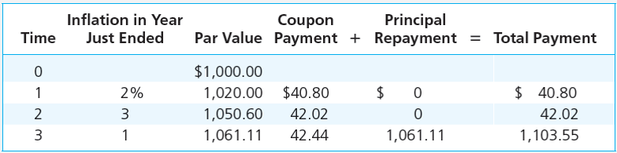
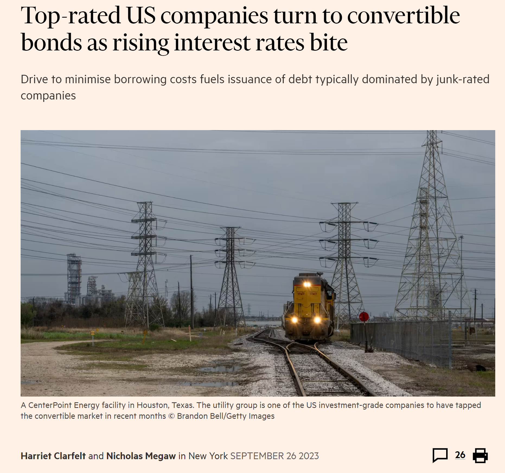
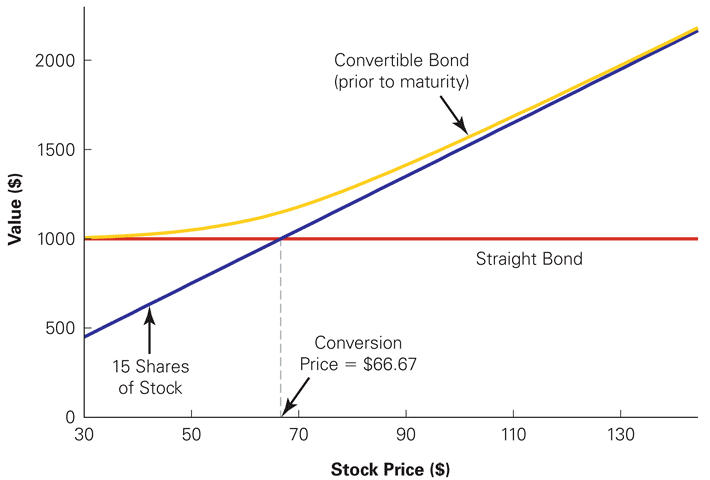

## Plan

**First Part: Raising Equity Capital**

A.  Equity Financing for Private Companies (Chap. 23.1)

B.  The Initial Public Offering (Chap. 23.2)

C.  The Seasoned Equity Offering (Chap. 23.4)

**Second Part: Debt Financing**

A.  Corporate Debt (Chap. 24.1)

B.  Other Types of Debt (Chap. 24.2)

C.  Bond Covenants (Chap. 24.3)

D.  Repayment Provisions (Chap. 24.4)

## A. Equity financing for private companies

- The initial capital that is required to start a business is usually
  provided by the entrepreneur and the immediate family.

- Often, a private company must seek outside sources that can provide
  additional capital for growth.

  - It is important to understand how the infusion of outside capital
    will affect the control of the company.

## Sources of funding {.smaller .dense}

- **Angel investors**:

  - Individual Investors who buy equity in small private firms.

  - Finding angels is typically difficult.

- **Venture capital firms**:

  - Offer limited partners advantages over investing directly in
    start-ups: Limited partners are more diversified and benefit from
    the expertise of the general partners.

  - But general partners charge high fees: Most firms charge 20% of any
    positive return they make (carried interest), and an annual
    management fee of about 2% of the fund's committed capital.

- **Private Equity Firms**:

  - Organized very much like a venture capital firm, but invests in
    equity of existing privately held firms rather than start-up
    companies.

  - May also initiate investments by finding a publicly traded firm and
    purchasing the outstanding equity, thereby taking the company
    private in a leveraged buyout (LBO).

## Sources of funding (con't) {.smaller}

- **Institutional Investors** (e.g., pension funds, insurance companies,
  endowments, and foundations) may invest directly in private firms or
  indirectly by becoming limited partners in venture capital firms.

- **Corporate Investors**: A corporation that invests in private
  companies. Although most other types of investors in private firms are
  primarily interested in the financial returns of their investments,
  corporate investors might invest for strategic corporate objectives,
  in addition to the financial returns.

## B. The Initial Public Offering (IPO) {.smaller}

- The process of selling stock to the public for the first time.

- Advantages of going public:

  - Greater liquidity: Private equity investors get the ability to
    diversify.

  - Better access to capital: Public companies typically have access to
    much larger amounts of capital through the public markets.

- Disadvantages of going public:

  - The equity holders become more widely dispersed. This makes it
    difficult to monitor management.

  - The firm must satisfy all the requirements of public companies (SEC
    filings, Sarbanes-Oxley, etc.).

## Types of offerings {.smaller .dense}

- Primary vs. Secondary:

  - Primary Offering: New shares available in a public offering that
    raise new capital.

  - Secondary Offering: Shares sold by existing shareholders in an
    equity offering.

- Best-Efforts vs. Firm Commitment vs. Auction IPOs:

  - Best-Efforts: For smaller IPOs, a situation in which the underwriter
    does not guarantee that the stock will be sold, but instead tries to
    sell the stock for the best possible price. Often such deals have an
    all-or-none clause: either all shares are sold on the IPO or the
    deal is called off.

  - Firm Commitment: An agreement between an underwriter and an issuing
    firm in which the underwriter guarantees that it will sell all of
    the stock at the offer price.

  - Auction IPO: Investors place bids and the IPO price is the highest
    price such that the number of bids at or above that price equal the
    number of offered shares.

## Largest U.S. IPOs

::: {.center}
{fig-align="center"}
:::

## Mechanics of an IPO

- Choose:

  - Lead Underwriter

    - The primary investment banking firm responsible for managing a
      security issuance.

  - Syndicate

    - A group of underwriters who jointly underwrite and distribute a
      security issuance.

## Top global IPO underwriters, ranked by proceeds

::: {.center}
{fig-align="center"}
:::

::: {.footnotesize}

*Source:* Global Equity Capital Markets Review, 2021

:::

## Mechanics of an IPO (con't) {.smaller}

- SEC Filings

  - Registration Statement: Legal document that provides financial and
    other information about a company to investors prior to a security
    issuance.

- Preliminary Prospectus (Red Herring): Part of the registration
  statement prepared by a company prior to an IPO that is circulated to
  investors before the stock is offered.

- Final Prospectus: Part of the final registration statement prepared by
  a company prior to an IPO that contains all the details of the
  offering, including the number of shares offered and the offer price.

## Mechanics of an IPO (con't) {.smaller}

- Valuation:

  - Compute the present value of the estimated future cash flows.

  - Estimate the value by examining comparables (recent IPOs).

- Road Show: During an IPO, when a company's senior management and its
  underwriters travel around promoting the company and explaining their
  rationale for an offer price to the underwriters' largest customers,
  mainly institutional investors such as mutual funds and pension funds.

- Book Building: A process used by underwriters for coming up with an
  offer price based on customers' expressions of interest.

## Mechanics of an IPO (con't) {.smaller}

- Pricing the Deal and Managing Risk

  - Spread: The fee a company pays to its underwriters that is a
    percentage of the issue price of a share of stock.

  - When an underwriter provides a firm commitment, it is potentially
    exposing itself to the risk of selling the shares at less than the
    offer price and thus taking a loss. However, research shows that 75%
    of IPOs experience an increase in share price on the first day (only
    9% experience a decrease).

## Mechanics of an IPO (con't) {.smaller .dense}

- Pricing the Deal and Managing Risk (con't):

  - Over-Allotment Allocation (Greenshoe Provision): an option that
    allows the underwriter to issue more stock, usually amounting to 15%
    of the original offer size, at the IPO offer price.

  - Underwriters initially market both the initial allotment and the
    allotment in the greenshoe provision by short selling the greenshoe
    allotment.

    - If the issue is a success, the underwriter exercises the greenshoe
      option, thereby covering its short position.

    - If the issue is not a success, the underwriter covers the short
      position by repurchasing the greenshoe allotment in the
      aftermarket, thereby supporting the price.

  - **Lockup**: A restriction that prevents insiders from selling their
    shares for some period, usually 90-180 days, after an IPO.

## D. The Seasoned Equity Offering (SEO) {.smaller}

- Public firms use SEOs to raise additional equity.

  - The steps are similar as for an IPO. The main difference is that a
    market price for the stock already exists, so the price-setting
    process is not necessary.

- Two kinds of SEOs exist:

  - **Cash Offer**: new shares are offered to investors at large.

  - **Rights Offer**: new shares are offered only to existing
    shareholders. $\Rightarrow$ protects existing shareholders from
    underpricing and wealth transfer.

## An example of wealth transfer {.smaller}

- Alpha has no debt and only one asset of 100 EUR. Its capital consists
  of 50 stocks (with a unit value of 2 EUR).

- Alpha announces the issuance of 50 new stocks at a price of 1 EUR. The
  low price guarantees the success of the increase in capital.

- After the operation, the company has 150 EUR in assets and its
  liability side consists of 100 shares.

- The price of a stock is thus 1.50 EUR.

- The previous shareholders have thus lost 50 cents, which is the gain
  of the new shareholders.

## Rights offer: example {.smaller}

- If Alpha instead decides to do a rights offer, each existing
  shareholder receives the right to purchase an additional share for 1
  EUR.

- If all existing shareholders exercise their right, the value of the
  company is 150 EUR and the liability side of the company consists of
  100 shares with a unit value of 1.50 EUR (the stock price has thus
  decreased by 50 cents).

- But existing and new shareholders are the same so the loss of 50 cents
  per stock is compensated by the profit on the new shares.

## Price reaction {.smaller}

- Researchers have found that, on average, the market greets the news of
  an SEO with a price decline (on average, 3-5 %).

- Why?

- This can be explained with the signalling and adverse selection theory
  (Chap. 16):

  - A company concerned about protecting its existing shareholders will
    tend to sell only at a price that correctly values or overvalues the
    firm.

  - Thus investors infer from the decision to sell that the company is
    likely to be overvalued. $\Rightarrow$ Price drop at announcement of
    SEO.

## Price reaction (con't)

- But adverse selection cannot be the whole story:

  - A rights issue mitigates the adverse selection problem. However, the
    stock price decreases even in that case.

  - In addition, as for IPOs, after an SEO the stock price tends to
    underperform the market. This suggests that the price decrease at
    the announcement is insufficient, because prices continue to decline
    thereafter.

## Second Part: Debt Financing

A.  Corporate Debt (Chap. 24.1)

B.  Other Types of Debt (Chap. 24.2)

C.  Bond Covenants (Chap. 24.3)

D.  Repayment Provisions (Chap. 24.4)

## A. Corporate debt

- Characteristics of a debt security:

  - Face value

  - Issue price

  - Coupon rate (fix, variable, indexed, \...)

  - Coupon payment dates

  - Maturity

## Issuance of debt {.smaller}

- **Private debt**: not publicly traded; larger aggregate market than
  the public debt market. Avoids cost of registration but has the
  disadvantage of being illiquid. Two segments:

  - **Term loans:** fixed term bank loans.

  - **Private placements:** bond issue that does not trade on a public
    market and is sold to a small group of investors.

- **Public debt**: publication of a prospectus, which specifies the
  details of the offering, and includes an indenture (formal debt
  agreement between issuer and bondholder).

## Seniority

- Most types of corporate bonds---notes (maturity less than 10 years)
  and debentures---are unsecured.

- Thus the bondholder's priority in claiming assets in the event of
  default---the bond's seniority---is important.

  - Senior vs. junior debt.

- In exchange for more risk, the investors of junior debt are promised
  higher yields.

## B. Other types of debt

- **Sovereign debt**: debt issued by national governments.

- An expanding market, thanks to the increase in public deficits

  - In France, the public debt in 2024 amounted to 112% of the GDP, or
    3,228 billion EUR.

## Existing U.S. Treasury Securities

{fig-align="center"}

## TIPS (Treasury-Inflation-Protected Securities)

- An inflation-indexed bond issued by the U.S. Treasury with maturities
  of 5, 10, and 20 years. They are standard fixed-rate coupon bonds with
  one difference: The outstanding principal is adjusted for inflation.

- Example:

{fig-align="center"}

## Other types of debt: Asset-Backed Securities {.smaller}

- Securitization transforms assets in financial securities that can be
  traded on financial markets.

- The largest sector of the asset-backed security market is the
  mortgage-backed security market (i.e., assets backed by home
  mortgages). $\Rightarrow$ Mortgage-Backed Securities.

- **Collateralized Debt Obligations (CDO)**: A re-securitization of
  other asset-backed securities + Often division into tranches that are
  assigned different repayment priority.

## C. Bond covenants {.smaller}

- Restrictive clauses in a bond contract that limit the issuers from
  undercutting their ability to repay the bonds.

- For example, covenants may

  - Restrict the ability of management to pay dividends

  - Restrict the level of further indebtedness

  - Specify that the issuer must maintain a minimum amount of working
    capital

- If the issuer fails to live up to any covenant, the bond goes into
  default.

## D. Repayment provisions {.smaller}

- Issuers can repurchase outstanding bonds in the market before
  maturity.

- The bond can also directly allow for early repayment by including a
  **call** provision: **callable bonds**.

- This gives the issuer the right (but not the obligation) to retire all
  outstanding bonds on (or after) a specific date (the call date) for
  the call price.

  - Call price is generally set at or above, and expressed as a
    percentage of, the bond's face value.

- Firms generally call a bond issue if interest rates have fallen.

  - Issuer can lower its borrowing costs by immediately refinancing at a
    lower rate.

  - Note: If rates rise, there is no need to refinance.

##

::: {.center}
{fig-align="center"}
:::

## Bonds with options {.smaller}

- Bonds are commonly sold with options which give the issuer or the
  investor some additional rights.

- Options for the investor

  - Puttable bonds: Give the holder an option to retire or extend the
    bond.

  - Convertible bonds: Can be exchanged for shares of the firm's common
    stock.

- Options for the issuer:

  - Callable bond: Can be repurchased before the maturity date.

- Has a bond with an option a lower or higher yield than an otherwise
  identical bond? Why?

## Hybrid bonds: convertible bonds {.smaller}

- A corporate bond with a provision that gives the bondholder an option
  to convert each bond owned into a fixed number of shares of common
  stock.

- Conversion Ratio: The number of shares received upon conversion of a
  convertible bond, usually stated per \$1000 of face value.

- Conversion Price: The face value of a convertible bond divided by the
  number of shares received if the bond is converted.

- Warrant: A call option written by the company itself on new stock

  - When a holder of a warrant exercises it and thereby purchases stock,
    the company delivers this stock by issuing new stock.

  - Convertible debt carries a lower interest rate because it has an
    embedded warrant.

##

{fig-align="center"}

## Quiz

- What are some of the advantages and disadvantages of going public?

- What is the difference between a cash offer and a rights offer for a
  seasoned equity offering?

- What happens if an issuer fails to live up to a bond covenant?

- Why does a convertible bond have a lower yield than an otherwise
  identical bond without the option to convert?
