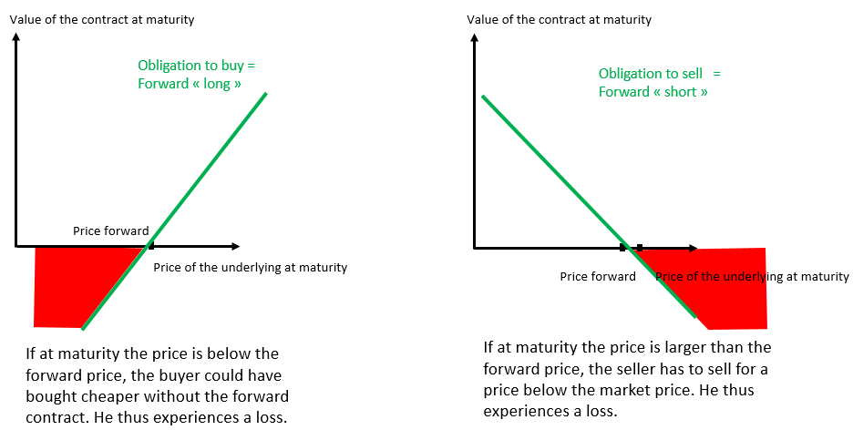
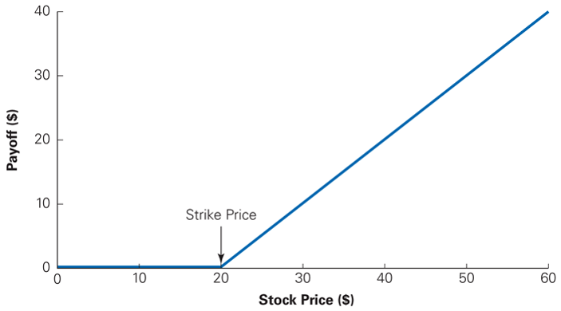
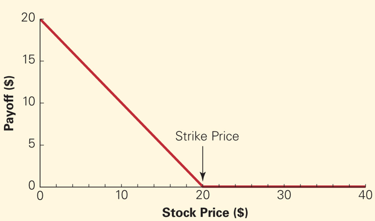
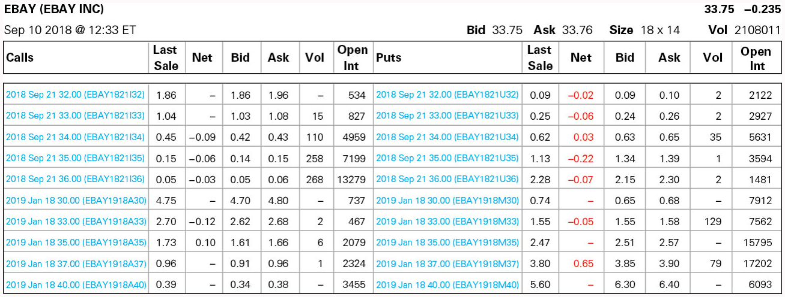
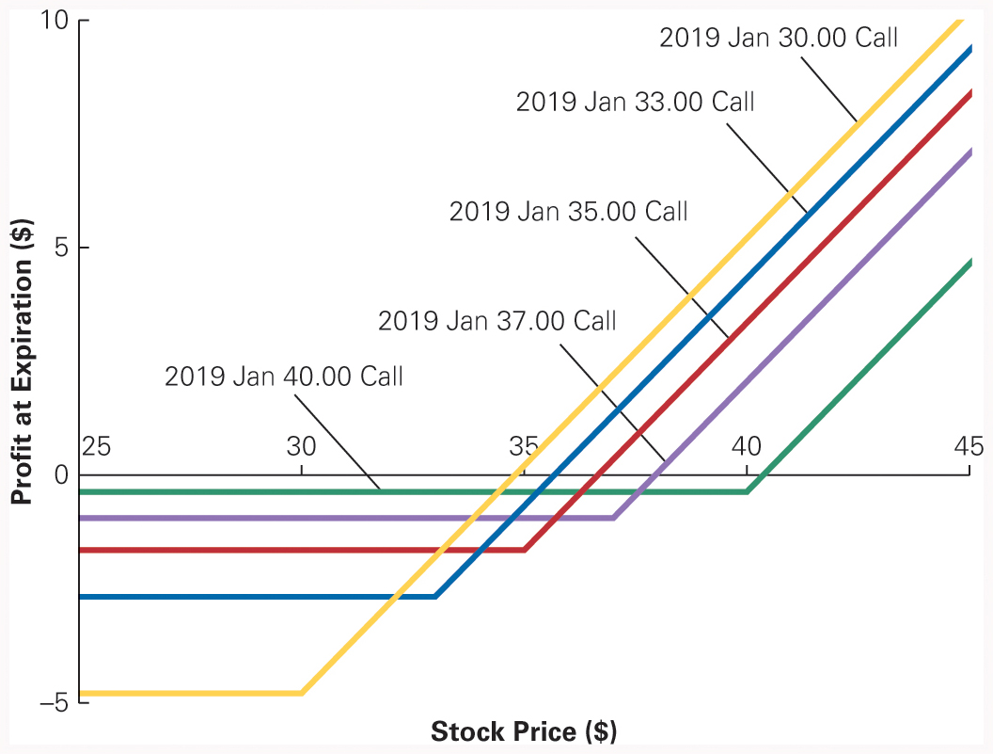
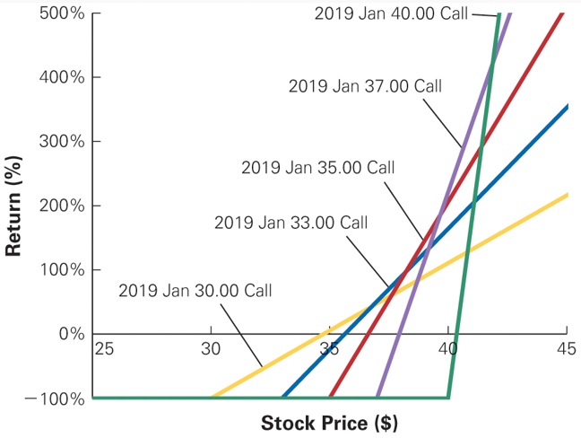
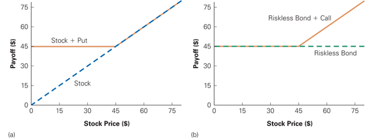

## Plan

A.  Futures & forwards: simple financial derivatives

B.  Option basics (Chap. 20.1)

C.  Option payoffs at expiration (Chap. 20.2)

## Introduction

- A company is exposed to many different risks:

  - Changes in demand

  - Changes in the cost of commodities

  - Loss of key employees

  - New competitors entering the market

  - Operational risks, etc.

## Introduction

- Important question for the company:

  - Should investors support these risks? or

  - Should the company reduce/manage the risks?

- Managers have different tools to reduce risks:

  - Prevention.

  - Hedging:

    - with insurance contracts.

    - in financial markets.

## Insurance vs. hedging with derivatives

- Some risks are easy to insure:

  - Accidents, illness, fire.

- For other risks it is hard or impossible to find insurance:

  - Climate risk,

  - Risk of natural disasters,

  - Cost of commodities.

- In particular, it is usually easier to hedge a "non diversifiable" or
  "hard to diversify" risk with a financial derivative than with an
  insurance contract.

## Financial derivatives

- The value of financial derivatives depends on another value (the
  underlying).

- The underlying is mostly the price of a financial security.

- Example:

  - Credit default swaps (CDS),

  - Swaps,

  - Futures/forwards,

  - Options.

## A. Futures \& forwards: simple financial derivatives {.smaller}

- A forward is a legal agreement between a seller and a buyer:

  - The buyer agrees to buy something at a specified price and a
    specified date,

  - The seller agrees to sell something at a specified price and a
    specified date.

- A market for standardised forward contracts equipped with a clearing
  house is called a futures market.

  - For futures there are margin requirements and the clearing house is
    the counterparty so that there is no credit risk in the futures
    market.

## Forward/futures: terminology {.smaller}

| **"Spot" market** | **"Futures/forward" market**        |
|:------------------|:------------------------------------|
| Price             | Futures/forward price               |
| Today             | Expiration date or transaction date |
| Something         | Underlying                          |
| Buyer             | Party which takes the               |
|                   | long position in the contract       |
| Seller            | Party which takes the               |
|                   | short position in the contract      |

## The value of a forward contract

The value of the forward contract at maturity depends on the spot price
at maturity:

{fig-align="center"}

## Closing a position {.smaller}

- The buyer makes a profit if the price of the underlying increases.

- The seller makes a profit if the price of the underlying decreases.

- The futures contract can be held until expiry. The expiration dates
  are usually in March, June, September, and December.

- The position can be closed before the expiration date: an investor
  with a long position can take a short position on the same contract.

## At the maturity of the contract

- The settlement can be made in cash (**cash settlement**).

  - Example: stock index.

- Or by the delivery of the underlying asset, real or financial
  (**physical delivery**).

  - Example: bonds, commodities.

## B. Option basics {.smaller}

- The major drawback of forward and future contracts is the possibility
  to experience a negative payoff.

- A forward contract that does not force the two parties to execute is
  called an "option."

- Thus, an option corresponds to a forward contract which only has a
  non-negative payoff (positive or zero).

- Because an option is a bet in which you cannot lose, you need to pay
  the price of the option to enter the bet.

## Call \& put options {.smaller}

- **Call**: gives the owner the right, but not the obligation, to buy a
  fixed quantity of the underlying asset at a certain price at (or
  before) a certain date.

  - Exercise price or strike price: The price at which an option holder
    buys or sells a share of stock when the option is exercised.

  - Expiration date: The last date on which an option holder has the
    right to exercise the option.

- **Put**: gives the owner the right, but not the obligation, to sell a
  fixed quantity of the underlying asset at the strike price at (or
  before) the expiration date.

- The price of an option or the option premium is paid by the buyer to
  the seller to acquire the right.

## Terminology {.smaller}

- Exercising an option: when a holder of an option enforces the
  agreement and buys or sells a share of stock at the agreed-upon price.

- The option buyer (holder): holds the right to exercise the option and
  has a long position in the contract.

- The option seller (writer):

  - Sells (or writes) the option and has a short position in the
    contract.

  - Because the long side has the option to exercise, the short side has
    an obligation to fulfill the contract if it is exercised.

## Terminology (con't) {.smaller}

- The intrinsic value of an option corresponds to the gain realised by
  the owner in the case of an immediate exercise.

  - At-the-money: describes an option whose exercise price is equal to
    the current stock price.

  - In-the-money: describes an option whose value, if immediately
    exercised, would be positive.

  - Out-of-the-money: describes an option whose value, if immediately
    exercised, would be negative.

  - Deep in-the-money (out-of-the-money): describes an option that is
    in-the-money (out-of-the-money) and for which the strike price and
    the stock price are very far apart.

## Terminology (con't 2) {.smaller}

- **European option:** options that allow their holders to exercise the
  option only on the expiration date.

- **American option:** options that allow their holders to exercise the
  option on any date up to, and including, the expiration date.

  - Note: The names American and European have nothing to do with the
    location where the options are traded.

- **Asian option:** based on an average, e.g., the average monthly
  return of the CAC40 over the next five years.

- **Bermuda option:** can be exercised only on specific dates.

## Rationale of option strategies

- Buyer (**long position**) of a **call** expects an increase in the
  price of the underlying.

- Seller (**short position**) of a **call** expects a decrease in the
  price of the underlying.

- Buyer (**long position**) of a **put** expects a decrease in the price
  of the underlying.

- Seller (**short position**) of a **put** expects an increase in the
  price of the underlying.

## C. Option payoffs at expiration

- The value of a call at expiration is $$\begin{equation*}
  C_{T} = \max \left(S_{T} - K; \ 0 \right),
  \end{equation*}$$ where $S_{T}$ is the price of the underlying at
  expiration and $K$ is the strike price of the option.

- Example for $K = 20$: {fig-align="center"}

## Option payoffs at expiration: put

- The value of a put at expiration is $$\begin{equation*}
  P_{T} = \max \left(K - S_{T}; \ 0 \right).
  \end{equation*}$$

- Example for $K = 20$: {fig-align="center"}

## Option pricing model: call {.smaller .dense}

- The most commonly used model to value European options is the
  Black-Scholes formula: $$\begin{equation*}
  C_t = S_t N\left(d_{1}\right) - K e^{-r_f(T-t)} N\left(d_{2}\right),
  \end{equation*}$$ where $$\begin{aligned}
  d_{1} & = \frac{ln\left(S_{t}/K\right)+\left(r_f+0.5\sigma^{2}\right) \left(T-t\right)}{\sigma \sqrt{T-t}}, \\
  d_{2} & = d_{1} - \sigma \sqrt{T-t},
  \end{aligned}$$ $S_{t}$ is the current price of the underlying, $T-t$
  is the time to expiration, $K$ is the strike price, $r_f$ is the
  risk-free rate, $\sigma$ is the volatility, and $N\left(\cdot\right)$
  is the cumulative distribution function of the standardized normal
  distribution.

- Remarks:

  - N($d_{2}$) = "risk-neutral" probability that the call is "in the
    money" at expiration.

  - N($d_1$) = "delta" of the option
    ($\Delta = tial C_{t} / tial S_{t}$).

  - There is a similar formula for the price of European put options
    which can be found, e.g., with the put-call parity.

## Options: history {.smaller}

- Options have existed for a long time but they have gained in
  popularity since 1973. In that year:

  - the first regulated option market was introduced (the Chicago Board
    Options Exchange, or CBOE)

  - two academic articles pioneering option pricing were published.

- In Europe, the two main derivative exchanges are the NYSE Liffe and
  Eurex.

- A large number of options are not traded on exchanges but rather in
  over the counter markets.

## Option quotes: example of CBOE

{fig-align="center"} Suppose that you have decided to buy a call with
a strike of 30 and expiration in January.

- Is this option "in-the-money" or "out-of-the-money"?

- From the table, compute the return (in %) obtained by an investor who
  chooses to buy the call today and hold it to expiry, assuming that the
  stock price reaches 40\$ at the expiration of the call option.

## Profit from holding a call option to expiration

::: {.center}
{fig-align="center"}
:::

## Returns from purchasing a call option and holding it to expiration

::: {.center}
{fig-align="center"}
:::

## Option usage in practice: portfolio insurance

- Options can be used to protect a portfolio against a decline in its
  value.

- Consider a portfolio which only contains Amazon stocks. The investor
  is worried that the stock price may decline. At the same time, he is
  reluctant to sell his stocks because he also thinks there is a
  reasonable likelihood that the stock price will increase in the
  future.

## Option usage in practice: portfolio insurance (con't) {.smaller}

{fig-align="center"}

::: {.scriptsize}

The plots show two different ways to insure against the possibility of
the price of Amazon stock falling below \$45:

(a) Orange line shows value on expiration date of a long position in
    Amazon stock and a European put option with a strike of \$45 (blue
    dashed line is the stock payoff).

(b) Orange line shows value on expiration date of a long position in a
    zero-coupon risk-free bond with a face value of \$45 and a European
    call option on Amazon with a strike price of \$45 (green dashed line
    is the bond payoff).

:::

## Quiz

- Does the holder of an option have to exercise it?

- Explain how you can use put options to create portfolio insurance. How
  can you create portfolio insurance using call options?
