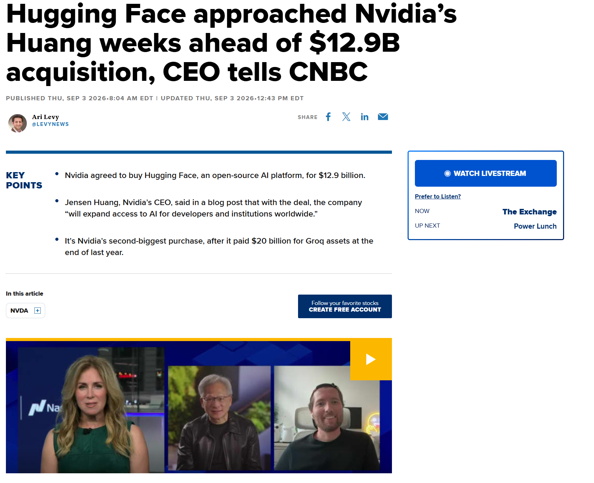
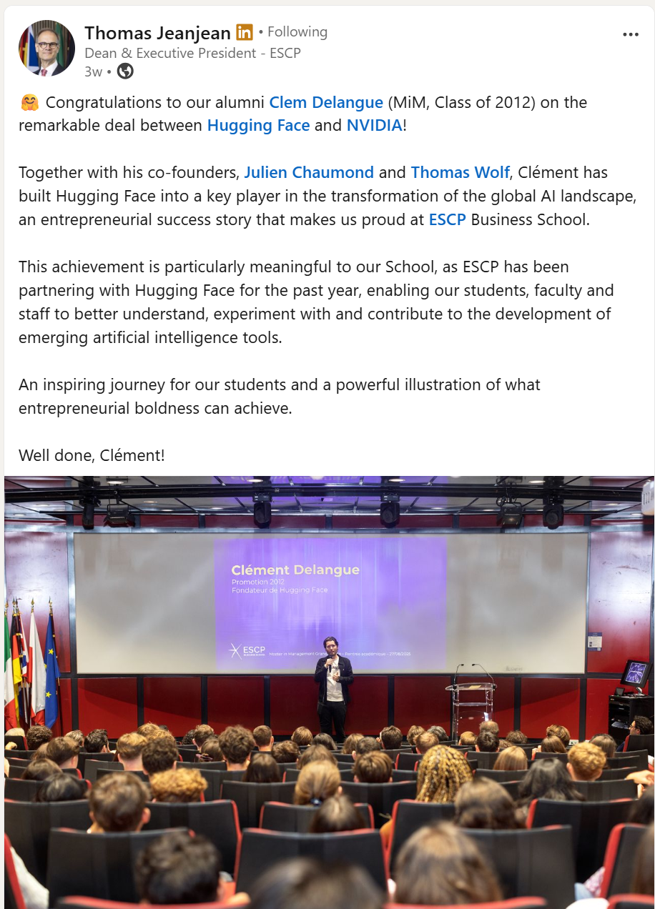
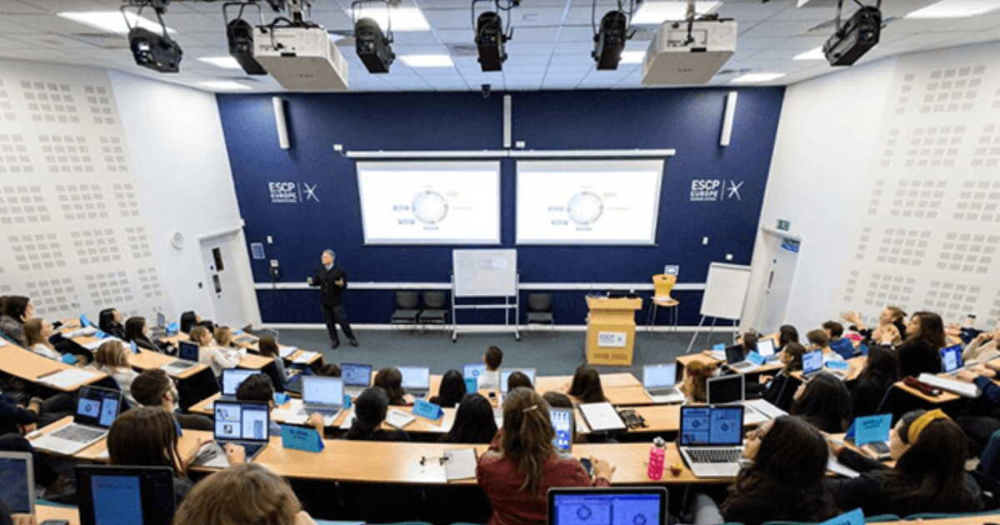
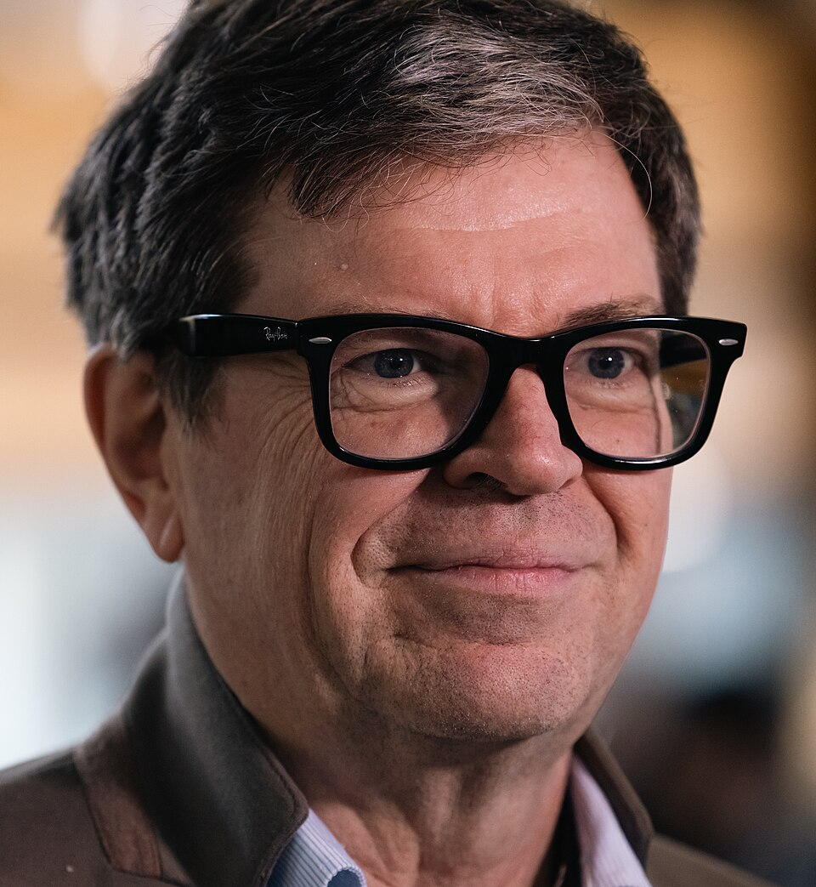

## Read the Financial Times, for free {.smaller}

- ESCP gives every student **free access to FT.com** through your ESCP email.

- To set it up: go to [ft.com](https://www.ft.com), click on any article, and
  fill in the form with your **ESCP email address**. The FT recognises the
  domain and activates the subscription. Then download the FT app.

- Why bother? Everything we do in this course is happening right now:
  interest rates, IPOs, takeovers, dividend cuts, market crashes. Reading the
  FT for 15 minutes a day is the fastest way to make the theory concrete.

- Tip: add topics to *myFT* (Markets, Private equity, Tech).

## Nvidia buys Hugging Face for USD 12.9 billion {.smaller}

:::: {.columns}
::: {.column width="55%"}
{width="100%"}
:::

::: {.column width="45%"}
- Hugging Face: the open-source platform where most AI models are shared.
  Founded in 2016 by three French entrepreneurs.

- 3 September 2026: Nvidia buys it for **USD 12.9 billion**, its
  second-largest acquisition ever.

- It started as a chatbot app for teenagers. This is what an AI ecosystem
  looks like when it works.
:::
::::

::: {.tiny}
Source: CNBC, 3 September 2026.
:::

## One of the founders sat where you sit {.smaller}

:::: {.columns}
::: {.column width="42%"}
{width="82%" style="max-height: 490px"}
:::

::: {.column width="58%"}
- Clément Delangue, CEO and co-founder of Hugging Face: ESCP **Master in
  Management, Class of 2012**. Same programme, same campus.

- ESCP has partnered with Hugging Face for the past year, so you can
  experiment with the tools directly.

- Paris is one of the busiest places in the world for AI entrepreneurship,
  and ESCP is in the middle of it. This story did not need a PhD in
  mathematics: a good idea, ambition, and the finance to fund it.
:::
::::

::: {.tiny}
Source: LinkedIn post by Thomas Jeanjean, Dean of ESCP, September 2026.
:::

## ESCP School of Technology, opening 2027 {.smaller}

:::: {.columns}
::: {.column width="48%"}
{width="100%"}

::: {.center}
{width="34%"}

[Yann Le Cun]{.small}
:::
:::

::: {.column width="52%"}
- A new **School of Technology** in 2027, under the patronage of **Yann Le
  Cun**, one of the founding figures of modern AI.

- First programme: a Bachelor in Management, Science & Technology. English,
  Paris then Turin then London, 40 students in the first intake.

- Then three MSc: robotics & logistics, product management, technology for
  managers.

- Part of the "Bold & United" 2026-2030 plan: a School of Governance follows
  in 2029.
:::
::::

::: {.tiny}
Source: [Capital.fr, 11 June 2026](https://www.capital.fr/votre-carriere/avec-un-nouveau-bachelor-et-le-parrainage-de-yann-le-cun-l-escp-accelere-dans-la-tech-1527525). Photo: Wikimedia Commons, CC BY-SA 2.0.
:::
