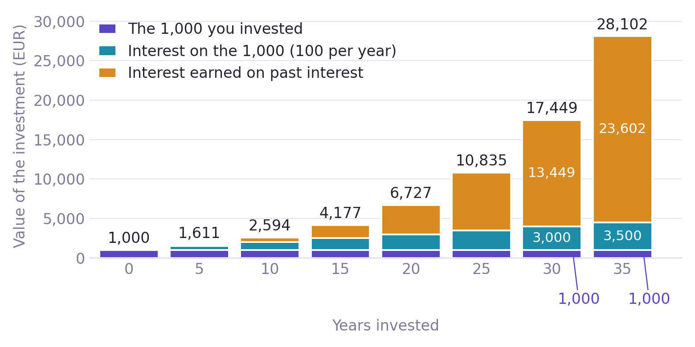
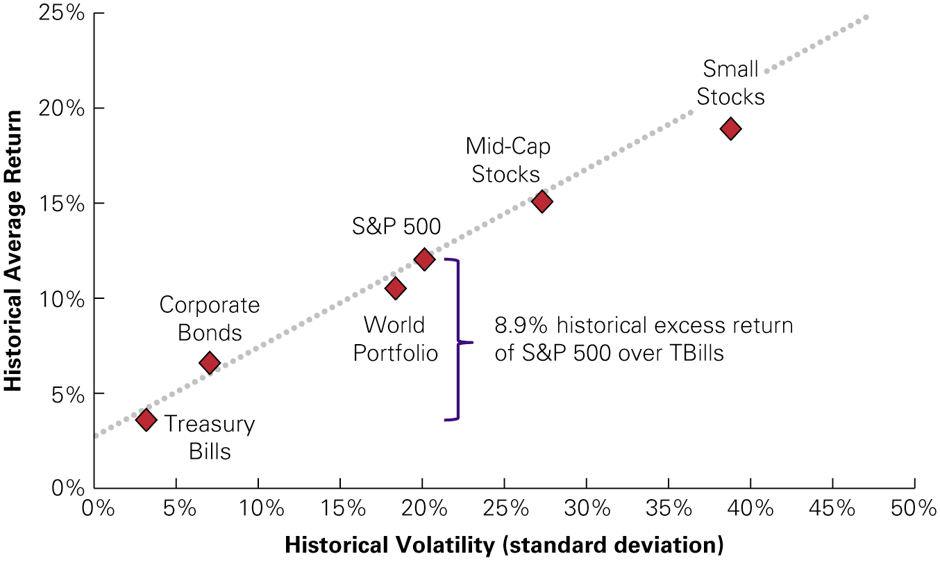
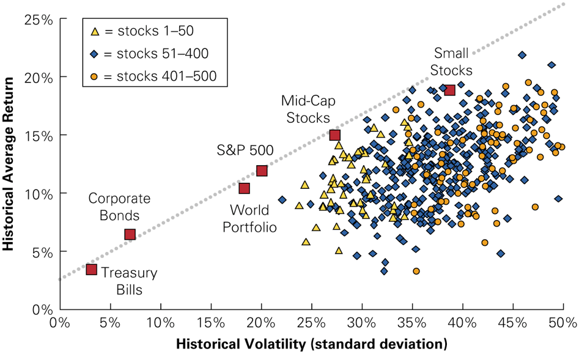
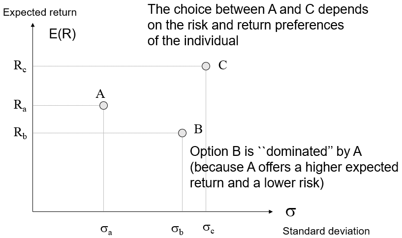
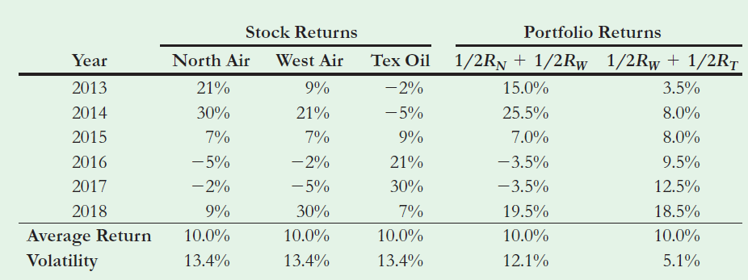
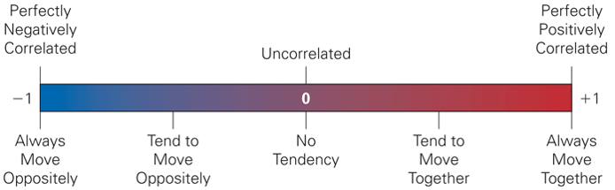
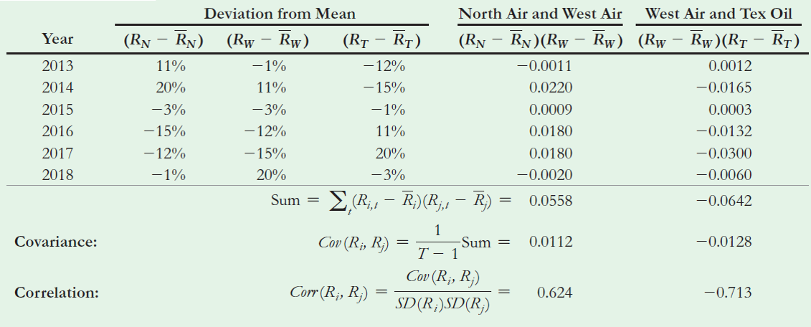
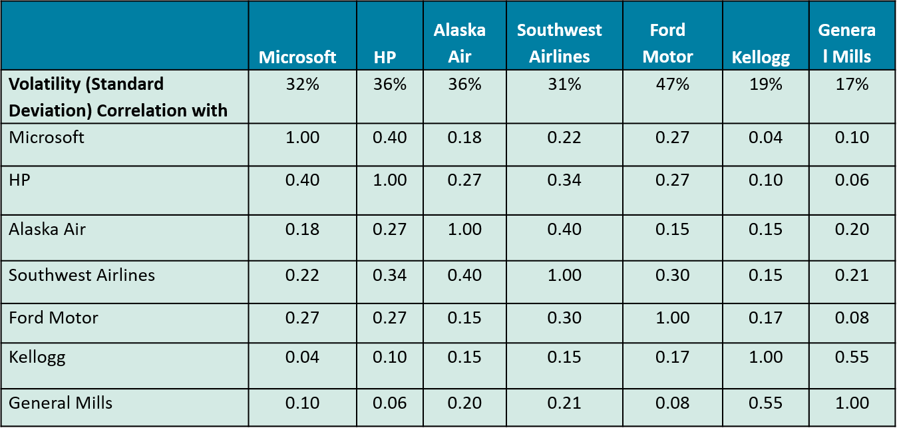

## Plan

- Recap what we learned in Lecture 1: returns and risk

- Understand how combining assets reduces risk (diversification)

- Learn how to compute the risk and return of a portfolio

## Key concepts

- Covariance and correlation between two stocks

- Diversification: which risk disappears in a portfolio and which does not

## Recap of Lecture 1 {.smaller}

Let's do a recap:

- The summation sign

- What a return is, and where it comes from

- Why returns compound, and what that does over a long horizon

- The geometric mean (CAGR) and the arithmetic mean

- Stock splits

- Variance and volatility

- The link between risk and return

## Recap: the summation sign {.smaller}

- $\sum$ is a shortcut for a long addition. Below it: where to **start**; above
  it: where to **stop**; to its right: **what to add**.

  $$\sum_{t=1}^{4} R_{t} = R_{1} + R_{2} + R_{3} + R_{4}$$

- When we do not know how many terms there are, we give that number a name, say
  $T$, and stop there:

  $$\sum_{t=1}^{T} R_{t} = R_{1} + R_{2} + \dots + R_{T}$$


## Recap: prices differ, returns allow us to compare {.smaller}

- A share of LVMH costs a few hundred euros, a share of Orange about ten. The
  prices alone say nothing about which was the better investment.

- The **return** puts every investment on the same scale: the percentage increase
  in value for every euro invested.

  $$\begin{aligned}
  R_{t+1} & = \frac{\text{Wealth at the end}}{\text{Amount invested}} - 1 \\[6pt]
  & = \frac{\text{Wealth at the end} - \text{Amount invested}}{\text{Amount invested}} \\[6pt]
  & = \frac{\text{Change in value}}{\text{Amount invested}}
  \end{aligned}$$

- Example: you buy at EUR 50 and sell at EUR 55 one year later. Each euro became
  1.10 euros, so the return is $55/50 - 1 = (55 - 50)/50 = 10\%$, whatever the
  size of your investment.

## Recap: capital gains and dividends {.smaller}

- A stock pays you in two ways over the year: its price moves, and it may pay a
  dividend. The return counts both.

  $$R_{t+1} = \frac{P_{t+1} + Div_{t+1} - P_{t}}{P_{t}} = \underbrace{\frac{P_{t+1} - P_{t}}{P_{t}}}_{\text{capital gain}} + \underbrace{\frac{Div_{t+1}}{P_{t}}}_{\text{dividend yield}}$$

- $P_{t}$ is the price when you buy, $P_{t+1}$ the price one year later, and
  $Div_{t+1}$ the dividend received in between.

- Example: bought at 50, sold at 53, dividend of 2. Capital gain $3/50 = 6\%$,
  dividend yield $2/50 = 4\%$, total return $10\%$.

## Recap: returns compound {.smaller}

- After several periods, you earn interests not only on the principal, but also on the
interests rates: you earn interests on the interests already earned. That is compounding.

- One euro becomes $(1+R_{1})$ after the first period, that amount then grows by
  $(1+R_{2})$, and so on. Over $N$ periods:

  $$1 + R_{1 \to N} = \left(1+R_{1}\right)\left(1+R_{2}\right)\dots\left(1+R_{N}\right)$$

- With $N = 4$ and returns of 6.1%, -5.32%, 6.72% and 8.93%:

  $$R_{1 \to 4} = \left(1.061\right)\left(0.9468\right)\left(1.0672\right)\left(1.0893\right) - 1 = 16.7\%$$

## Compounding: EUR 1,000 invested at 10% {.smaller}

::: {.center}
{fig-align="center" width="90%"}
:::

Of the EUR 28,102 you end up with, only EUR 1,000 is your own money and EUR 3,500
is interest on it. The other EUR 23,602 is interest earned on past interest.

## Recap: the geometric mean, or CAGR {.smaller}

- Since returns compound, the meaningful "average" return is the constant yearly
  return that would have produced the same final wealth. That is the geometric
  mean, also called the CAGR (compound annual growth rate).

  $$\text{Geometric mean} = \left(\frac{\text{Wealth after } n \text{ years}}{\text{Amount invested}}\right)^{\frac{1}{n}} - 1$$

  $$= \left(\left(1+R_{1}\right)\left(1+R_{2}\right)\dots\left(1+R_{n}\right)\right)^{\frac{1}{n}} - 1$$

- Our four periods: $\left(1.167\right)^{\frac{1}{4}} - 1 = 3.94\%$ per period.
  Earning 3.94% four times in a row gives back exactly the same 16.7%.

## Recap: stock splits {.smaller}

- In a stock split the company replaces each old share by several new ones. The
  price per share falls, but nothing of value has changed: you hold more, smaller
  slices of the same pie.

- A price drop after a split is therefore not a loss. Always compare the value of
  your whole position, not the price of a single share.

- Example: you hold 100 shares at EUR 150. The company does a 3:1 split: each
  share becomes 3, and the price drops to EUR 50. Looking only at the price, you
  would think you lost $50/150 - 1 = -66.7\%$. Looking at your position:

  $$R = \frac{300 \times 50 - 100 \times 150}{100 \times 150} = \frac{15{,}000 - 15{,}000}{15{,}000} = 0\%$$

## Recap: arithmetic mean and expected return {.smaller}

- The geometric mean describes what happened. To say what we **expect** next
  year, we use the arithmetic mean: add the returns, divide by how many there are.

  $$\overline{R} = \frac{1}{T}\sum_{t=1}^{T} R_{t} = \frac{R_{1} + R_{2} + \dots + R_{T}}{T}$$

- Our four returns give $\left(6.1 - 5.32 + 6.72 + 8.93\right)/4 = 4.11\%$,
  against a geometric mean of 3.94%.

- The arithmetic mean is always the larger of the two, unless every return is
  identical. It is our best guess of next period's return, and it is the one we
  will use from now on as the **expected return**, $E(R)$.

## Recap: variance and volatility {.smaller}

- Risk is about how far the actual return lands from its average. The variance
  measures it: take each year's distance from the mean, square it so that gains
  and losses both count, and average.

  $$\text{Var}\left(R\right) = \frac{1}{T-1}\sum_{t=1}^{T}\left(R_{t} - \overline{R}\right)^{2} \qquad \sigma_{R} = \sqrt{\text{Var}\left(R\right)}$$

- The square root $\sigma_{R}$ is the **volatility**. It is expressed in
  percentage points, so it can be read next to the mean return.

- Volatility is symmetric: it counts a good surprise exactly like a bad one.

## Recap: risk and return {.smaller}

:::: {.columns}
::: {.column width="50%"}
Large portfolios: clear link


:::

::: {.column width="50%"}
Individual stocks: no clear link


:::
::::

- Big diversified portfolios line up neatly: more volatility, more return. Single
  stocks do not, and many of them carry a lot of risk for no extra return.

- Why? Part of the risk of a single stock disappears when it is held together
  with others, and is therefore not rewarded. **That is what this lecture is
  about.**

## {.center}

::: {.content-visible when-format="revealjs"}
::: {.center .huge}
Beginning of lecture 2 content
:::

::: {.center .small}
Today we study the basis of portfolio choice. It can look abstract and distant at
first, but it is the basis on which investment decisions are made every day, and on
which a sector of trillions of euros operates: the financial sector.
:::
:::

```{=latex}
\vfill
\begin{center}
{\color{escpblue}\Huge\bfseries Beginning of lecture 2 content}

\vspace{1.5em}
\begin{minipage}{0.8\textwidth}
\small\centering
Today we study the basis of portfolio choice. It can look abstract and distant at
first, but it is the basis on which investment decisions are made every day, and on
which a sector of trillions of euros operates: the financial sector.
\end{minipage}
\end{center}
\vfill
```

## Introduction

:::: {.columns}
::: {.column width="62%"}
- Optimal portfolio choice:

  - How can we optimise risk and return by combining multiple assets?

  - Pioneered by Markowitz in his article "Portfolio Selection"
    published in the "Journal of Finance" in 1952.
:::

::: {.column width="38%"}
::: {.center}
{fig-align="center" height="300px"}

[Harry Markowitz, Nobel Memorial Prize 1990]{.small}
:::
:::
::::

## Outline

A.  Risk and return of a two-stock portfolio: the effect of
    diversification

- The content of this lecture mostly draws on the BDM textbook Chap.
  10.5-6 and 11.1.

## Which framework for choice under risk? {.smaller}

- Let's play a game

- Do you prefer:

  A.  Win EUR 100 000 for sure.

  B.  Participate in a lottery which yields EUR 0 with probability 0.5,
      and EUR 200 000 with probability 0.5?

  . . .

- Distribution of expected gains:

  - $E\left(W_{A}\right) = 100 000$

  - $E\left(W_{B}\right) = 0.5 \times 0 + 0.5 \times 200 000 = 100 000$

    . . .

- According to the expected value criterion: indifference.

- And still: (in general) preference for the sure outcome! (i.e.
  aversion to risk). The mean-variance framework tries to address this.

## How investors choose: two equivalent rules {.smaller}

We assume financial agents (investors) care about two things only: return and
risk, measured by the variance.

::: {.box .box-a}
**Same return, different risk:** they pick the less risky asset.

More formally: *for a given level of return, they minimize risk.*
:::

::: {.box .box-a}
**Same risk, different return:** they pick the asset with the higher return.

More formally: *for a given level of risk, they maximize return.*
:::

These two rules are **equivalent**: both describe the same investor, one who
wants more return and less risk.

## The mean-variance framework {.smaller}

- Every asset (or investment option) can be placed as a point on a chart:
  its **expected return** $E(R)$ on the vertical axis, and its **risk** on the
  horizontal axis.

- Risk is measured by the standard deviation $\sigma$, the square root of the
  variance, so both axes are in the same units (%).

::: {.center}
{fig-align="center" width="60%"}
:::

## Final wealth is a random variable {.smaller}

- When we invest, we do not know today how much we will end up with. The final
  wealth $W$ is a **random variable**: it can take several values.

- What we can do is estimate its **probability distribution**: how likely or
  unlikely each end result is. In the lottery of the game: $W = 0$ with
  probability 0.5, $W = 200{,}000$ with probability 0.5.

- Two numbers summarize a distribution. They are called its **first two
  moments**:

  - the mean $E(W)$: what we get on average;

  - the variance $\text{Var}(W)$: how spread out the possible results are.

- The sure EUR 100,000 and the lottery have the same $E(W)$, but the lottery has
  a much larger $\text{Var}(W)$.

## Mean-variance utility {.smaller}

- The mean-variance idea is formalized with a **utility function**: a score of
  how satisfied an investor is with a risky investment. We assume each investor
  picks the investment with the highest utility.

- The utility depends on the first two moments of wealth:
  $U(E(W),\text{Var}(W))$. It goes up with the expected wealth $E(W)$ and down
  with the variance of wealth $\text{Var}(W)$.

- A common specification is $$
  U(E(W),\text{Var}(W)) = E(W)-\frac{\gamma}{2} \text{Var}(W),
  $$ where $\gamma>0$ indicates how much investors dislike variance in comparison with
  mean returns.

- More risk aversion or lower risk tolerance
  refer to higher values of $\gamma.$

## A. Risk and return of a two-stock portfolio: the effect of diversification

- You can invest in two stocks:

  ::: {.center}
  :::

- The appropriate combination of stocks can produce an investment with
  lower risk. **This is extremely powerful and important!!!**

- Intuition investing in stocks that co-move  in opposite directions reduces the risk
- EUR 50 invested in Umbrella Inc and EUR 50 in Sun Umbrella Inc.

## Two risky stocks: a more realistic example of diversification (with fictitious stocks)

::: {.center}
{fig-align="center"}
:::

## {.center}

::: {.content-visible when-format="revealjs"}
::: {.center}
**But first, let's face "3 monsters" that we will need here**

::: {.huge}
$\sigma_{X,Y} \qquad \rho_{X,Y} \qquad \beta_{Y,X}$
:::

**Covariance $\qquad$ Correlation $\qquad$ Beta**

*Three key concepts to understand how stocks move in relation to each other*
:::
:::

```{=latex}
\vfill
\begin{center}
{\Large\bfseries But first, let's face ``3 monsters'' that we will need here}\\[1em]
{\color{escpblue}\Huge$\displaystyle\sigma_{X,Y} \qquad \rho_{X,Y} \qquad \beta_{Y,X}$}\\[1em]
\textbf{Covariance \qquad Correlation \qquad Beta}\\[0.5em]
\textit{Three ways of saying the same thing: how two stocks move together}
\end{center}
\vfill
```

## Monster 1: the covariance {.smaller}

- The covariance asks one question: **when one stock does better than usual, does
  the other one do better than usual too?**

- For each year, measure how far stock $i$ landed from its own average return, do
  the same for stock $j$, and multiply the two distances. Then average over the
  $T$ years:

  $$\text{Cov}\left(R_{i},R_{j}\right) = \frac{1}{T-1} \sum^{T}_{t=1}\left(R_{it} - \overline{R}_{i}\right)\left(R_{jt} - \overline{R}_{j}\right)$$

- $R_{it}$ is the return of stock $i$ in year $t$ and $\overline{R}_{i}$ its
  average return over the whole period.

## Monster 1: reading the covariance {.smaller}

- **Both above their average, or both below**: the two distances have the same
  sign, their product is positive. Years like this push the covariance up.

- **One above while the other is below**: the product is negative and pushes the
  covariance down.

- So a **positive** covariance means the two stocks tend to move together, a
  **negative** one that they tend to move in opposite directions, and a covariance
  near zero that there is no systematic link.

- Only the sign is easy to read. The size depends on the units, which is why we
  rescale it into the correlation.

## Monster 1: the covariance with scenarios {.smaller}

- Sometimes we do not have past years, but a list of possible scenarios: a boom, a
  normal year, a recession, each with its probability.

- The idea does not change. We weight each scenario by its probability $p_{i}$
  instead of counting every year equally:

  $$\sigma_{X,Y} = \sum_{i} p_{i} \left(x_{i} - E\left( X \right)\right) \left(y_{i} - E\left( Y \right)\right)$$

- $x_{i}$ and $y_{i}$ are the returns of the two stocks in scenario $i$, and
  $E(X)$, $E(Y)$ their expected returns.

## Monster 2: the correlation {.smaller}

- The covariance tells us the direction, but its size is not comparable across
  pairs of stocks. The correlation fixes that: divide the covariance by the two
  volatilities.

  $$\rho_{X,Y} = \text{Corr}\left(R_{i},R_{j}\right) = \frac{\text{Cov}\left(R_{i},R_{j}\right)}{\sigma_{R_{i}} \sigma_{R_{j}}}$$

- The units cancel, so the result is always a number between $-1$ and $+1$:

  - $+1$: the two always move together, in perfect step.

  - $0$: no systematic link between them.

  - $-1$: when one goes up, the other goes down, every time.

- It is the same information as the covariance, on a scale we can read.

## Interpretation of the correlation

{fig-align="center"}

The correlation measures how returns move in relation to each other.

## Monster 3: the beta {.smaller}

- The beta answers a different question: **when $X$ moves by 1%, by how much does
  $Y$ move on average?** It is the covariance divided by the variance of $X$, the
  one that does the moving:

  $$\beta_{Y,X} = \frac{\text{Cov}\left(X,Y\right)}{\text{Var}\left(X\right)} = \frac{\sigma_{X,Y}}{\sigma_{X}^{2}}$$

- If $X$ is the whole market, the beta says how sensitive the stock $Y$ is to the
  market: a beta of 1.5 means that a market rise of 1% comes with a rise of about
  1.5% for that stock, and a fall of 1% with a fall of about 1.5%.

- A beta above 1 amplifies the market, below 1 dampens it, and a negative beta
  moves against it.

- Beta comes back as the central measure of risk in Lecture 4 (the CAPM).

## The three monsters side by side {.smaller}

| Measure | Formula | What it tells us | Range |
|:--------|:--------|:-----------------|:------|
| Covariance | $\sigma_{X,Y}$ | Do they move together? | any number |
| Correlation | $\sigma_{X,Y} / (\sigma_{X}\sigma_{Y})$ | How strongly, on a fixed scale | $-1$ to $+1$ |
| Beta | $\sigma_{X,Y} / \sigma_{X}^{2}$ | How much $Y$ moves when $X$ moves 1% | any number |

- All three are built from the same covariance. They only differ in what we divide
  it by.

- Covariance and correlation always have the same sign: if two stocks move
  together, both are positive.

## Computing the covariance and correlation between two stocks

::: {.center}
{fig-align="center"}
:::

## Historical annual volatilities and correlations for selected stocks

::: {.center}
{fig-align="center"}
:::

## Properties of the covariance and variance (reminder) {.smaller}

- The covariance is bilinear: $$\begin{aligned}
  \text{Cov}\left[R_{1}+R_{2},R_{3}\right] & = \text{Cov} \left[R_{1},R_{3}\right] +\text{Cov} \left[R_{2},R_{3}\right]  \\
  \text{Cov}\left[m R_{2},R_{3}\right] & = m \text{Cov} \left[R_{2},R_{3}\right]
  \end{aligned}$$

- The variance is a special case of the covariance $$\begin{aligned}
  \text{Var}\left[R_{1}\right] & = \text{Cov} \left[R_{1},R_{1}\right] \\
  \text{Var}\left[m R_{1}\right] & = m \text{Cov} \left[R_{1},mR_{1}\right]  = m^2 \text{Cov} \left[R_{1},R_{1}\right]= m^2 \text{Var}\left[R_{1}\right]
  \end{aligned}$$

## Computing the variance and standard deviation of a portfolio: the case with two stocks {.smaller}

- The return of the portfolio is $R_{p} = x_{1}R_{1}+x_{2}R_{2}$.

- $x_{1}$ and $x_{2}$ are the **weights**: the fraction of your money in each
  stock, adding up to 1. EUR 30 of every EUR 100 in stock 1 and EUR 70 in stock 2
  means $x_{1} = 0.30$ and $x_{2} = 0.70$, so each return counts in proportion to
  the money behind it.

- We get $$\begin{aligned}
  \text{Var}\left(R_{p}\right) & = \text{Cov}\left(R_{p}, R_{p} \right) = \text{Cov}\left(x_{1}R_{1}+x_{2}R_{2}, x_{1}R_{1}+x_{2}R_{2} \right) \\
  & = x_{1}^{2} \text{Var}\left(R_{1}\right) + x_{2}^{2} \text{Var}\left(R_{2}\right) + 2 x_{1} x_{2} \text{Cov}\left( R_{1},R_{2}\right) \\
  & = x_{1}^{2} \text{Var}\left(R_{1}\right) + x_{2}^{2} \text{Var}\left(R_{2}\right) + 2 x_{1} x_{2} \sigma_{R_{1}}\sigma_{R_{2}}\text{Corr}\left( R_{1},R_{2}\right).
  \end{aligned}$$

- The volatility of the portfolio is
  $$\sigma_{R_{p}} = \sqrt{\text{Var}\left(R_{p}\right)}.$$

## The risk of a portfolio with two stocks {.smaller}

- The risk of a portfolio with two stocks is **not** the sum of the
  individual stock risks.

- It is the sum of the individual stock risks, plus the comovement of
  the stocks: $$
  \text{Var}\left(R_{p}\right) = \underbrace{x_{1}^{2} \text{Var}\left(R_{1}\right) + x_{2}^{2} \text{Var}\left(R_{2}\right)}_{\text{individual risks}} + \underbrace{2 x_{1} x_{2} \text{Cov}\left( R_{1},R_{2}\right)}_{\text{comovement}}
  $$

- If they co-move in different directions, the aggregated risk is
  smaller.

- If they co-move in the same direction, the aggregated risk is greater.

## Diversification and correlation {.smaller}

$\sigma_{p}$ is the volatility of the portfolio, and $\rho_{12}$ the correlation
between the two stocks.

::: {.box .box-a}
$\rho_{12} = 1$ $\Rightarrow$
$\sigma_{p} = x_{1}\sigma_{1}+x_{2}\sigma_{2}$ The risk of the portfolio
is the average risk.
:::

::: {.box .box-a}
$\rho_{12} < 1$ $\Rightarrow$
$\sigma_{p} < x_{1}\sigma_{1}+x_{2}\sigma_{2}$ The risk of the portfolio
is smaller than the average risk due to the effect of diversification.
:::

::: {.box .box-a}
$\rho_{12} = -1$ $\Rightarrow$
$\sigma_{p} = \left|x_{1}\sigma_{1}-x_{2}\sigma_{2}\right|$ The negative
comovement of the assets reduces the risk of the portfolio. The risk of the
portfolio is the absolute value of the difference between the weighted risks.
:::

## The volatility of a portfolio of $N$ stocks {.smaller}

- The portfolio return is $$
  R_{p} = x_{1} R_{1}+ \cdots + x_{N}R_{N} = \sum^{N}_{i=1} x_{i}R_{i}.
  $$

- The variance is $$\begin{aligned}
  \text{Var}\left[R_{p}\right] & = \text{Cov}\left[R_{p}, R_{p} \right] = \sum^{N}_{i=1} x_{i} \text{Cov}\left[R_{i}, R_{p} \right], \\
  & = \sum^{N}_{i=1} x_{i} \text{Cov}\left[R_{i},\sum^{N}_{j=1} x_{j}R_{j} \right]  = \sum^{N}_{i=1} x_{i} \sum^{N}_{j=1} x_{j}\text{Cov}\left[R_{i},R_{j} \right],  \\
  & = \sum^{N}_{i=1} \sum^{N}_{j=1} x_{i}  x_{j}\text{Cov}\left[R_{i},R_{j} \right].
  \end{aligned}$$

- **Don't panic**: We will not use this formula for more than two
  stocks.

## Can a weight be negative? {.smaller}

- So far every weight was between 0 and 1: you put part of your money in each
  stock.

- A weight can also be **negative**. It means you have sold a stock you do not
  own. This is a **short sale**, or "shorting" the stock.

- How is that possible? You borrow the share from someone (in practice your
  broker), sell it today, and buy it back later to give it back. You hold the
  cash now and owe one share later.

- You gain if the price falls: sell at 100, buy back at 60, return the share, and
  keep 40. You lose if the price rises: buying back at 150 costs you 50.

## Shorting: an everyday picture {.smaller}

- A friend lends you a soccer match ticket and says "give it back next month".

- You think tickets will be cheaper next month, so you sell it today for EUR 100.

- Next month tickets cost EUR 60. You buy one, hand it back to your friend, and
  keep the EUR 40 difference. You made money on a ticket you never owned.

- If tickets had risen to EUR 150 instead, you would still have to buy one to
  return it, and lose EUR 50.

- Two lessons: a short position **wins when the price goes down and loses when it
  goes up**, and there is no ceiling on the loss, because a price can keep rising.

## Negative weights in the portfolio formula {.smaller}

- You have EUR 100. You short EUR 50 of stock 1 and put all the cash you now hold,
  your EUR 100 plus the EUR 50 raised, into stock 2.

- The weights are $x_{1} = -50/100 = -0.5$ and $x_{2} = 150/100 = 1.5$. They still
  add up to 1, since the money always comes from somewhere.

- The formulas do not change:

  $$R_{p} = x_{1}R_{1} + x_{2}R_{2} = -0.5 \, R_{1} + 1.5 \, R_{2}$$

- If stock 1 falls, the negative weight turns that fall into a gain for the
  portfolio. Lecture 3 uses negative weights to widen the set of portfolios we
  can build.

## Worked example: two stocks, four years {.smaller}

We observe the yearly returns of two stocks over four years:

| Year | Stock A | Stock B |
|:----:|:-------:|:-------:|
| 1    | 12%     | 1%      |
| 2    | -4%     | 9%      |
| 3    | 10%     | -3%     |
| 4    | 2%      | 5%      |

- Notice that they tend to move in opposite directions: A's best years are B's
  worst.

- We compute, step by step: the mean returns, the variances and volatilities,
  the covariance, the correlation, the beta, and then the return and risk of a
  portfolio that puts half of the money in each stock.

- To keep the arithmetic simple, we work in percentage points throughout.

## Step 1: mean returns {.smaller}

- Add the four returns and divide by four:

  $$\overline{R}_{A} = \frac{12 - 4 + 10 + 2}{4} = \frac{20}{4} = 5\%$$

  $$\overline{R}_{B} = \frac{1 + 9 - 3 + 5}{4} = \frac{12}{4} = 3\%$$

- These are our estimates of the expected return of each stock: on a typical
  year, A earns 5% and B earns 3%.

## Step 2: variances and volatilities {.smaller}

- For each year, take the distance to the mean, square it, then add up:

| Year | $R_{A} - 5$ | squared | $R_{B} - 3$ | squared |
|:----:|:-----------:|:-------:|:-----------:|:-------:|
| 1    | 7           | 49      | -2          | 4       |
| 2    | -9          | 81      | 6           | 36      |
| 3    | 5           | 25      | -6          | 36      |
| 4    | -3          | 9       | 2           | 4       |
| Sum  |             | **164** |             | **80**  |

- Divide by $T - 1 = 3$ and take the square root:

  $$\begin{aligned}
  \text{Var}(R_{A}) &= \frac{164}{3} = 54.7 \qquad & \sigma_{A} &= \sqrt{54.7} = 7.4\% \\
  \text{Var}(R_{B}) &= \frac{80}{3} = 26.7 \qquad & \sigma_{B} &= \sqrt{26.7} = 5.2\%
  \end{aligned}$$

## Step 3: covariance {.smaller}

- Same distances as before, but now multiply A's distance by B's, year by year:

| Year | $R_{A} - 5$ | $R_{B} - 3$ | product   |
|:----:|:-----------:|:-----------:|:---------:|
| 1    | 7           | -2          | -14       |
| 2    | -9          | 6           | -54       |
| 3    | 5           | -6          | -30       |
| 4    | -3          | 2           | -6        |
| Sum  |             |             | **-104**  |

  $$\text{Cov}(R_{A}, R_{B}) = \frac{-104}{3} = -34.7$$

- Every product is negative: in each year, when one stock is above its average
  the other is below. The two stocks move in opposite directions.

## Step 4: correlation and beta {.smaller}

- Correlation: divide the covariance by the two volatilities.

  $$\rho_{A,B} = \frac{-34.7}{7.4 \times 5.2} = \frac{-34.7}{38.2} = -0.91$$

  Close to $-1$: the two stocks move almost perfectly against each other.

- Beta of B with respect to A: divide the covariance by the variance of A, the
  stock that does the moving.

  $$\beta_{B,A} = \frac{-34.7}{54.7} = -0.63$$

  When A goes up by 1%, B goes down by about 0.63% on average.

## Step 5: return of the 50/50 portfolio {.smaller}

- Put half of the money in each stock: $x_{A} = x_{B} = 0.5$.

- Year by year, the portfolio earns the average of the two returns:

| Year | Stock A | Stock B | Portfolio |
|:----:|:-------:|:-------:|:---------:|
| 1    | 12%     | 1%      | 6.5%      |
| 2    | -4%     | 9%      | 2.5%      |
| 3    | 10%     | -3%     | 3.5%      |
| 4    | 2%      | 5%      | 3.5%      |

- Its mean return is $(6.5 + 2.5 + 3.5 + 3.5)/4 = 4\%$, exactly what the formula
  gives:

  $$\overline{R}_{p} = x_{A}\overline{R}_{A} + x_{B}\overline{R}_{B} = 0.5 \times 5 + 0.5 \times 3 = 4\%$$

## Step 6: risk of the 50/50 portfolio {.smaller}

- With the formula from this lecture:

  $$\text{Var}(R_{p}) = 0.5^{2} \times 54.7 + 0.5^{2} \times 26.7 + 2 \times 0.5 \times 0.5 \times (-34.7)$$

  $$= 13.7 + 6.7 - 17.3 = 3.0 \qquad\qquad \sigma_{p} = \sqrt{3.0} = 1.7\%$$

- Check directly on the portfolio returns: the distances to the 4% mean are
  $2.5$, $-1.5$, $-0.5$, $-0.5$; their squares add up to $9$, and $9/3 = 3.0$.
  Same answer.

- **Takeaway**: alone, the stocks have volatilities of 7.4% and 5.2%. Together,
  1.7%. The negative covariance term removed most of the risk while the return
  stayed a plain average of the two. That is diversification at work.
