## Plan

- Find the efficient portfolios built from two stocks

- See what short sales add to the picture

- Move from two stocks to many: the efficient frontier

- Add a risk-free asset and identify the single best risky portfolio

- Separate the risk that diversification removes from the risk that stays

## Outline

A.  Efficient portfolios with two stocks

B.  $N$ risky stocks: the efficient frontier

C.  The "super-efficient" portfolio

- The content of this lecture mostly draws on the BDM textbook Chap.
  11.2-5.

## Recap: a portfolio is a set of weights {.smaller}

- A portfolio is described by how your money is split between the stocks. Those
  fractions are the **weights**, and they add up to 1.

- With EUR 30 of every EUR 100 in stock 1 and EUR 70 in stock 2, the weights are
  $x_{1} = 0.30$ and $x_{2} = 0.70$, and the portfolio return is

  $$R_{p} = x_{1}R_{1} + x_{2}R_{2}$$

- The return of the portfolio is simply each stock's return counted in proportion
  to the money behind it.

## Recap: portfolio risk depends on comovement {.smaller}

- Risk does not add up the same way. The variance of a two-stock portfolio is

  $$\text{Var}\left(R_{p}\right) = \underbrace{x_{1}^{2}\text{Var}\left(R_{1}\right) + x_{2}^{2}\text{Var}\left(R_{2}\right)}_{\text{individual risks}} + \underbrace{2x_{1}x_{2}\text{Cov}\left(R_{1},R_{2}\right)}_{\text{comovement}}$$

- The last term is what makes a portfolio different from the sum of its parts. It
  is positive when the two stocks tend to move together and negative when they
  move in opposite directions.

- The volatility of the portfolio is $\sigma_{R_{p}} = \sqrt{\text{Var}\left(R_{p}\right)}$.

## Recap: correlation drives diversification {.smaller}

$\sigma_{p}$ is the volatility of the portfolio, and $\rho_{12}$ the correlation
between the two stocks.

::: {.box .box-a}
$\rho_{12} = 1$ $\Rightarrow$
$\sigma_{p} = x_{1}\sigma_{1}+x_{2}\sigma_{2}$ The risk of the portfolio
is the average risk.
:::

::: {.box .box-a}
$\rho_{12} < 1$ $\Rightarrow$
$\sigma_{p} < x_{1}\sigma_{1}+x_{2}\sigma_{2}$ The risk of the portfolio
is smaller than the average risk due to the effect of diversification.
:::

::: {.box .box-a}
$\rho_{12} = -1$ $\Rightarrow$
$\sigma_{p} = \left|x_{1}\sigma_{1}-x_{2}\sigma_{2}\right|$ The negative
comovement of the assets reduces the risk of the portfolio.
:::

## A. Efficient portfolios with two stocks

::: {.center}
|   Stock   | Expected return | Volatility |
|:---------:|:---------------:|:----------:|
|   Intel   |       26%       |    50%     |
| Coca-Cola |       6%        |    25%     |
:::

- We assume that the correlation between the two stocks is zero.

  - Which portfolio should we choose?

## Efficient portfolios with two stocks (con't 2) {.smaller}

- Which portfolio should we choose?

- Example: portfolio invested to 40% in Intel and 60% in Coca-Cola.

. . .

$$\begin{aligned}
E\left[R_{40-60}\right]& = x_{I} E\left[R_{I}\right] + x_{C} E\left[R_{C}\right] = 0.4\times 0.26 + 0.6 \times 0.06 =  0.14 \\
& \\
\text{Var}\left[R_{40-60}\right] & = x_{I}^{2} \text{Var}\left[R_{I}\right]+x_{C}^{2} \text{Var}\left[R_{C}\right]+2x_{I}x_{C}Corr\left(R_{I}, R_{C}\right) \sigma_{I} \sigma_{C} \\
& = 0.4^{2} \times 0.5^{2} + 0.6^{2} \times 0.25^{2}+0 \\
& = 0.0625 \\
& \\
\sigma_{40-60} & = \sqrt{0.0625} = 25\%
\end{aligned}$$

## Efficient portfolios with two stocks (con't 3)

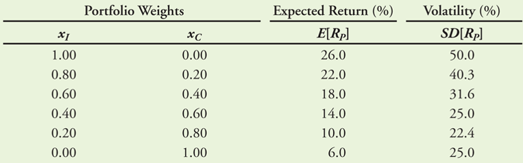{fig-align="center"} Expected returns and volatility for different
portfolios of two stocks.

## But wait... "an efficient portfolio"? {.smaller}

- We define as efficient, all portfolios with:

  - Minimum variance for a given expected return;

  - Maximum expected return for a given variance.

- A portfolio is inefficient when it is possible to find another
  portfolio which has a larger expected return and a lower or equal
  volatility.

- Hence: investors who simultaneously maximise the expected return on
  their portfolio and minimise risk, will choose an efficient portfolio.

## Back to our example

::: {.center}
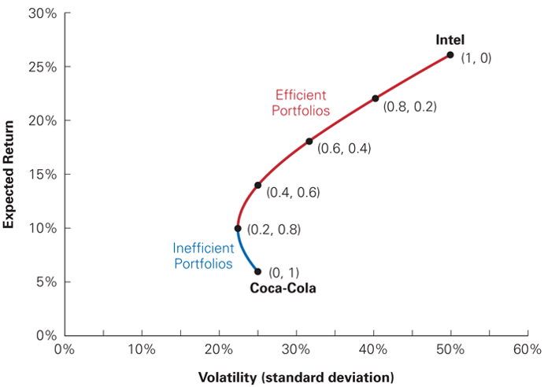{fig-align="center"}
:::

## Improving returns with an efficient portfolio: the effect of correlation

- Consider a portfolio which consists to 100% of Coca-Cola stocks

- How can you maximize the expected return of this portfolio without
  increasing its volatility?

## Improving returns with an efficient portfolio: the effect of correlation (con't)

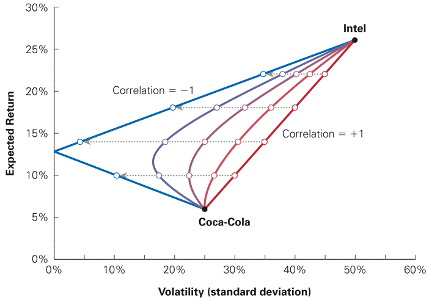{fig-align="center"}

## The minimum variance portfolio {.smaller}

- It is easy to find the minimum variance portfolio in the case of two
  stocks: $$\begin{aligned}
  \min_{x} \ \sigma^{2}_{p} = x^{2} \sigma^{2}_{1} + \left(1-x\right)^{2} \sigma^{2}_{2} + 2(1-x)x\sigma_{1}\sigma_{2} \rho_{1,2}
  \end{aligned}$$ The first-order condition is $$\begin{aligned}
  2 x \sigma^{2}_{1} - 2 (1-x) \sigma^{2}_{2} + 2 \sigma_{1}\sigma_{2}\rho_{1,2} - 4 x \sigma_{1} \sigma_{2} \rho_{1,2} = 0
  \end{aligned}$$
  $$\Leftrightarrow \ \ \ x = \frac{\sigma^{2}_{2}-\sigma_{1}\sigma_{2}\rho_{1,2}}{\sigma^{2}_{1}+\sigma^{2}_{2}-2\sigma_{1}\sigma_{2}\rho_{1,2}}.$$

## Short sales

- Short sales make it possible to benefit from falling stock prices.
  $\rightarrow$ Strategy:

  - Take a short position: borrow and sell a stock.

  - Close a short position: buy the stock back and return it.

- Usually done when you expect the price to go down.

## Short sales

::: {.center}
{fig-align="center"}

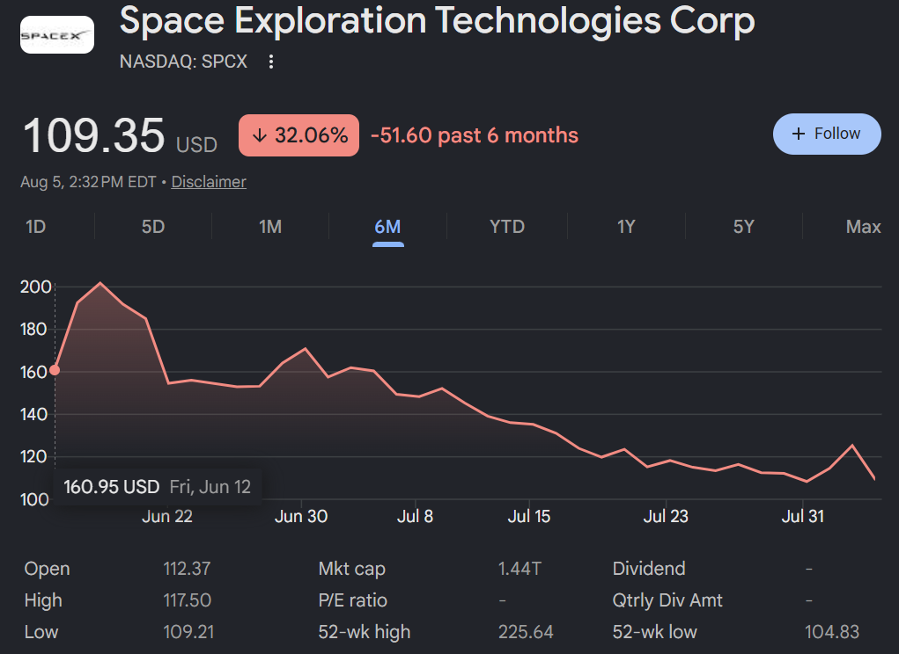{fig-align="center"}
:::

## Short sales {.smaller}

- Example: short sale of Stock A for a value of 100 and investment of
  the proceeds at the risk-free rate of 5% for one year. Consider the
  following scenarios at the end of the year:

  ::: {.center}
  | Return of Stock A           |  10% |   0% | -10% | -20% |
  |:----------------------------|-----:|-----:|-----:|-----:|
  | Position in risk-free asset |  105 |  105 |  105 |  105 |
  | Short position              | -110 | -100 |  -90 |  -80 |
  | Gain/loss                   |   -5 |    5 |   15 |   25 |
  :::

- Mathematically, a short position corresponds to a negative portfolio
  weight in the stock.

## Return of a portfolio with short sales

- Jérôme has 20 000 EUR available to invest for one year.

- He decides to sell short for a total of 10 000 EUR Coca-Cola stocks to
  buy Intel stocks for a total of 30 000 EUR

  - Remark: we still assume that the correlation between the two stocks
    is zero.

- What is the expected return and the volatility of his portfolio?

##

::: {.center}
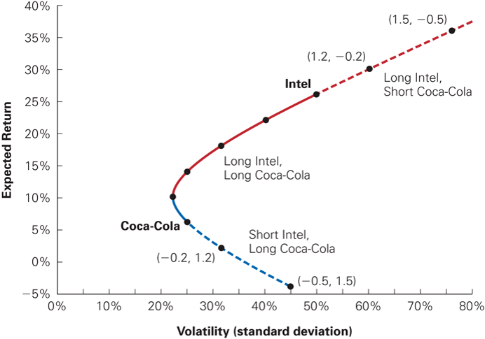{fig-align="center"}
:::

## B. $N$ risky stocks: the efficient frontier {.smaller}

- What is the effect of adding a third stock to a portfolio of Coca-Cola
  and Intel?

- We assume that the stock of Bore Industries is uncorrelated with the
  other two stocks and that its expected return is only 2% and its
  volatility is the same as the one of the Coca-Cola stock (25%).

- Reminder: You would have to use this formula: $$\begin{aligned}
  \text{Var}\left[R_{p}\right] & = \text{Cov}\left[R_{p}, R_{p} \right] = \sum^{N}_{i=1} x_{i} \text{Cov}\left[R_{i}, R_{p} \right], \\
  & = \sum^{N}_{i=1} x_{i} \text{Cov}\left[R_{i},\sum^{N}_{j=1} x_{j}R_{j} \right]  = \sum^{N}_{i=1} x_{i} \sum^{N}_{j=1} x_{j}\text{Cov}\left[R_{i},R_{j} \right],  \\
  & = \sum^{N}_{i=1} \sum^{N}_{j=1} x_{i}  x_{j}\text{Cov}\left[R_{i},R_{j} \right].
  \end{aligned}$$

## Expected return and volatility for selected portfolios of Intel, Coca-Cola, and Bore Industries stocks

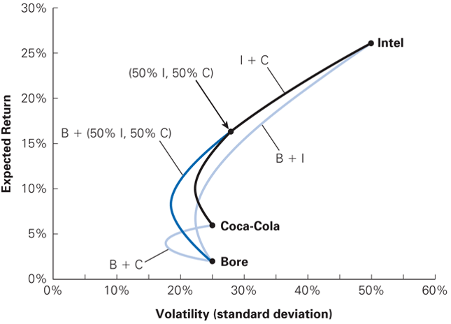{fig-align="center"}

## Volatility and expected return for all portfolios of Intel, Coca-Cola, and Bore stock

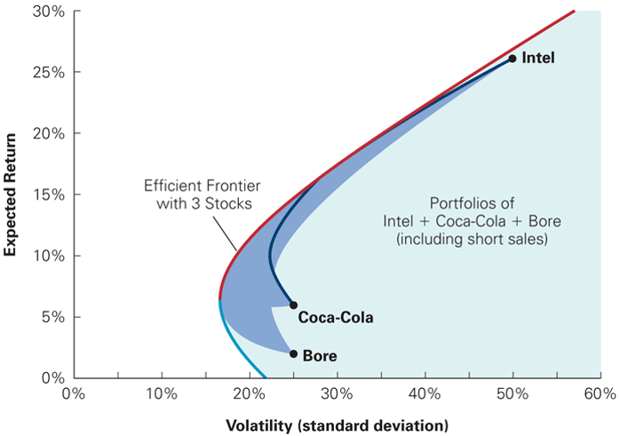{fig-align="center"}

## Efficient frontier with three versus ten stocks

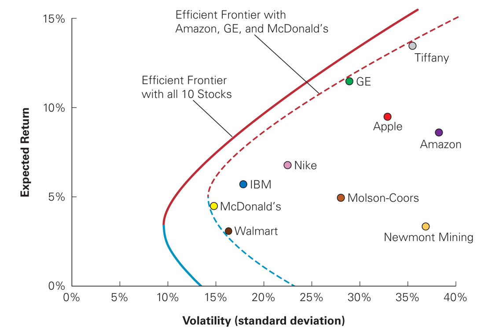{fig-align="center"}

## Summary on efficient portfolios {.smaller}

- We define as efficient, any portfolio with minimum variance for a
  given expected return.

  - Or: any portfolio with maximum return for a given level of risk.

- The efficient frontier is then the set of efficient portfolios.

  - It can be shown that it is the upper part of a hyperbola in the
    ($E(R)$, $\sigma$) plane.

- Augmenting the number of securities included in a portfolio allows to
  obtain an efficient portfolio with a lower risk, for a given level of
  expected return.

- Remark: an efficient portfolio may contain some short positions.

## C. The "super-efficient" portfolio

- Up to now, the efficient portfolio only contained risky securities.

  - The investment decision depends on the preferences ("risk vs
    return") of each investor

- Let us allow investors to invest in a risk-free asset

  - Its return is denoted by $r_f$ (risk-free rate)

  - Zero risk

## Risky asset and risk-free investment: the effect of leverage (James Tobin, 1958) {.smaller .dense}

Two investments are available:

- Stocks of Umbrella Inc:

  ::: {.center}
  +-----------------+-----------------+---------+
  | Return          | Expected return | St.Dev. |
  +:========:+:====:+:===============:+:=======:+
  | Sun      | Rain |                 |         |
  +----------+------+-----------------+---------+
  | 1-2 -10% | 30%  | 10%             | 20%     |
  +----------+------+-----------------+---------+
  :::

- A risk-free bank deposit

  ::: {.center}
  +---------------+-----------------+---------+
  | Return        | Expected return | St.Dev. |
  +:======:+:====:+:===============:+:=======:+
  | Sun    | Rain |                 |         |
  +--------+------+-----------------+---------+
  | 1-2 3% | 3%   | 3%              | 0%      |
  +--------+------+-----------------+---------+
  :::

## Risky asset and risk-free investment: the effect of leverage (con't)

Invest 50 in Umbrella Inc and 50 in the bank account:

::: {.center}
:::

## Risky asset and risk-free investment: the effect of leverage (con't 2)

Borrow 50 and invest 150 in Umbrella Inc:

::: {.center}
:::

## Risky asset and risk-free investment: the effect of leverage (con't 3)

Possible combinations in the risk-return diagram
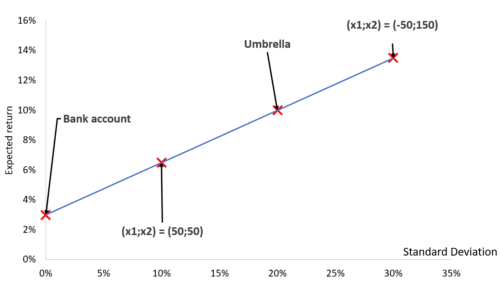{fig-align="center"}

## Leverage effect: general formula for the expected portfolio return and risk {.smaller .dense}

- Expected return: weighted average (by the fraction invested) of each
  constituent's return:
  $E\left(R_{p}\right) = \sum^{N}_{i=1} x_{i} \times E\left(R_{i}\right)+x_{f} r_{f},$
  where assets $i = 1, \dots, N$ are risky and
  $x_{f}+\sum^{N}_{i=1} x_{i}=1$.

- Risk:\
  If $N=1$, then $\sigma_{p} = x \sigma$, where $x$ is the fraction
  invested in the risky asset and $\sigma$ is its volatility.\
  If $N>1$, then it suffices to calculate portfolio variance using only
  the risky assets with

  $$\sigma^{2}_{p} = \sum^{N}_{i=1} x^{2}_{i} \sigma^{2}_{i} + \sum^{N}_{i=1} \sum^{N}_{\overset{j=1}{j \ne i}} x_{i} x_{j} \text{Cov}\left(R_{i}, R_{j}\right),$$

  and take $\sigma_{p} = \sqrt{\sigma^{2}_{p}}$.

- Borrowing thereby corresponds to a negative portfolio weight in the
  risk-free asset, $x_{f}<0$.

## Leverage effect: consequences {.smaller}

The possibility to change the risk and return of a portfolio with a
risk-free security has two fundamental consequences.

1.  It is easy to generate high returns ...if a high level of risk is
    taken. $\Rightarrow$ Never analyse a return without also analysing
    its risk.

2.  It is now possible to select objectively between two risky
    investments: $\Rightarrow$ The portfolio which generates the highest
    slope in the ($E(R)$, $\sigma$) plane is preferred, **regardless of
    the risk aversion**.

## Sharpe ratio: identification of the best investment

- Sharpe ratio:
  $$\frac{\operatorname{Excess \ return \ of \ the \ portfolio}}{\operatorname{Portfolio \ volatility}} = \frac{E\left[R_{p}\right]-r_{f}}{\sigma_{p}}.$$

- **Remark:** Here, the best investment does not depend on the aversion
  to risk. $\Rightarrow$ Regardless of the risk aversion, all investors
  should hold the portfolio of risky assets

## What is the link between leverage, diversification, and efficient portfolios? {.smaller}

- If investors can invest and borrow at the risk-free rate, only one
  risky portfolio is efficient: the "tangency portfolio" or
  "super-efficient portfolio."

- Conclusion:

  - From a given set of risky securities, investors should construct the
    same portfolio.

  - They will then adjust for their risk-aversion by investing/borrowing
    at the risk-free rate. $\Rightarrow$ Two fund separation theorem
    (James Tobin)

- It can then be shown that the efficient frontier is a half straight
  line, tangent to the Markowitz's hyperbola. The tangency point is the
  ...tangency portfolio.

## The efficient frontier with a risk-free asset

::: {.center}
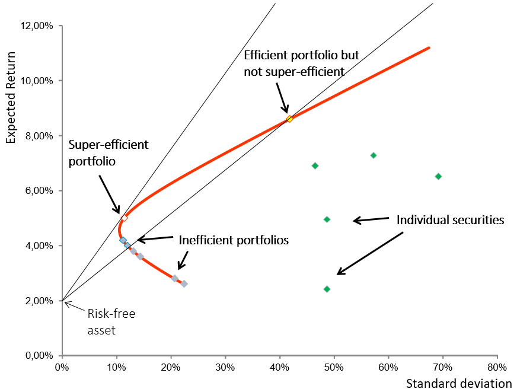{fig-align="center"}
:::

## Summary on efficient frontier with a risk-free asset {.smaller}

- It can be shown that the equation of the efficient frontier WITH
  risk-free asset (e.g., with borrowing/leverage) is given by:
  $$E\left(R_{p}\right)=r_{f}+\underbrace{\frac{E\left(R_{T}\right)-r_{f}}{\sigma_{T}}\sigma_{p}}_{Risk \ premium},$$
  where the subscript $p$ corresponds to the efficient portfolio and the
  subscript T to the tangency (or "super-efficient") portfolio

  - **Reminder**: all efficient portfolios contain the tangency
    portfolio and the risk-free asset (long or short)

## Two types of risk

1.  **Systematic risk**: common to all securities.

    ::: {.center}
    {fig-align="center"}
    :::

2.  **Idiosyncratic risk**: specific to one security.

    ::: {.center}
    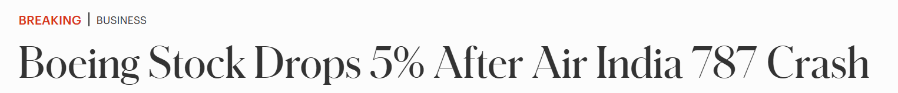{fig-align="center"}
    :::

## Diversification and risk {.smaller}

- Which risk do investors reduce by diversifying their portfolios?

  - The **systematic** risk? \[risk common to all securities\]

  - The **idiosyncratic** risk? \[risk specific to a particular
    security\]

- Remark: the variance of any portfolio can be written as
  $$\sigma^{2}_{p}  = \sum^{N}_{i=1} x^{2}_{i} \sigma^{2}_{i} + \sum^{N}_{i=1} \sum^{N}_{\overset{j=1}{j\ne i}} x_{i}  x_{j}\text{Cov}\left[R_{i},R_{j} \right].$$

- Not clear? Take $x_{i} = 1/N$ (equally-weighted portfolio)

## Diversification and risk: a simple example

Volatility of an equally-weighted portfolio versus the number of stocks

::: {.center}
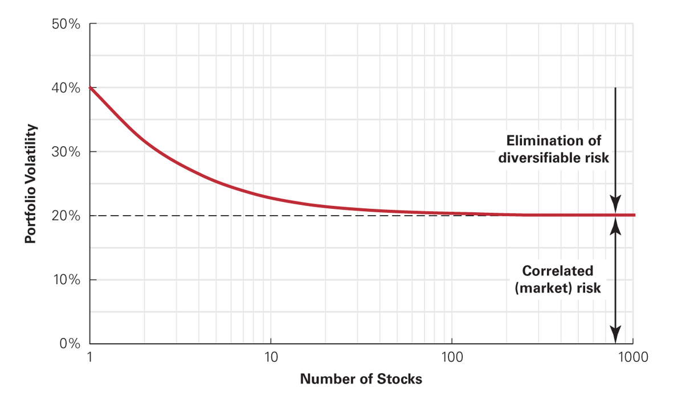{fig-align="center"}
:::

## Diversification and risk: summary {.smaller .dense}

::::::: {.columns}
:::: {.column width="48%"}

::: {.box .box-a}
Common risk [Market-wide:]{.underline} economic conditions, interest and
exchange rates, inflation, ... **The asset is affected by the evolution
of the market** (with its own sensitivity)
:::
::::

:::: {.column width="48%"}

::: {.box .box-a}
Independent risk [Specific to the firm/security i :]{.underline} product
market, quality of the management, operational risk, ...
:::
::::
:::::::

:::::::::: {.columns}
::::: {.column width="48%"}

::: {.center}
$\downarrow$
:::

::: {.box .box-a}
**Systematic** risk = **Undiversifiable** risk (market risk)
:::
:::::

::: {.column width="4%"}

:::

::::: {.column width="48%"}

::: {.center}
$\downarrow$
:::

::: {.box .box-a}
**Idiosyncratic** risk = **Diversifiable** risk
:::
:::::
::::::::::

## Exercise 1: Optimal Portfolio Choice with one risky asset {.smaller}

- Stock A trades today for a price of EUR 100. Depending on the
  evolution of the economy, the price of Stock A in one year will be:

  - 120 with probability 0.5 (expansion)

  - 100 with probability 0.5 (recession)

- The risk-free rate is 5%

- The investment fund AlwaysMore claims to offer an investment product
  which is superior to Stock A. For an initial investment of 220, it
  commits itself to pay in one year:

  - 320 in the expansion

  - 200 in the recession.

- Should you accept this offer? If not, what is the highest price you
  are willing to pay for this investment?

## Exercise 2: Optimal Portfolio Choice with two risky assets {.smaller}

- You want to form a portfolio with two stocks A and B. These stocks
  have expected returns of $E_A =10\%$ and $E_B =15\%$ with standard
  deviations of $\sigma_{A} = 15\%$ and $\sigma_{B} = 25\%$. The
  correlation coefficient between the two stocks is $-0.3$.

1.  What is the risk and return of a portfolio invested to 40% in A and
    60% in B?

2.  If you want to achieve an expected return of 11%, how much risk do
    you need to take?

3.  Suppose that you can invest in the two stocks and also invest and
    borrow at the risk-free rate of 5%. Show that you can construct a
    portfolio with the same return than stock A but with a lower risk.

## Exercise (diversification) {.smaller}

- You can invest in two stocks with the following characteristics

  ::: {.center}
  |       |                 |         |
  |:-----:|:---------------:|:-------:|
  | Stock | Expected Return | St.Dev. |
  |   A   |       12%       |   15%   |
  |   B   |       20%       |   45%   |
  :::

- What is the risk and the return of a portfolio invested to 50% in A
  and 50% in B if the correlation coefficient is 0.2?

- If the stocks are perfectly negatively correlated, what is the
  portfolio with the lowest risk?

## Quiz

- Define the leverage effect

- Define the diversification effect

- Is it possible to augment the return of a portfolio with the risk-free
  asset?

  - What happens then to the risk of the portfolio?

- If the stocks are not perfectly correlated, then the risk of the
  portfolio is always: a) lower, b) larger c) equal to the weighted
  average of the individual risks?

## Quiz {.smaller}

- Is it possible to fix the level of risk of a portfolio and how?

- Is it possible to fix the level of expected return of a portfolio and
  how?

- In which case can it be advantageous to buy a stock with higher risk
  and lower expected return?

- What are short sales?

- What are you betting on in the case of a short sale?

- What does a short position correspond to in terms of portfolio weight?
