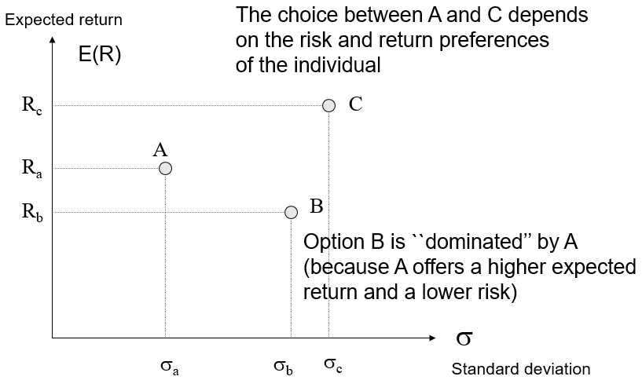
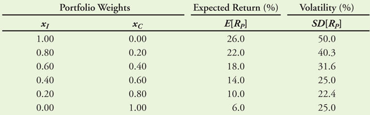
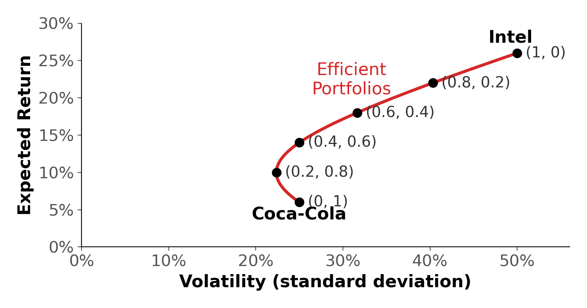
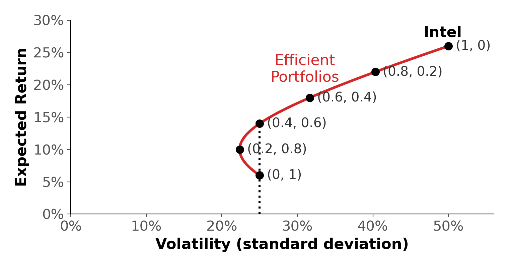
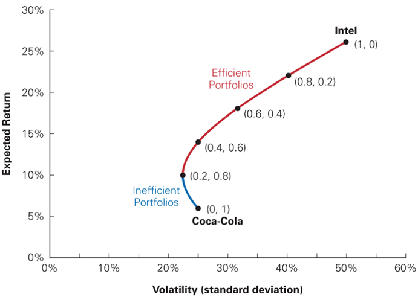
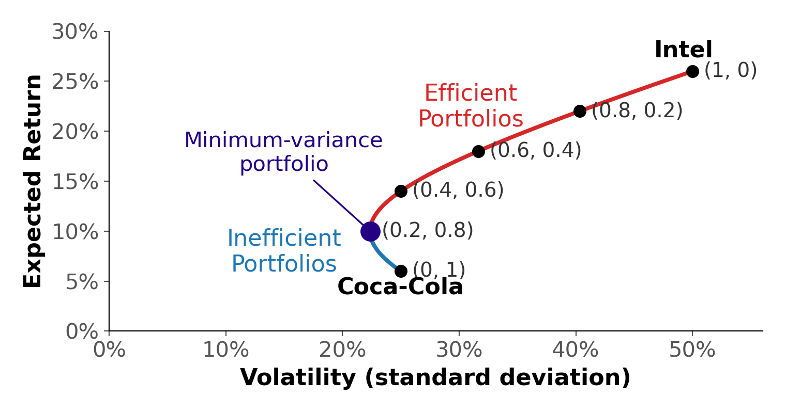
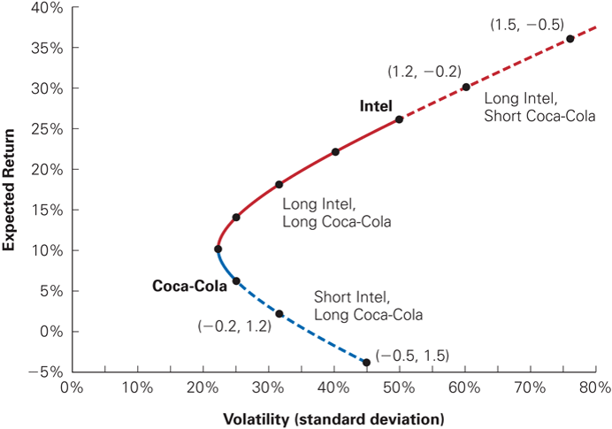
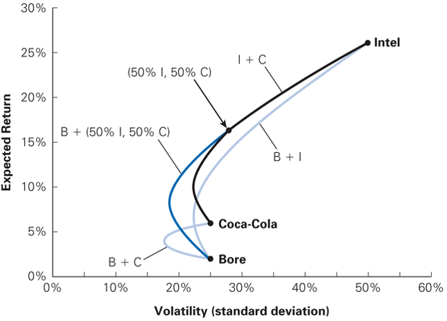
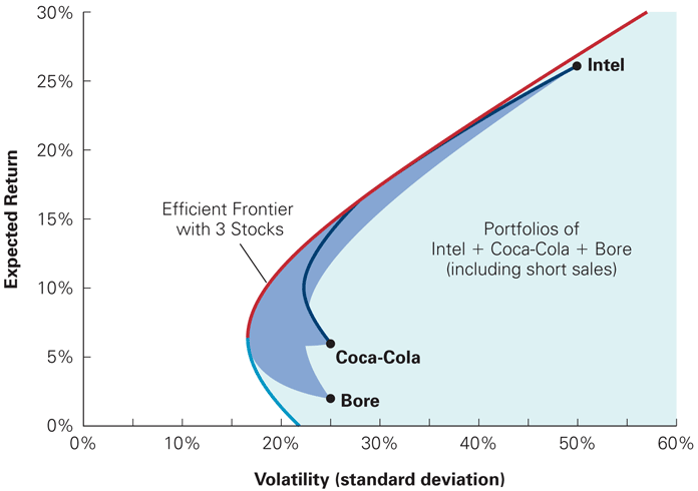
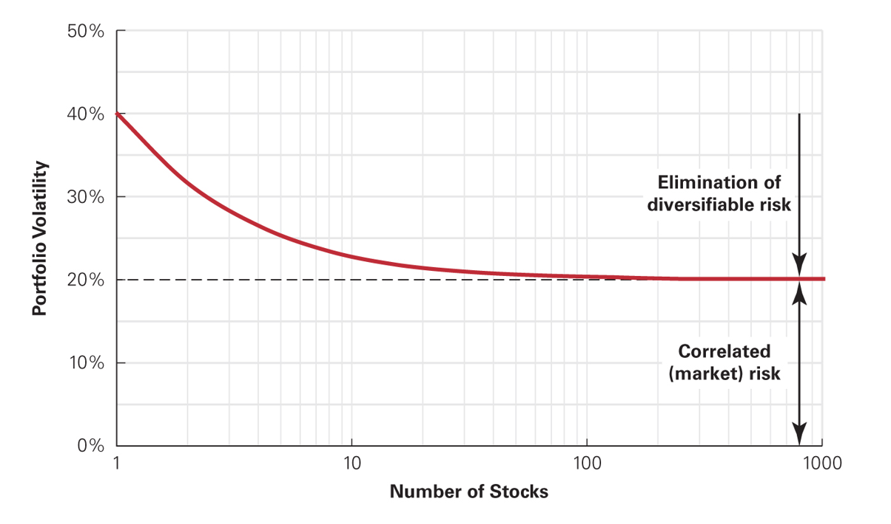

## Plan

- Recap from lecture 2

- Find the efficient portfolios built from two stocks

- Move from two stocks to many: the efficient frontier

- Add a risk-free asset and identify the single best risky portfolio: The “super-efficient” portfolio

- Separate the risk that diversification removes from the risk that stays

Mostly based on the BDM textbook Chap. 11.2-5.

## {.center}

::: {.content-visible when-format="revealjs"}
::: {.center .huge}
Recap lecture 2
:::
:::

```{=latex}
\vfill
\begin{center}
{\color{escpblue}\Huge\bfseries Recap lecture 2}
\end{center}
\vfill
```

## Recap of Lecture 2 {.smaller}

Let's do a recap:

- Portfolio choice: in what to invest?

- The mean-variance framework

- The utility function

- The three monsters: covariance, correlation, beta

- Diversification and its link with correlation

- Portfolio return, variance and standard deviation

## Recap: portfolio choice, in what to invest? {.smaller}

- You have money to invest and many assets to choose from. A **portfolio** is
  the answer to one question: how much of the money goes into each asset?

- We start the analysis with only 2 assets, but we will extend it.

- Formally, we answer this question by choosing the weights $x_{1}$ and $x_{2}$:
  the percentage of the portfolio we invest in each asset, with $x_{1} + x_{2} = 1$.

- Two assets held together are not the same thing as each asset on its own:
  the portfolio's risk depends on how the assets move relative to each other.

- Lecture 2 built the tools to describe any portfolio by its expected return
  and its risk.

## Recap: the mean-variance framework {.smaller}

- Investors care about two things: **expected return** (more is better) and
  **risk**, measured by the variance or its square root, the standard deviation (less
  is better).

- Every asset is a point on a chart with risk on the horizontal axis and
  expected return on the vertical axis.

::: {.center}
{fig-align="center" width="40%"}
:::

- The mean variance framework is defined by two equivalent rules: for a given return, minimise risk; for a given risk,
  maximise return.

## Recap: the utility function {.smaller}

- The trade-off between return and risk is written as a **utility function**: a
  score of how satisfied an investor is with a risky investment. We model investors behavior
  as if they act to maximize this function.

  $$U = E(W) - \frac{\gamma}{2}\,\text{Var}(W)$$

- $E(W)$ is the expected final wealth and $\text{Var}(W)$ its variance. The
  score rises with the mean and falls with the variance.

- Remember that wealth $W$ is a **random variable**: it is uncertain, we do not
  know the result of the investment before we invest. We can only characterize
  its past behaviour with the mean and the variance.

- $\gamma > 0$ is the **risk aversion**: A higher $\gamma$ means a more cautious
  investor.

## Recap: the three monsters {.smaller}

| Measure | Formula | What it tells us | Range |
|:--------|:--------|:-----------------|:------|
| Covariance | $\sigma_{X,Y}$ | Do $X$ and $Y$ move together? | any number |
| Correlation | $\sigma_{X,Y} / (\sigma_{X}\sigma_{Y})$ | How strongly, on a fixed scale | $-1$ to $+1$ |
| Beta | $\sigma_{X,Y} / \sigma_{X}^{2}$ | How much $Y$ moves when $X$ moves 1% | any number |

- All three are built from the covariance: for each year, the distance of $X$
  from its mean times the distance of $Y$ from its mean, averaged.

  $$\text{Cov}\left(R_{i},R_{j}\right) = \frac{1}{T-1} \sum^{T}_{t=1}\left(R_{it} - \overline{R}_{i}\right)\left(R_{jt} - \overline{R}_{j}\right)$$

- Positive: they tend to move together. Negative: in opposite directions.

## Recap: correlation and beta {.smaller}

- **Correlation**: the covariance divided by the two volatilities. The units
  cancel, so the result always lies between $-1$ and $+1$.

  $$\rho_{X,Y} = \text{Corr}\left(R_{i},R_{j}\right) = \frac{\text{Cov}\left(R_{i},R_{j}\right)}{\sigma_{R_{i}}\,\sigma_{R_{j}}}$$

  $+1$: always move together. $0$: no systematic link. $-1$: always in
  opposite directions.

- **Beta**: the covariance divided by the variance of $X$, the one that does the
  moving. It answers: when $X$ moves by 1%, by how much does $Y$ move on average?

  $$\beta_{Y,X} = \frac{\text{Cov}\left(X,Y\right)}{\text{Var}\left(X\right)} = \frac{\sigma_{X,Y}}{\sigma_{X}^{2}}$$

  A beta of 1.5 with respect to the market: a market rise of 1% comes with a
  rise of about 1.5% for the stock.

## Recap: portfolio return {.smaller}

**The portfolio return**

- The **weights** $x_{1}, x_{2}$ are the fractions of the money in each stock;
  they add up to 1.

- The portfolio return is the **weighted average of the individual returns**:
  each stock's return counts in proportion to the money invested in it.

  $$R_{p} = x_{1}R_{1} + x_{2}R_{2}$$

- Example: 30% in stock 1 and 70% in stock 2, with returns of 10% and 4%, gives
  $R_{p} = 0.3 \times 10\% + 0.7 \times 4\% = 5.8\%$.

## Recap: portfolio variance and volatility {.smaller}

- Risk does not add up the same way. The variance of the portfolio is

  $$\text{Var}\left(R_{p}\right) = \underbrace{x_{1}^{2}\text{Var}\left(R_{1}\right) + x_{2}^{2}\text{Var}\left(R_{2}\right)}_{\text{individual risks}} + \underbrace{2x_{1}x_{2}\text{Cov}\left(R_{1},R_{2}\right)}_{\text{comovement}}$$

- The comovement term is what makes a portfolio different from the sum of its
  parts. The volatility is $\sigma_{R_{p}} = \sqrt{\text{Var}\left(R_{p}\right)}$.

- Since the covariance is the correlation times the two volatilities,
  $\text{Cov}\left(R_{1},R_{2}\right) = \rho_{12}\,\sigma_{1}\,\sigma_{2}$, the same
  variance can be written with the correlation:

  $$\text{Var}\left(R_{p}\right) = x_{1}^{2}\sigma_{1}^{2} + x_{2}^{2}\sigma_{2}^{2} + 2x_{1}x_{2}\,\rho_{12}\,\sigma_{1}\,\sigma_{2}$$

  This is the form that shows how the correlation drives the risk of the
  portfolio (next slide).

## Recap: correlation drives diversification {.smaller}

The correlation term defines how strong the diversification effect will be.

::: {.box .box-a}
**Correlation = 1**. There is no diversification: the portfolio's risk is just
the weighted average of the two risks.
:::

::: {.box .box-a}
**Correlation below 1 (including zero)**. The portfolio's risk is **smaller than
the average risk** of the individual assets. There is diversification.
:::

::: {.box .box-a}
**The stocks tend to move in opposite directions** (negative correlation). A
move in one is usually offset by a move in the other, so diversification is
strongest here. In the extreme case of a correlation of −1 the risks subtract
exactly, and with the right weights the portfolio's risk can be brought down to
zero.
:::

## {.center}

::: {.content-visible when-format="revealjs"}
::: {.center .huge}
Beginning of lecture 3 content
:::

::: {.center .small}
Lecture 2 gave us the tools to measure the return and the risk of any portfolio.
Today we use them to answer the real question: among all the portfolios we could
build, which ones are worth holding?
:::
:::

```{=latex}
\vfill
\begin{center}
{\color{escpblue}\Huge\bfseries Beginning of lecture 3 content}

\vspace{1.5em}
\begin{minipage}{0.8\textwidth}
\small\centering
Lecture 2 gave us the tools to measure the return and the risk of any portfolio.
Today we use them to answer the real question: among all the portfolios we could
build, which ones are worth holding?
\end{minipage}
\end{center}
\vfill
```

## A. Efficient portfolios with two stocks

::: {.center}
|   Stock   | Expected return | Volatility |
|:---------:|:---------------:|:----------:|
|   Intel   |       26%       |    50%     |
| Coca-Cola |       6%        |    25%     |
:::

- We assume that the correlation between the two stocks is zero.

  - Which portfolio should we choose?

## Efficient portfolios with two stocks (con't 2) {.smaller}

- Which portfolio should we choose?

- Example: portfolio invested to 40% in Intel and 60% in Coca-Cola.

. . .

$$\begin{aligned}
E\left[R_{40-60}\right]& = x_{I} E\left[R_{I}\right] + x_{C} E\left[R_{C}\right] = 0.4\times 0.26 + 0.6 \times 0.06 =  0.14 \\
& \\
\text{Var}\left[R_{40-60}\right] & = x_{I}^{2} \text{Var}\left[R_{I}\right]+x_{C}^{2} \text{Var}\left[R_{C}\right]+2x_{I}x_{C}Corr\left(R_{I}, R_{C}\right) \sigma_{I} \sigma_{C} \\
& = 0.4^{2} \times 0.5^{2} + 0.6^{2} \times 0.25^{2}+0 \\
& = 0.0625 \\
& \\
\sigma_{40-60} & = \sqrt{0.0625} = 25\%
\end{aligned}$$

## Efficient portfolios with two stocks (con't 3)

{fig-align="center"} Expected returns and volatility for different
portfolios of two stocks.

## From the table to the frontier {.smaller}

::: {.center}
{width="52%"}
:::

Each row is one portfolio; plotted as points they trace the curve of all
two-stock portfolios, whose upper part is the **efficient** set.

::: {.center}
{width="52%"}
:::

## Efficient portfolios {.smaller}

- We define as efficient, all portfolios with:

  - Minimum variance for a given expected return;

  - Maximum expected return for a given variance.

- A portfolio is **INefficient** when it is possible to find another
  portfolio which has a larger expected return and a lower or equal
  volatility.

- To know if a portfolio is efficient we ask **two** questions: is there a portfolio witht
the same return but lower risk? is there one with the same risk but higher return?

- Hence: investors who simultaneously maximise the expected return on
  their portfolio and minimise risk, will choose an efficient portfolio.


## Same risk, more return? {.smaller}

**If I hold the portfolio (0, 1), all in Coca-Cola, is there a portfolio with
the same volatility but a higher return?**

::: {.center}
{width="66%"}
:::

Follow the dotted line up from 25% volatility: it meets the curve twice.

## The efficient frontier for two stocks

::: {.center}
{fig-align="center"}
:::

## The effect of correlation {.smaller}

:::: {.columns}
::: {.column width="42%"}
::: {style="text-align: left"}
- How much risk you remove by combining two assets depends on their
  correlation, and that is what shapes the frontier.

- **Correlation +1**: risk is a weighted average of the two volatilities. The
  frontier is a straight line: no diversification.

- **Lower correlation**: the curve bends to the left, the same returns at lower
  risk. The gain is largest for negative correlation, and maximal at $-1$.
:::
:::

::: {.column width="58%"}
{fig-align="center" width="100%" style="max-height: 470px"}
:::
::::

## The effect of correlation (con't)

- So, a good way to reduce the risk of portfolio, or to increase the level of return we can get
for every level of risk is to add assets with a negative correlation.

## The minimum-variance portfolio: what it is {.smaller}

::: {.center}
{width="48%"}
:::

- The combination of the two stocks with the **lowest risk**: the leftmost
  point, the "nose" where the curve turns back. Here (0.2, 0.8), with 22.4%
  volatility, below either stock alone (25% and 50%).

- The **efficient set begins here**: above it the curve is efficient, below it
  every portfolio is dominated.

- It **ignores expected returns**: its weights depend only on volatilities and
  correlation. The most cautious investor picks it without looking at returns.

## The minimum variance portfolio {.smaller}

- We have the formula for the portfolio variance:

  $$\sigma^{2}_{p} = x_{1}^{2}\sigma^{2}_{1} + x_{2}^{2}\sigma^{2}_{2} + 2x_{1}x_{2}\,\sigma_{1}\sigma_{2}\rho_{1,2}$$

- By definition the two weights add up to one, $x_{1} + x_{2} = 1$, so
  $x_{2} = 1 - x_{1}$. Replacing $x_{2}$ in the formula leaves a single
  unknown, $x_{1}$:

  $$\sigma^{2}_{p} = x_{1}^{2}\sigma^{2}_{1} + \left(1-x_{1}\right)^{2}\sigma^{2}_{2} + 2x_{1}\left(1-x_{1}\right)\sigma_{1}\sigma_{2}\rho_{1,2}$$

- The minimum variance portfolio is the value of $x_{1}$ that makes this
  expression as small as possible:

  $$\min_{x_{1}} \ \sigma^{2}_{p}$$

## The minimum variance portfolio (con't) {.smaller}

- Take the derivative with respect to $x_{1}$ and set it to zero (the
  first-order condition):

  $$2x_{1}\sigma^{2}_{1} - 2\left(1-x_{1}\right)\sigma^{2}_{2} + 2\sigma_{1}\sigma_{2}\rho_{1,2} - 4x_{1}\sigma_{1}\sigma_{2}\rho_{1,2} = 0$$

- Solve for $x_{1}$:

  $$x_{1} = \frac{\sigma^{2}_{2}-\sigma_{1}\sigma_{2}\rho_{1,2}}{\sigma^{2}_{1}+\sigma^{2}_{2}-2\sigma_{1}\sigma_{2}\rho_{1,2}}
  \qquad\qquad x_{2} = 1 - x_{1}$$

- Only volatilities and the correlation appear: the expected returns play no
  role. Check with Intel and Coca-Cola ($\rho_{1,2} = 0$):
  $x_{1} = 0.25^{2} / (0.5^{2} + 0.25^{2}) = 0.2$, the portfolio (0.2, 0.8).

## Short sales: a reminder from Lecture 2 {.smaller}

- A **short sale** is selling a stock you do not own. You borrow the share (in
  practice from your broker), sell it today, and buy it back later to return it.
  You hold the cash now and owe one share later.

- You **gain if the price falls**: sell at 100, buy back at 60, return the share,
  keep 40. You **lose if it rises**: buying back at 150 costs you 50. And there
  is no ceiling on the loss, because a price can keep rising.

- In the portfolio formula a short sale is a **negative weight**. Short EUR 50 of
  stock 1 and put EUR 150 into stock 2: $x_{1} = -0.5$, $x_{2} = 1.5$, still adding
  up to 1. The return and variance formulas do not change.

- Why it matters here: negative weights **widen the set of portfolios** we can
  build.

## Short sales: an example, step by step {.smaller}

- **Today.** You borrow one share of Stock A, worth 100, and sell it. You now
  hold 100 in cash and owe one share. You put the 100 in the risk-free asset at
  5% for one year.

- **In one year.** Two things happen at once:

  - Your risk-free investment has grown to $100 \times 1.05 = 105$.

  - You must buy one share of A to return it. Its price is $100 \times (1 +$
    return of A$)$: if A rose 10%, buying it back costs 110; if it fell 20%,
    only 80.

- **Your gain or loss** is what you have (105) minus what you must pay to buy the
  share back.

## Short sales: an example, step by step (con't) {.smaller}

::: {.center}
| Return of Stock A                   |  10% |   0% | -10% | -20% |
|:------------------------------------|-----:|-----:|-----:|-----:|
| Cash from the risk-free asset       |  105 |  105 |  105 |  105 |
| Cost of buying the share back       |  110 |  100 |   90 |   80 |
| **Gain/loss** (cash minus cost)     |   -5 |    5 |   15 |   25 |
:::

- Read down a column: when A **rises** 10%, buying it back costs 110, more than
  the 105 you have, so you lose 5. When A **falls** 20%, buying it back costs
  only 80, so you keep 25.

- The short position is worth **minus** the price of the share: a short sale is
  a **negative weight** in Stock A. The lower A goes, the more you gain.

## Return of a portfolio with short sales

- Jérôme has 20 000 EUR available to invest for one year.

- He decides to sell short for a total of 10 000 EUR Coca-Cola stocks to
  buy Intel stocks for a total of 30 000 EUR

  - Remark: we still assume that the correlation between the two stocks
    is zero.

- What is the expected return and the volatility of his portfolio?

## Return of a portfolio with short sales: solution {.smaller}

- **Weights.** Jérôme's own money is 20 000. He holds 30 000 of Intel and owes
  10 000 of Coca-Cola:

  $$x_{I} = \frac{30\,000}{20\,000} = 1.5 \qquad x_{C} = \frac{-10\,000}{20\,000} = -0.5 \qquad x_{I} + x_{C} = 1$$

- **Expected return.** Same formula as before; the negative weight simply
  subtracts Coca-Cola's return:

  $$E[R_{p}] = 1.5 \times 26\% + (-0.5) \times 6\% = 39\% - 3\% = 36\%$$

## Return of a portfolio with short sales: solution (con't) {.smaller}

- **Variance and volatility.** Zero correlation, so the covariance term is
  zero; the negative weight is squared, so it still adds risk:

  $$\text{Var}(R_{p}) = 1.5^{2} \times 0.5^{2} + (-0.5)^{2} \times 0.25^{2} = 0.5625 + 0.0156 = 0.578$$

  $$\sigma_{p} = \sqrt{0.578} = 76\%$$

- More return than Intel alone (36% vs 26%) but much more risk (76% vs 50%):
  short selling extends the curve beyond Intel, as the next figure shows.

##

::: {.center}
{fig-align="center"}
:::

## B. $N$ risky stocks: the efficient frontier {.smaller}

- What happens to the curve when we add a **third stock** to Intel and
  Coca-Cola?

- Meet **Bore Industries**: expected return only 2%, the same 25% volatility as
  Coca-Cola, and **uncorrelated** with both. On its own it is a poor investment,
  dominated by Coca-Cola.

- Yet adding it helps. Any pair of stocks gives a curve; mixing Bore with a
  50/50 Intel-Coca-Cola portfolio gives a **new curve that lies to the left**
  of the old one: the same returns at lower risk. Bore's returns are unrelated
  to the other two, so part of its risk cancels out in the mix.

- With three stocks we are no longer limited to a curve: every combination is
  now possible, and the portfolios fill a whole **region**. The efficient
  frontier is the **upper-left edge** of that region, further left than the
  two-stock curve.

- Each extra stock pushes the frontier further left. The next slides show the
  three-stock case, then three stocks versus ten.

## Expected return and volatility for selected portfolios of Intel, Coca-Cola, and Bore Industries stocks

{fig-align="center"}

## Volatility and expected return for all portfolios of Intel, Coca-Cola, and Bore stock

{fig-align="center"}

## Efficient frontier with three versus ten stocks

{fig-align="center" width="78%"}

Each stock added moves the frontier left: the same return at a lower risk.

## Summary on efficient portfolios {.smaller}

- A portfolio is **efficient** when no other portfolio offers more return for
  the same risk, or less risk for the same return.

- The **efficient frontier** is the set of all efficient portfolios: the
  upper-left edge of the region of possible portfolios.

- **More stocks, better frontier.** Every stock we add, even a poor one on its
  own, moves the frontier further left. The best frontier uses all available
  investments.

- Efficient portfolios may include **short positions**.

- One thing is still missing: so far every portfolio is made only of **risky**
  stocks. What if we can also lend or borrow at a risk-free rate?

## Portfolio variance with $N$ stocks {.smaller}

With more stocks the formula is the same, only longer. For three stocks:

$$\text{Var}\left(R_{p}\right) = \underbrace{x_{1}^{2}\sigma_{1}^{2} + x_{2}^{2}\sigma_{2}^{2} + x_{3}^{2}\sigma_{3}^{2}}_{\text{own risk of each stock}}$$

$$+\ \underbrace{2x_{1}x_{2}\sigma_{1,2} + 2x_{1}x_{3}\sigma_{1,3} + 2x_{2}x_{3}\sigma_{2,3}}_{\text{how the stocks move together}}$$

- **Own risk**: one term per stock, its weight squared times its variance.

- **Comovement**: one term for every *pair* of stocks, where $\sigma_{1,2}$ is
  the covariance between stocks 1 and 2, counted twice.

With 3 stocks: 3 variance terms and 3 pairs. With 50 stocks: 50 variance terms
and 1,225 pairs. **In a large portfolio the risk comes mostly from the
covariances**, not from each stock's own variance.

## Portfolio variance with $N$ stocks (con't) {.smaller .dense}

$$\text{Var}\left(R_{p}\right) = \sum_{i=1}^{N}\sum_{j=1}^{N} x_{i}\,x_{j}\,\sigma_{i,j}$$

In words: for every pair of stocks $i$ and $j$, multiply their two weights by
their covariance, then add up. Written out:

$$\text{Var}\left(R_{p}\right) = x_{1}^{2}\sigma_{1}^{2} + \cdots + x_{N}^{2}\sigma_{N}^{2} \; + \; 2x_{1}x_{2}\sigma_{1,2} + 2x_{1}x_{3}\sigma_{1,3} + \cdots + 2x_{N-1}x_{N}\sigma_{N-1,N}$$

Those pairs fit in a square table, one row and one column per stock. **The
variance is the sum of all its cells.**

|             | **Stock 1**               | **Stock 2**               | **Stock 3**               | $\cdots$ | **Stock N**               |
|-------------|---------------------------|---------------------------|---------------------------|----------|---------------------------|
| **Stock 1** | $x_{1}^{2}\sigma_{1}^{2}$ | $x_{1}x_{2}\sigma_{1,2}$  | $x_{1}x_{3}\sigma_{1,3}$  | $\cdots$ | $x_{1}x_{N}\sigma_{1,N}$  |
| **Stock 2** | $x_{2}x_{1}\sigma_{1,2}$  | $x_{2}^{2}\sigma_{2}^{2}$ | $x_{2}x_{3}\sigma_{2,3}$  | $\cdots$ | $x_{2}x_{N}\sigma_{2,N}$  |
| **Stock 3** | $x_{3}x_{1}\sigma_{1,3}$  | $x_{3}x_{2}\sigma_{2,3}$  | $x_{3}^{2}\sigma_{3}^{2}$ | $\cdots$ | $x_{3}x_{N}\sigma_{3,N}$  |
| $\vdots$    |                           |                           |                           |          |                           |
| **Stock N** | $x_{N}x_{1}\sigma_{1,N}$  | $x_{N}x_{2}\sigma_{2,N}$  | $x_{N}x_{3}\sigma_{3,N}$  | $\cdots$ | $x_{N}^{2}\sigma_{N}^{2}$ |

- **The diagonal** ($N$ cells): each stock paired with itself, so the cell is its
  own variance. These are the first terms of the formula.

- **Off the diagonal** ($N^{2}-N$ cells): the covariances, each pair appearing
  twice, which is where the $2$ in front of each covariance term comes from. In
  a large portfolio these cells are the vast majority: **they decide the risk**.

## C. Adding a risk-free asset {.smaller}

- Besides diversifying, there is a second way to control risk: keep part of
  the money in a **risk-free asset**, such as a bank deposit or Treasury bills.

- Its return, the **risk-free rate** $r_{f}$, is known in advance: zero
  volatility, and zero correlation with every stock.

- We can also do the reverse: **borrow** at $r_{f}$ and invest more than our own
  money in risky assets. This is called **leverage**, or buying on margin.

- The question for this section: what do the possible portfolios look like once
  we mix a risky investment with the risk-free asset? We start with a simple
  example due to James Tobin (1958).

## Tobin's example: two investments {.smaller}

Next year is either sunny or rainy, each with probability one half.

- **Umbrella Inc.** loses money in the sun and makes money in the rain.

- A **bank deposit** pays 3% whatever the weather.

::: {.center}
| Investment | Sun     | Rain    | Expected return | Volatility |
|:-----------|:-------:|:-------:|:---------------:|:----------:|
| Umbrella   | $-10\%$ | $+30\%$ | $10\%$          | $20\%$     |
| Deposit    | $+3\%$  | $+3\%$  | $3\%$           | $0\%$      |
:::

- Umbrella: expected return $0.5 \times (-10\%) + 0.5 \times 30\% = 10\%$; each
  outcome is 20 points from it, so the volatility is $20\%$.

- The deposit has no risk but a much lower return. Can we get something in
  between? Can we get *more* than Umbrella?

## Step 1: 50 in Umbrella, 50 in the bank {.smaller}

- You have 100. Put 50 in Umbrella and 50 in the deposit: weights
  $x_{U} = 0.5$ and $x_{f} = 0.5$.

- Return in each state, then its mean and spread:

::: {.center}
| State | Portfolio return                                   |
|:------|:---------------------------------------------------|
| Sun   | $0.5 \times (-10\%) + 0.5 \times 3\% = -3.5\%$     |
| Rain  | $0.5 \times 30\% + 0.5 \times 3\% = 16.5\%$        |
:::

  $$E[R_{p}] = \frac{-3.5\% + 16.5\%}{2} = 6.5\% \qquad\qquad \sigma_{p} = 10\%$$

- Both numbers sit exactly **halfway** between the deposit (3%, 0%) and
  Umbrella (10%, 20%). Half the money in the risky asset gives half its risk
  and half its risk premium.

## What is leverage? {.smaller}

- **Leverage is investing with borrowed money**: you put in part of the amount
  and borrow the rest, so you control a position bigger than your own cash.

- Everyday example: a EUR 300,000 flat bought with EUR 60,000 of your own money
  and a EUR 240,000 mortgage. You put up 20% of the price but you get 100% of
  its moves: if the flat gains 10%, your 60,000 gains 50%; if it loses 10%,
  half your money is gone. Firms do the same with debt, funds with margin loans.

- The interest is owed whatever happens, so leverage **magnifies gains and
  losses alike**. It does not make an investment better, it scales it up.

- In our framework nothing new is needed: borrowing at $r_{f}$ is simply a
  **negative weight on the risk-free asset**, $x_{f} < 0$, with the weight on
  the risky asset above 1. The weights still add up to 1, and the same return
  and risk formulas apply.

## Step 2: borrow 50 and put 150 in Umbrella {.smaller}

- Now borrow 50 from the bank at 3% and invest 150 in Umbrella: weights
  $x_{U} = 1.5$ and $x_{f} = -0.5$. Borrowing is a **negative weight** in the
  risk-free asset.

::: {.center}
| State | Portfolio return                                    |
|:------|:----------------------------------------------------|
| Sun   | $1.5 \times (-10\%) - 0.5 \times 3\% = -16.5\%$     |
| Rain  | $1.5 \times 30\% - 0.5 \times 3\% = 43.5\%$         |
:::

  $$E[R_{p}] = \frac{-16.5\% + 43.5\%}{2} = 13.5\% \qquad\qquad \sigma_{p} = 30\%$$

- More expected return than Umbrella alone (13.5% vs 10%), but also more risk
  (30% vs 20%). **Leverage scales both up** in the same proportion: 1.5 times
  the risk, 1.5 times the risk premium.

## All the combinations lie on a straight line {.smaller}

{fig-align="center" width="62%"}

- With a fraction $x$ in Umbrella and $1 - x$ in the bank:
  $E[R_{p}] = r_{f} + x \left( E[R_{U}] - r_{f} \right)$ and
  $\sigma_{p} = x \, \sigma_{U}$.

- Both grow in proportion to $x$, so every mix is a point on the **straight
  line** from the deposit through Umbrella: lending puts you between the two,
  borrowing ($x > 1$) beyond Umbrella.

## Leverage effect: general formula for the expected portfolio return and risk {.smaller .dense}

- Expected return: weighted average (by the fraction invested) of each
  constituent's return:
  $E\left(R_{p}\right) = \sum^{N}_{i=1} x_{i} \times E\left(R_{i}\right)+x_{f} r_{f},$
  where assets $i = 1, \dots, N$ are risky and
  $x_{f}+\sum^{N}_{i=1} x_{i}=1$.

- Risk:\
  If $N=1$, then $\sigma_{p} = x \sigma$, where $x$ is the fraction
  invested in the risky asset and $\sigma$ is its volatility.\
  If $N>1$, then it suffices to calculate portfolio variance using only
  the risky assets with

  $$\sigma^{2}_{p} = \sum^{N}_{i=1} x^{2}_{i} \sigma^{2}_{i} + \sum^{N}_{i=1} \sum^{N}_{\overset{j=1}{j \ne i}} x_{i} x_{j} \text{Cov}\left(R_{i}, R_{j}\right),$$

  and take $\sigma_{p} = \sqrt{\sigma^{2}_{p}}$.

- Borrowing thereby corresponds to a negative portfolio weight in the
  risk-free asset, $x_{f}<0$.

## Leverage effect: consequences {.smaller}

The possibility to change the risk and return of a portfolio with a
risk-free security has two fundamental consequences.

1.  It is easy to generate high returns ...if a high level of risk is
    taken. $\Rightarrow$ Never analyse a return without also analysing
    its risk.

2.  It is now possible to select objectively between two risky
    investments: $\Rightarrow$ The portfolio which generates the highest
    slope in the ($E(R)$, $\sigma$) plane is preferred, **regardless of
    the risk aversion**.

## Sharpe ratio: identification of the best investment

- Sharpe ratio:
  $$\frac{\operatorname{Excess \ return \ of \ the \ portfolio}}{\operatorname{Portfolio \ volatility}} = \frac{E\left[R_{p}\right]-r_{f}}{\sigma_{p}}.$$

- **Remark:** Here, the best investment does not depend on the aversion
  to risk. $\Rightarrow$ Regardless of the risk aversion, all investors
  should hold the portfolio of risky assets

## What is the link between leverage, diversification, and efficient portfolios? {.smaller}

- If investors can invest and borrow at the risk-free rate, only one
  risky portfolio is efficient: the "tangency portfolio" or
  "super-efficient portfolio."

- Conclusion:

  - From a given set of risky securities, investors should construct the
    same portfolio.

  - They will then adjust for their risk-aversion by investing/borrowing
    at the risk-free rate. $\Rightarrow$ Two fund separation theorem
    (James Tobin)

- It can then be shown that the efficient frontier is a half straight
  line, tangent to the Markowitz's hyperbola. The tangency point is the
  ...tangency portfolio.

## The efficient frontier with a risk-free asset

::: {.center}
{fig-align="center"}
:::

## Summary on efficient frontier with a risk-free asset {.smaller}

- It can be shown that the equation of the efficient frontier WITH
  risk-free asset (e.g., with borrowing/leverage) is given by:
  $$E\left(R_{p}\right)=r_{f}+\underbrace{\frac{E\left(R_{T}\right)-r_{f}}{\sigma_{T}}\sigma_{p}}_{Risk \ premium},$$
  where the subscript $p$ corresponds to the efficient portfolio and the
  subscript T to the tangency (or "super-efficient") portfolio

  - **Reminder**: all efficient portfolios contain the tangency
    portfolio and the risk-free asset (long or short)

## Two types of risk

1.  **Systematic risk**: common to all securities.

    ::: {.center}
    {fig-align="center"}
    :::

2.  **Idiosyncratic risk**: specific to one security.

    ::: {.center}
    {fig-align="center"}
    :::

## Diversification and risk {.smaller}

- Which risk do investors reduce by diversifying their portfolios?

  - The **systematic** risk? \[risk common to all securities\]

  - The **idiosyncratic** risk? \[risk specific to a particular
    security\]

- Remark: the variance of any portfolio can be written as
  $$\sigma^{2}_{p}  = \sum^{N}_{i=1} x^{2}_{i} \sigma^{2}_{i} + \sum^{N}_{i=1} \sum^{N}_{\overset{j=1}{j\ne i}} x_{i}  x_{j}\text{Cov}\left[R_{i},R_{j} \right].$$

- Not clear? Take $x_{i} = 1/N$ (equally-weighted portfolio)

## Diversification and risk: a simple example

Volatility of an equally-weighted portfolio versus the number of stocks

::: {.center}
{fig-align="center"}
:::

## Diversification and risk: summary {.smaller .dense}

::::::: {.columns}
:::: {.column width="48%"}


::: {.box .box-a}
Common risk [Market-wide:]{.underline} economic conditions, interest and
exchange rates, inflation, ... **The asset is affected by the evolution
of the market** (with its own sensitivity)
:::
::::

:::: {.column width="48%"}


::: {.box .box-a}
Independent risk [Specific to the firm/security i :]{.underline} product
market, quality of the management, operational risk, ...
:::
::::
:::::::

:::::::::: {.columns}
::::: {.column width="48%"}


::: {.center}
$\downarrow$
:::

::: {.box .box-a}
**Systematic** risk = **Undiversifiable** risk (market risk)
:::
:::::

::: {.column width="4%"}

:::

::::: {.column width="48%"}


::: {.center}
$\downarrow$
:::

::: {.box .box-a}
**Idiosyncratic** risk = **Diversifiable** risk
:::
:::::
::::::::::

## Exercise 1: Optimal Portfolio Choice with one risky asset {.smaller}

- Stock A trades today for a price of EUR 100. Depending on the
  evolution of the economy, the price of Stock A in one year will be:

  - 120 with probability 0.5 (expansion)

  - 100 with probability 0.5 (recession)

- The risk-free rate is 5%

- The investment fund AlwaysMore claims to offer an investment product
  which is superior to Stock A. For an initial investment of 220, it
  commits itself to pay in one year:

  - 320 in the expansion

  - 200 in the recession.

- Should you accept this offer? If not, what is the highest price you
  are willing to pay for this investment?

## Exercise 2: Optimal Portfolio Choice with two risky assets {.smaller}

- You want to form a portfolio with two stocks A and B. These stocks
  have expected returns of $E_A =10\%$ and $E_B =15\%$ with standard
  deviations of $\sigma_{A} = 15\%$ and $\sigma_{B} = 25\%$. The
  correlation coefficient between the two stocks is $-0.3$.

1.  What is the risk and return of a portfolio invested to 40% in A and
    60% in B?

2.  If you want to achieve an expected return of 11%, how much risk do
    you need to take?

3.  Suppose that you can invest in the two stocks and also invest and
    borrow at the risk-free rate of 5%. Show that you can construct a
    portfolio with the same return than stock A but with a lower risk.

## Exercise (diversification) {.smaller}

- You can invest in two stocks with the following characteristics

  ::: {.center}
  |       |                 |         |
  |:-----:|:---------------:|:-------:|
  | Stock | Expected Return | St.Dev. |
  |   A   |       12%       |   15%   |
  |   B   |       20%       |   45%   |
  :::

- What is the risk and the return of a portfolio invested to 50% in A
  and 50% in B if the correlation coefficient is 0.2?

- If the stocks are perfectly negatively correlated, what is the
  portfolio with the lowest risk?

## Quiz

- Define the leverage effect

- Define the diversification effect

- Is it possible to augment the return of a portfolio with the risk-free
  asset?

  - What happens then to the risk of the portfolio?

- If the stocks are not perfectly correlated, then the risk of the
  portfolio is always: a) lower, b) larger c) equal to the weighted
  average of the individual risks?

## Quiz {.smaller}

- Is it possible to fix the level of risk of a portfolio and how?

- Is it possible to fix the level of expected return of a portfolio and
  how?

- In which case can it be advantageous to buy a stock with higher risk
  and lower expected return?

- What are short sales?

- What are you betting on in the case of a short sale?

- What does a short position correspond to in terms of portfolio weight?
