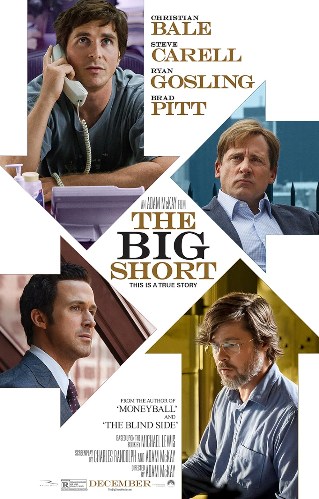

## The Big Short (2015): a true story {.smaller}

:::: {.columns}
::: {.column width="40%"}
{style="max-height: 540px"}
:::

::: {.column width="60%"}
- Based on the book by Michael Lewis. A handful of investors bet **against**
  the US housing market in 2005–2007, and won when it collapsed.

- The whole film turns on two strange names: **subprime mortgage-backed
  securities** and **CDOs**.

- Behind them sits an idea you already know from Lectures 2 and 3:
  **correlation** and portfolio risk.
:::
::::

## Subprime MBS and CDOs, in plain words {.smaller}

- **Mortgage**: a loan a family takes to buy a house, repaid every month.
  **Subprime**: a mortgage given to a borrower with a weak credit history, who is
  more likely to stop paying.

- **Mortgage-backed security (MBS)**: a bank bundles thousands of mortgages
  into one pool and sells pieces of it to investors. The investors receive the
  monthly repayments of the families.

- **Collateralized debt obligation (CDO)**: a bundle of those bundles, cut into
  layers (*tranches*). When families stop paying, the losses hit the bottom
  layer first. The top layer is paid first and loses money only if **many**
  mortgages fail **at the same time**.

- Rating agencies gave that top layer a **AAA** rating: as safe as US
  government bonds. The question is: why?

## Why AAA? Correlation, again {.smaller}

- Recall the variance of a portfolio: the comovement term, with the
  correlation $\rho$, decides how much risk diversification removes.

::: {.box .box-a}
**Normal times: low correlation.** One family loses its job in Ohio, another
gets divorced in Florida. Defaults are mostly **unrelated**, so in a pool of
thousands a few fail and most pay. The top layer almost never loses: AAA.
:::

::: {.box .box-b}
**Crisis: high correlation.** House prices fall **everywhere at once**.
Families cannot sell or refinance, and they default **together**. The
correlation jumps towards 1, diversification disappears, and even the "safe"
top layers lose money.
:::

- The models used the correlation of good times, so the real risk was **much
  greater than estimated**. Correlation rises exactly when you need
  diversification most.
