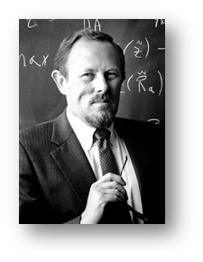
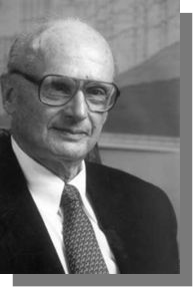
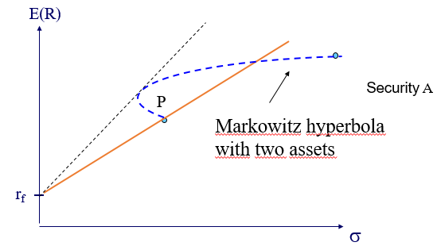
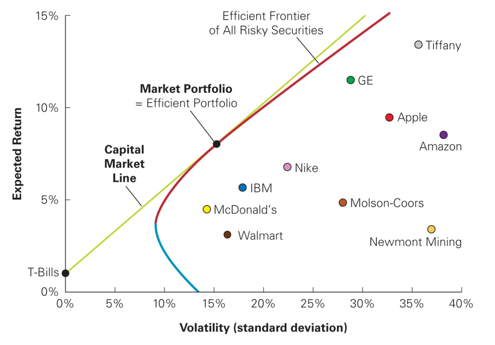
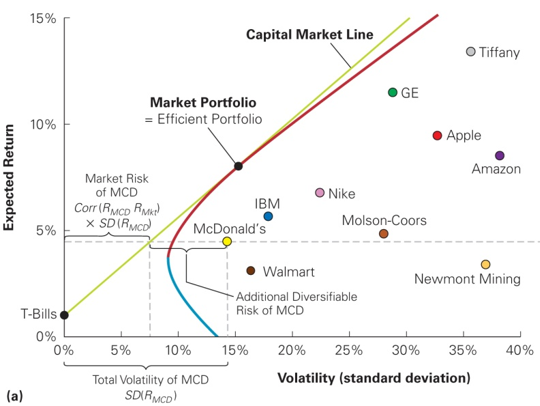
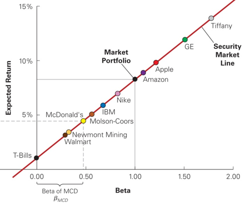

## Introduction {.smaller}

- Determine the appropriate risk premium (Capital Asset Pricing Model /
  CAPM)

  - Tobin (1958), Jack Treynor (1962), William Sharpe (1964), John
    Lintner (1965), Jan Mossin (1966).

:::::: {.columns}
::: {.column width="25%"}
{fig-align="center"}
:::

::: {.column width="25%"}
{fig-align="center"}
:::

::: {.column width="25%"}
{fig-align="center"}
:::
::::::

:::::: {.columns}
::: {.column width="25%"}
James Tobin
:::

::: {.column width="25%"}
William Sharpe
:::

::: {.column width="25%"}
Harry Markowitz
:::
::::::

## Outline

1.  Efficient portfolio and required returns (Chap. 11.6)

2.  Capital Asset Pricing Model (Chap. 11.7)

3.  Determining the risk premium (according to the CAPM) (Chap. 11.8)

## A. Efficient portfolio and required returns

- To start, we ask a basic question:

  ::: {.center}
  **How can we improve the Sharpe ratio of our portfolio?**
  :::

- Example: investors wish to add the security A to their portfolio P
  (any portfolio).

  - Can we determine whether this security improves the Sharpe ratio of
    their portfolio? If yes, how?

## Improving the Sharpe ratio of a portfolio: example

Example of the set of possible portfolios of P and the security A

::: {.center}
{fig-align="center"}
:::

Purchase of A is financed by borrowing at the risk-free rate.

## Improving the Sharpe ratio of a portfolio: example (con't) {.smaller .dense}

- Investors who hold the portfolio P borrow a "small" quantity $\delta$
  at the risk-free rate and invest this amount in A. The return of their
  portfolio changes by:
  $\Delta R = \delta\left(E\left(R_{A}\right) - r_{f}\right).$

- The risk of their portfolio changes by (using a first-order Taylor
  expansion, see appendix):

::: {.small}

$$\begin{aligned}
\Delta \sigma & = \sqrt{\sigma^{2}_{P}+\delta^{2}\sigma^{2}_{A}+2\delta \sigma_{P}\sigma_{A}\rho_{A,P}}-\sigma_{P} && \text{new volatility $-$ old volatility} \\
& \approx \sqrt{\sigma^{2}_{P}+2\delta \sigma_{P}\sigma_{A}\rho_{A,P}}-\sigma_{P} && \text{$\delta^{2}$ is negligible for a small $\delta$} \\
& = \sigma_{P}\sqrt{1+2\delta \frac{\sigma_{A}\rho_{A,P}}{\sigma_{P}}}-\sigma_{P} && \text{factor out $\sigma_{P}$} \\
& \approx \sigma_{P}\left(1+\delta \frac{\sigma_{A}\rho_{A,P}}{\sigma_{P}}\right)-\sigma_{P} && \text{$\sqrt{1+x} \approx 1+x/2$} \\
& = \textcolor{firebrick}{\boldsymbol{\delta \sigma_{A} \rho_{A,P}}} && \text{the two $\sigma_{P}$ cancel}
\end{aligned}$$

:::

## Improving the Sharpe ratio of a portfolio: intuition

$$\Delta \sigma = \textcolor{firebrick}{\boldsymbol{\delta \sigma_{A} \rho_{A,P}}}$$

- This result is intuitive: the contribution to the risk of their
  portfolio depends not only of the risk of the new security A but also
  on the correlation with their existing portfolio!

  - Not convinced? Start with the general expression of the variance of
    a portfolio (Eq. 11.13 in the textbook).

## Improving the Sharpe ratio of a portfolio: example (con't 2) {.smaller}

- A similar increase of the risk of the existing portfolio
  ($\Delta \sigma$) via leverage would increase the return by:
  $$\Delta \sigma \frac{E\left(R_{p}\right)-r_{f}}{\sigma_{P}}.$$

- Hence, it is optimal to add security A if and only if:
  $$\delta \left[E\left(R_{A}\right)-r_{f}\right]\geq \delta \sigma_A \rho_{A,P} \frac{E\left(R_{p}\right)-r_{f}}{\sigma_{P}}.$$

- Or: $$\begin{aligned}
  E\left(R_{A}\right) \geq r_{f} + \rho_{A,P} \frac{\sigma_{A}}{\sigma_{P}}\left[E\left(R_{p}\right)-r_{f}\right] = r_{f}+\beta_{A,P}\left[E\left(R_{p}\right)-r_{f}\right].
  \end{aligned}$$

## To sum up

- Investors should add security A to their existing portfolio P only if
  $$E\left(R_{A}\right) \geq r_{f}+\beta_{A,P}\left[E\left(R_{p}\right)-r_{f}\right].$$

  - Remark: If the return is lower, the best strategy is to short the
    security.

- Hence, we define the required return of an asset as:
  $$r_{i} = r_{f}+\beta_{i,P}\left[E\left(R_{p}\right)-r_{f}\right].$$

## Example: required return of a new investment

- Omega: expected return of 15% and volatility of 20%.

- Treasury bills (risk-free) pay 3%.

- REIT (real estate investment trust): expected return of 9% and
  volatility of 35%. Correlation with Omega is 10%.

- Should we invest in the REIT if we already hold Omega?

## B. Capital Asset Pricing Model

- Reminder: Markowitz (1952) + Tobin (1958) $\rightarrow$ any investor
  holds a combination of a risk-free investment and the super-efficient
  portfolio.

- How can we extend this result to a theory of market equilibrium?
  $\Rightarrow$ Let us add a couple of hypotheses to the previous
  result.

## CAPM: hypotheses {.smaller}

- Starting point: Markowitz (1952) / Tobin (1958).

  ::: {.center}
  ::: {.large}

  **+**

  :::
  :::

- Investors hold homogeneous beliefs about expected returns,
  volatilities, and correlations of all financial assets.

- The market is in equilibrium.

- All investors hold an efficient portfolio, that is a portfolio which
  offers the highest expected return for a given level of volatility.

$\Rightarrow$ The super-efficient portfolio is unique.

## Supply, demand, and the efficiency of the market portfolio {.smaller}

- Reminder: homogeneous beliefs $\rightarrow$ the investors all invest
  in the same super-efficient portfolio.

  - All risky assets are held by all investors in the same proportions
    (within the risky portfolio).

- But investors put different weights on the super-efficient portfolio
  and the risk-free asset depending on their risk aversion.

- Does this permit to pin down the composition of the super-efficient
  portfolio?

## Supply, demand and the efficiency of the market portfolio: example {.smaller}

- Camille has identified the efficient portfolio and decides to hold it.

- She holds 10 000 EUR in stocks of Capgemini and 5 000 EUR in stocks of
  Sanofi.

- Tom, more risk averse, only holds 2 000 EUR invested in Sanofi stocks.

  1.  Assuming that his portfolio is also efficient, what is his
      investment in Capgemini stocks?

  2.  If all investors hold the efficient portfolio, what can we say
      about the total market capitalisation of Capgemini relative to the
      one of Sanofi?

## The efficiency of the market portfolio {.smaller}

- It is easy to generalize the preceding example to any market.

  - Investors all hold the same efficient portfolio of risky assets
    (same weights).

  - Equilibrium between supply and demand $\rightarrow$ efficient
    portfolio contains all risky assets, weighted by their market
    capitalisation.

- **In equilibrium, the market portfolio is the super-efficient
  portfolio/tangency portfolio.**

## The Capital Market Line

- The equation of the efficient frontier is then given by:
  $$E\left(R_{p}\right) = r_{f} + \frac{E\left( R_{M}\right)-r_{f}}{\sigma_{M}}\sigma_{P}.$$
  $\Rightarrow$ Equation of the Capital Market Line (CML)

- All portfolios on the CML are made up of the market portfolio and the
  risk-free asset!

## Capital Market Line: example

::: {.center}
{fig-align="center"}
:::

## C. Determining the risk premium {.smaller}

- Reminder: we are still trying to pin down an equilibrium relation for
  the returns on individual assets.

- Up to now, we know:

  - The required return on an asset (defined relative to any existing
    portfolio).

  - The composition of the portfolios on the efficient frontier (CML) +
    the composition of the portfolios held by each investor.

- It is thus straightforward to establish the relation between the
  required returns of an asset and the different market parameters!

## Expected returns, required returns and market portfolio

- Special feature of any efficient portfolio: the expected return of all
  assets is equal to the required return (otherwise ...)!

- And yet, each investor holds the market portfolio! Thus, in
  equilibrium:
  $$E\left(R_{i}\right) = r_{i} = r_{f}+\underbrace{\beta_{i} \times \left[E\left(R_{m}\right)-r_{f}\right]}_{\operatorname{Risk \ premium \ of \ security} \ i}.$$

## Market risk and beta {.smaller}

- The previous equation shows the "beta" of an asset with respect to the
  market portfolio:
  $$\beta_{i} = \overbrace{\frac{\sigma_{R_{i}}\times Corr\left(R_{i},R_{m}\right)}{\sigma_{R_{m}}}}_{\overset{\operatorname{Volatility \ of \ asset} \ i \ \operatorname{that}}{\operatorname{is \ common \ with \ the  \ market }}} = \frac{Cov\left(R_{i},R_{m}\right)}{Var\left(R_{m}\right)}.$$

- The required return of an asset depends on the sensitivity of that
  asset to the market risk.

  - It is thus independent from the idiosyncratic risk!

## Example 1: expected return on a stock

- The risk-free rate is 4%.

- The market portfolio has an expected return of 10% and a volatility of
  16%.

- Stock A has a volatility of 16% and a correlation with the market
  portfolio of 33%.

1.  What is the beta of stock A and what is its expected return?

2.  What is the portfolio on the CML which has the same risk as Stock A
    and what is its expected return?

## Example 2:  expected return with negative beta

- The beta of the stock B is -0.3.

- The risk-free rate is 4% and the expected return on the market
  portfolio is 10%.

What is the expected return according to the CAPM?

What do you think about that?

## Security Market Line

- The CAPM highlights a linear relation between the beta of a security
  and the expected return.

- This straight line---called the Security Market Line---passes through
  the risk-free asset ($\beta = 0$) and the market portfolio
  ($\beta = 1$).

- In equilibrium, all assets are on the SML.

  - But no asset is on the CML!!

## CML and SML: illustration

::: {.center}
{fig-align="center"} Capital Market Line (CML)
:::

## CML and SML: illustration (con't)

::: {.center}
{fig-align="center"} Security Market Line (SML)
:::

## The beta of a portfolio {.smaller}

- The beta of a portfolio with return $R_{p}= \sum_{i}x_{i}R_{i}$ is
  given by: $$\begin{aligned}
  \beta_{p}= &\frac{Cov\left(R_{p},R_{m}\right)}{Var\left(R_{m}\right)} = \frac{Cov\left(\sum_{i}x_{i}R_{i},R_{m}\right)}{Var\left(R_{m}\right)} \\
  = & \sum_{i}x_{i}\frac{Cov\left(R_{i},R_{m}\right)}{Var\left(R_{m}\right)} =\sum_{i}x_{i} \beta_{i}.
  \end{aligned}$$

- The beta of a portfolio is equal to the weighted average of the betas
  of its constituents.

## Example:  expected return of a portfolio

- The betas of Danone (BN.PA) and Ubisoft (UBI.PA) are respectively 0.5
  and 1.8.

- The risk-free rate is 4%.

- The expected return on the market portfolio is 10%.

According to the CAPM, what is the expected return of an
equally-weighted portfolio of these two stocks?

## Summary: what to remember from the CAPM? {.smaller}

- The market portfolio is the only efficient portfolio. Hence, the
  highest expected return for a given level of volatility is achieved by
  combining the market portfolio with the risk-free asset (borrowing or
  lending).

- The risk premium of any asset is proportional to its beta with respect
  to the market. There is a linear relation between the expected return
  of an asset and its (systematic) risk called the SML.

- Remark: the hypotheses of the CAPM are quite restrictive. Nevertheless
  the CAPM is used widely to estimate the expected returns of assets or
  the cost of capital of projects.

## Appendix: portfolio volatility approximation {.smaller}

In Section 1 of the slides, I claim that the approximation below holds:

$$\begin{aligned}
\Delta \sigma & = \sqrt{\sigma^{2}_{p}+\delta^{2}\sigma^{2}_{A}+2\delta \sigma_{P}\sigma_{A}\rho_{A,P}}-\sigma_{P} \\
& \approx \delta \frac{\sigma_{P}\sigma_{A}\rho_{A,P}}{\sigma_{P}}.
\end{aligned}$$

To prove this result, define the function $f$ as $$\begin{aligned}
f(\delta) := \sqrt{\sigma^{2}_{p}+\delta^{2}\sigma^{2}_{A}+2\delta \sigma_{P}\sigma_{A}\rho_{A,P}}.
\end{aligned}$$

From Taylor's theorem, it follows that for $\delta$ close to zero, we
have $$\begin{aligned}
f(\delta) \approx f(0) + f'(0) \delta.
\end{aligned}$$

## Appendix: portfolio volatility approximation (con't) {.smaller}

Moreover, it is easy to check that $$\begin{aligned}
f'(\delta) = \frac{\delta \sigma^{2}_{A}+\sigma_{P}\sigma_{A}\rho_{A,P}}{\sqrt{\sigma^{2}_{p}+\delta^{2}\sigma^{2}_{A}+2\delta \sigma_{P}\sigma_{A}\rho_{A,P}}},
\end{aligned}$$ and, at $\delta = 0,$ $f$ and its first derivative
simplify to $f(0) = \sigma_P$ and
$f'(0) = \frac{\sigma_{P}\sigma_{A}\rho_{A,P}}{\sigma_{P}}.$ Thus,
Taylor's theorem implies that $$\begin{aligned}
\sqrt{\sigma^{2}_{p}+\delta^{2}\sigma^{2}_{A}+2\delta \sigma_{P}\sigma_{A}\rho_{A,P}} \approx  \sigma_P + \frac{\sigma_{P}\sigma_{A}\rho_{A,P}}{\sigma_{P}}\delta.
\end{aligned}$$ The approximation on the previous slide then follows
almost immediately.
