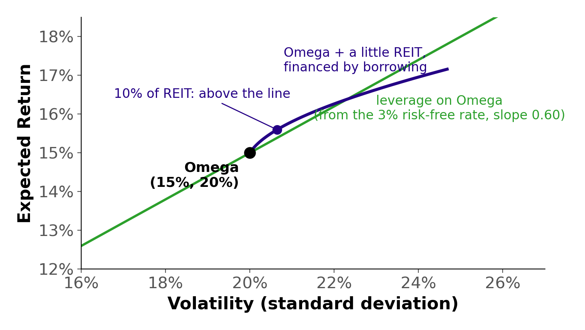

## Plan

- Recap from lecture 3

- Ask what return a stock must offer to be worth adding to a portfolio: the
  required return and the beta

- Meet the CAPM: when every investor holds the tangency portfolio, that
  portfolio is the market itself

- Use the CAPM to determine the risk premium of any stock

Mostly based on the BDM textbook Chap. 11.6-8.

## {.center}

::: {.content-visible when-format="revealjs"}
::: {.center .huge}
Recap lecture 3
:::
:::

```{=latex}
\vfill
\begin{center}
{\color{escpblue}\Huge\bfseries Recap lecture 3}
\end{center}
\vfill
```

## Recap of Lecture 3 {.smaller}

Let's do a recap:

- Combining two stocks: many portfolios, many risk-return pairs

- Efficient portfolios and the efficient frontier

- The shape of the frontier depends on the correlation

- The minimum-variance portfolio

- Short sales extend the frontier

- From two stocks to N: the frontier moves left

- Adding the risk-free asset

- Borrowing and leverage

- The Sharpe ratio, and how it picks the efficient frontier

- The super-efficient (tangency) portfolio

- Two types of risk

## Recap: combining two stocks {.smaller}

- Given two stocks, we choose the **weights** $x_{1}$ and $x_{2}$, with
  $x_{1} + x_{2} = 1$. Each choice is one portfolio, with its own expected
  return and its own risk.

- Plotted as points, risk across and return up, all the mixes of the two stocks
  trace a **curve** (Intel and Coca-Cola, zero correlation):

::: {.center}
{width="52%"}
:::

## Recap: efficient portfolios and the frontier {.smaller}

::: {.box .box-a}
A portfolio is **efficient** when, for its level of risk, no other portfolio
gives a higher return; equivalently, for its level of return, no other portfolio
has a lower risk.
:::

::: {.box .box-a}
The **efficient frontier** is the set of all efficient portfolios: the upper part
of the curve.
:::

- Example: (0, 1) and (0.4, 0.6) both have 25% volatility, but the second returns
  14% against 6%. Holding only Coca-Cola is dominated; the lower part of the curve
  is inefficient.

## Recap: the shape depends on correlation {.smaller}

:::: {.columns}
::: {.column width="42%"}
::: {style="text-align: left"}
- **Correlation +1**: no diversification. The curve is a straight line between
  the two stocks.

- **Lower correlation**: the curve bends to the left, the same returns at lower
  risk.

- **Correlation −1**: the risks can cancel completely; with the right weights the
  portfolio has zero risk.
:::
:::

::: {.column width="58%"}
{fig-align="center" width="100%" style="max-height: 470px"}
:::
::::

## Recap: the minimum-variance portfolio {.smaller}

::: {.center}
{width="48%"}
:::

- The mix with the **lowest risk** of all: the "nose" of the curve, where the
  efficient set begins. Here (0.2, 0.8), with 22.4% volatility, below either
  stock alone.

- Its weights depend only on the volatilities and the correlation, **not on the
  expected returns**.

## Recap: short sales extend the frontier {.smaller}

- A **short sale** is a negative weight: sell a stock you borrowed, and invest
  more than your own money in the other one.

- Shorting assets allows to extend the efficient frontier further.

::: {.center}
{width="40%"}
:::

## Recap: from two stocks to N {.smaller}

- A third stock turns the curve into a **region** of possible portfolios. The
  efficient frontier is its **upper-left edge**.

- Every stock we add, even a poor one on its own, moves the frontier further
  left: more diversification. The best frontier uses all available investments.

::: {.center}
{width="46%"}
:::

## Recap: adding the risk-free asset {.smaller}

- The risk-free rate $r_{f}$ is known in advance: zero volatility, zero
  correlation with every stock.

- A fraction $x$ in a risky portfolio and $1 - x$ at $r_{f}$ gives
  $E[R_{p}] = r_{f} + x\,(E[R_{U}] - r_{f})$ and $\sigma_{p} = x\,\sigma_{U}$:
  both grow with $x$, so every mix is on a **straight line** from the risk-free
  point. Umbrella (10%, 20%) and a 3% deposit, half and half: 6.5% and 10%.

::: {.center}
{width="54%"}
:::

## Recap: borrowing and leverage {.smaller}

- **Leverage** is investing with borrowed money. In the formulas it is a
  **negative weight on the risk-free asset**, $x_{f} < 0$, with more than 100% in
  the risky one.

- Borrow 50 at 3% and put 150 in Umbrella: $x_{U} = 1.5$, $x_{f} = -0.5$. Return
  13.5% instead of 10%, volatility 30% instead of 20%: leverage scales the risk
  premium and the risk by the **same factor**.

- It takes you beyond the risky portfolio on the same straight line. Gains and
  losses are both magnified, so **never judge a return without its risk**.

## Recap: the Sharpe ratio {.smaller}

- The slope of the line from the risk-free point is the **Sharpe ratio**: the
  extra return you get per unit of risk.

  $$\text{Sharpe ratio} = \frac{E[R] - r_{f}}{\sigma}$$

::: {.center}
| Portfolio        | Expected return | Volatility | Sharpe ratio |
|:-----------------|:---------------:|:----------:|:------------:|
| Coca-Cola (0, 1) | 6%              | 25%        | 0.12         |
| (0.2, 0.8)       | 10%             | 22.4%      | 0.31         |
| (0.5, 0.5)       | 16%             | 28%        | 0.46         |
| Intel (1, 0)     | 26%             | 50%        | 0.46         |
:::

- A steeper line pays more at every level of risk, whoever you are. With
  leverage any return is possible, so **compare Sharpe ratios, not returns**.

## Recap: the Sharpe ratio and the efficient frontier {.smaller}

::: {.center}
{width="48%"}
:::

- The steepest line from the risk-free point is the one **tangent** to the curve.
  Once a risk-free asset exists, the efficient frontier **is that straight line**:

  $$E(R_{p}) = r_{f} + \underbrace{\frac{E(R_{T}) - r_{f}}{\sigma_{T}}}_{\text{Sharpe ratio of } T} \times \sigma_{p}
  \qquad \text{here } 3\% + 0.475 \times \sigma_{p}$$

## Recap: the super-efficient portfolio {.smaller}

::: {.center}
{width="38%"}
:::

- The tangency point $T$ is the risky portfolio with the **highest Sharpe
  ratio**: the tangency, or **super-efficient**, portfolio.

- **Everyone holds it.** Risk aversion only sets where you sit on the line:
  cautious investors lend part of their money at $r_{f}$, bold ones borrow and
  put more than their own money in $T$ (two-fund separation).

## Recap: two types of risk {.smaller}

::: {.box .box-a}
**Systematic risk**: market-wide (economy, interest rates, inflation). It hits
every stock at once, so diversification **cannot** remove it.
:::

::: {.box .box-a}
**Idiosyncratic risk**: specific to one firm (its products, its management). It
averages out across many stocks, so diversification **does** remove it.
:::

::: {.center}
{width="36%"}
:::

Volatility falls as stocks are added and flattens at the systematic level.

## {.center}

::: {.content-visible when-format="revealjs"}
::: {.center .huge}
Beginning of lecture 4 content
:::

::: {.center .small}
Lecture 3 found the best portfolio of risky assets. Today we ask what that implies
for the return each stock has to offer: the CAPM.
:::
:::

```{=latex}
\vfill
\begin{center}
{\color{escpblue}\Huge\bfseries Beginning of lecture 4 content}

\vspace{1.5em}
\begin{minipage}{0.8\textwidth}
\small\centering
Lecture 3 found the best portfolio of risky assets. Today we ask what that implies
for the return each stock has to offer: the CAPM.
\end{minipage}
\end{center}
\vfill
```

## Introduction {.smaller}

- Today: how to determine the risk premium a stock must offer, with the
  **Capital Asset Pricing Model (CAPM)**: Tobin (1958), Treynor (1962), Sharpe
  (1964), Lintner (1965), Mossin (1966).

- **Why it matters.** The CAPM is the most widely used model linking risk and
  return. About three firms in four use it to estimate their **cost of
  capital**: the discount rate for projects, valuations and regulated prices.

:::::: {.columns}
::: {.column width="25%"}
{fig-align="center" width="55%" style="max-height: 170px"}
:::

::: {.column width="25%"}
{fig-align="center" width="55%" style="max-height: 170px"}
:::

::: {.column width="25%"}
{fig-align="center" width="55%" style="max-height: 170px"}
:::
::::::

:::::: {.columns}
::: {.column width="25%"}
James Tobin
:::

::: {.column width="25%"}
William Sharpe
:::

::: {.column width="25%"}
Harry Markowitz
:::
::::::

## Outline

1.  Efficient portfolio and required returns (Chap. 11.6)

2.  Capital Asset Pricing Model (Chap. 11.7)

3.  Determining the risk premium (according to the CAPM) (Chap. 11.8)

## A. Required returns: the answer first {.smaller}

- Last class we met the **Sharpe ratio**: the extra return we get for every
  unit of risk we take. Today we use it to decide whether an asset is **worth
  adding to a portfolio**.

- You hold a portfolio $P$. Someone offers you a stock $A$. **Should you buy
  some?**

::: {.box .box-a}
**The answer, in one sentence.** A stock is worth adding only if its expected
return pays for the risk it adds to *your* portfolio. And the risk it adds
depends on how it **moves with what you already hold**, not on how risky it is
on its own.
:::

- The rest of this section unpacks that sentence in three steps:

  1. measure the risk $A$ adds to $P$;

  2. measure what that extra risk is worth;

  3. compare with what $A$ actually pays.

## Step 1: the risk a stock adds {.smaller}

- Add a small amount $\delta$ of $A$ to $P$, financed by borrowing at $r_{f}$.
  The extra return is easy: $\delta\,(E(R_{A}) - r_{f})$.

- The extra risk is not $\delta\,\sigma_{A}$. For a small $\delta$ the
  volatility of the portfolio rises by about

  $$\Delta\sigma \approx \delta \times \sigma_{A} \times \rho_{A,P}$$

  $\delta$: the fraction of the portfolio put into $A$; $\sigma_{A}$: the
  volatility of $A$ on its own; $\rho_{A,P}$: the correlation between $A$ and
  the portfolio $P$.

- The **correlation** is in the formula: a stock that moves with your portfolio
  adds its full risk, an uncorrelated one almost none, a negatively correlated
  one **reduces** risk. The same diversification story as Bore Industries.

- Where the formula comes from: the appendix at the end of the deck.

## Step 2: what is that extra risk worth? {.smaller}

- You could take the same extra risk another way: **leverage**, borrowing to
  buy more of $P$.

- Leverage on $P$ pays the Sharpe ratio of $P$ for each unit of risk (Lecture
  3). So extra risk $\Delta\sigma$ taken through $P$ would earn

  $$\Delta\sigma \times \frac{E(R_{P}) - r_{f}}{\sigma_{P}}$$

  $\Delta\sigma$: the extra risk from step 1; $E(R_{P}) - r_{f}$: the risk
  premium of $P$; $\sigma_{P}$: its volatility. The fraction is $P$'s Sharpe ratio.

- That is the **benchmark**. $A$ is worth adding when its extra return (step 1,
  left) is at least what the same risk earns through $P$ (right):

  $$\delta\,(E(R_{A}) - r_{f}) \;\geq\; \Delta\sigma \times \left(E(R_{P}) - r_{f}\right) / \sigma_{P}$$

## In a picture: Omega and the REIT {.smaller}

::: {.center}
{width="66%"}
:::

Zoom around Omega (15%, 20%). The green line is leverage on Omega. Adding a
little REIT (9%, 35%, correlation 0.10) financed by borrowing traces the blue
curve, which leaves Omega **above the line**: a small addition raises the Sharpe
ratio. Add too much and the curve drops below it again.

## Step 3: the rule, and the beta {.smaller}

- Buy $A$ if its extra return beats the benchmark:

  $$\delta\,(E(R_{A}) - r_{f}) \;\geq\; \delta\,\sigma_{A}\,\rho_{A,P} \times \frac{E(R_{P}) - r_{f}}{\sigma_{P}}$$

- Cancel $\delta$ and group the risk terms into one number:

  $$\beta_{A,P} = \rho_{A,P}\,\frac{\sigma_{A}}{\sigma_{P}} = \frac{\text{Cov}(R_{A},R_{P})}{\text{Var}(R_{P})}$$

  The **beta** from Lecture 2, with $P$ as the thing that moves: when $P$ moves
  by 1%, $A$ moves by $\beta_{A,P}$% on average.

- The rule becomes a **required return** $r_{A}$: buy $A$ if it pays at least
  $r_{A}$, short it if it pays less.

  $$E(R_{A}) \;\geq\; r_{A} = r_{f} + \beta_{A,P}\,\big(E(R_{P}) - r_{f}\big)$$

## Example: should we add the REIT to Omega? {.smaller}

- Omega: expected return 15%, volatility 20%. Treasury bills: 3%. REIT: expected
  return 9%, volatility 35%, correlation with Omega 0.10.

- Beta of the REIT with respect to Omega:
  $\beta = 0.10 \times 35\% / 20\% = 0.175$.

- Required return:
  $r_{\text{REIT}} = 3\% + 0.175 \times (15\% - 3\%) = 5.1\%$.

- The REIT pays 9%, above 5.1%: **yes, buy some.** It looks poor on its own (less
  return than Omega for more risk), but its low correlation means it adds very
  little risk.

- **The twist.** With a correlation of 0.50 instead of 0.10: $\beta = 0.875$,
  required return $3\% + 0.875 \times 12\% = 13.5\%$, above the 9% it pays: **no.**
  Same stock, same return, same risk; the correlation alone flips the decision.

## From the required return to the CAPM {.smaller}

- The rule holds for **any** portfolio $P$: the required return of a stock is
  the risk-free rate plus its beta with respect to $P$ times $P$'s risk premium.

- Lecture 3 showed that every investor holds the same risky portfolio, the
  tangency portfolio. Section B asks what that portfolio must be when everyone
  holds it, and finds the answer: **the market**.

- Replace $P$ by the market portfolio and the required return becomes the
  **CAPM**.

## B. Capital Asset Pricing Model

- Reminder: Markowitz (1952) + Tobin (1958) $\rightarrow$ any investor
  holds a combination of a risk-free investment and the super-efficient
  portfolio.

- How can we extend this result to a theory of market equilibrium?
  $\Rightarrow$ Let us add a couple of hypotheses to the previous
  result.

## CAPM: hypotheses {.smaller}

- Starting point: Markowitz (1952) / Tobin (1958).

  ::: {.center}
  ::: {.large}

  **+**

  :::
  :::

- Investors hold homogeneous beliefs about expected returns,
  volatilities, and correlations of all financial assets.

- The market is in equilibrium.

- All investors hold an efficient portfolio, that is a portfolio which
  offers the highest expected return for a given level of volatility.

$\Rightarrow$ The super-efficient portfolio is unique.

## Supply, demand, and the efficiency of the market portfolio {.smaller}

- Reminder: homogeneous beliefs $\rightarrow$ the investors all invest
  in the same super-efficient portfolio.

  - All risky assets are held by all investors in the same proportions
    (within the risky portfolio).

- But investors put different weights on the super-efficient portfolio
  and the risk-free asset depending on their risk aversion.

- Does this permit to pin down the composition of the super-efficient
  portfolio?

## Supply, demand and the efficiency of the market portfolio: example {.smaller}

- Camille has identified the efficient portfolio and decides to hold it.

- She holds 10 000 EUR in stocks of Capgemini and 5 000 EUR in stocks of
  Sanofi.

- Tom, more risk averse, only holds 2 000 EUR invested in Sanofi stocks.

  1.  Assuming that his portfolio is also efficient, what is his
      investment in Capgemini stocks?

  2.  If all investors hold the efficient portfolio, what can we say
      about the total market capitalisation of Capgemini relative to the
      one of Sanofi?

## The efficiency of the market portfolio {.smaller}

- It is easy to generalize the preceding example to any market.

  - Investors all hold the same efficient portfolio of risky assets
    (same weights).

  - Equilibrium between supply and demand $\rightarrow$ efficient
    portfolio contains all risky assets, weighted by their market
    capitalisation.

- **In equilibrium, the market portfolio is the super-efficient
  portfolio/tangency portfolio.**

## The Capital Market Line

- The equation of the efficient frontier is then given by:
  $$E\left(R_{p}\right) = r_{f} + \frac{E\left( R_{M}\right)-r_{f}}{\sigma_{M}}\sigma_{P}.$$
  $\Rightarrow$ Equation of the Capital Market Line (CML)

- All portfolios on the CML are made up of the market portfolio and the
  risk-free asset!

## Capital Market Line: example

::: {.center}
{fig-align="center"}
:::

## C. Determining the risk premium {.smaller}

- Reminder: we are still trying to pin down an equilibrium relation for
  the returns on individual assets.

- Up to now, we know:

  - The required return on an asset (defined relative to any existing
    portfolio).

  - The composition of the portfolios on the efficient frontier (CML) +
    the composition of the portfolios held by each investor.

- It is thus straightforward to establish the relation between the
  required returns of an asset and the different market parameters!

## Expected returns, required returns and market portfolio

- Special feature of any efficient portfolio: the expected return of all
  assets is equal to the required return (otherwise ...)!

- And yet, each investor holds the market portfolio! Thus, in
  equilibrium:
  $$E\left(R_{i}\right) = r_{i} = r_{f}+\underbrace{\beta_{i} \times \left[E\left(R_{m}\right)-r_{f}\right]}_{\operatorname{Risk \ premium \ of \ security} \ i}.$$

## Market risk and beta {.smaller}

- The previous equation shows the "beta" of an asset with respect to the
  market portfolio:
  $$\beta_{i} = \overbrace{\frac{\sigma_{R_{i}}\times Corr\left(R_{i},R_{m}\right)}{\sigma_{R_{m}}}}_{\overset{\operatorname{Volatility \ of \ asset} \ i \ \operatorname{that}}{\operatorname{is \ common \ with \ the  \ market }}} = \frac{Cov\left(R_{i},R_{m}\right)}{Var\left(R_{m}\right)}.$$

- The required return of an asset depends on the sensitivity of that
  asset to the market risk.

  - It is thus independent from the idiosyncratic risk!

## Example 1: expected return on a stock

- The risk-free rate is 4%.

- The market portfolio has an expected return of 10% and a volatility of
  16%.

- Stock A has a volatility of 16% and a correlation with the market
  portfolio of 33%.

1.  What is the beta of stock A and what is its expected return?

2.  What is the portfolio on the CML which has the same risk as Stock A
    and what is its expected return?

## Example 2:  expected return with negative beta

- The beta of the stock B is -0.3.

- The risk-free rate is 4% and the expected return on the market
  portfolio is 10%.

What is the expected return according to the CAPM?

What do you think about that?

## Security Market Line

- The CAPM highlights a linear relation between the beta of a security
  and the expected return.

- This straight line---called the Security Market Line---passes through
  the risk-free asset ($\beta = 0$) and the market portfolio
  ($\beta = 1$).

- In equilibrium, all assets are on the SML.

  - But no asset is on the CML!!

## CML and SML: illustration

::: {.center}
{fig-align="center"} Capital Market Line (CML)
:::

## CML and SML: illustration (con't)

::: {.center}
{fig-align="center"} Security Market Line (SML)
:::

## The beta of a portfolio {.smaller}

- The beta of a portfolio with return $R_{p}= \sum_{i}x_{i}R_{i}$ is
  given by: $$\begin{aligned}
  \beta_{p}= &\frac{Cov\left(R_{p},R_{m}\right)}{Var\left(R_{m}\right)} = \frac{Cov\left(\sum_{i}x_{i}R_{i},R_{m}\right)}{Var\left(R_{m}\right)} \\
  = & \sum_{i}x_{i}\frac{Cov\left(R_{i},R_{m}\right)}{Var\left(R_{m}\right)} =\sum_{i}x_{i} \beta_{i}.
  \end{aligned}$$

- The beta of a portfolio is equal to the weighted average of the betas
  of its constituents.

## Example:  expected return of a portfolio

- The betas of Danone (BN.PA) and Ubisoft (UBI.PA) are respectively 0.5
  and 1.8.

- The risk-free rate is 4%.

- The expected return on the market portfolio is 10%.

According to the CAPM, what is the expected return of an
equally-weighted portfolio of these two stocks?

## Summary: what to remember from the CAPM? {.smaller}

- The market portfolio is the only efficient portfolio. Hence, the
  highest expected return for a given level of volatility is achieved by
  combining the market portfolio with the risk-free asset (borrowing or
  lending).

- The risk premium of any asset is proportional to its beta with respect
  to the market. There is a linear relation between the expected return
  of an asset and its (systematic) risk called the SML.

- Remark: the hypotheses of the CAPM are quite restrictive. Nevertheless
  the CAPM is used widely to estimate the expected returns of assets or
  the cost of capital of projects.

## Appendix: portfolio volatility approximation {.smaller}

In Section 1 of the slides, I claim that the approximation below holds:

$$\begin{aligned}
\Delta \sigma & = \sqrt{\sigma^{2}_{p}+\delta^{2}\sigma^{2}_{A}+2\delta \sigma_{P}\sigma_{A}\rho_{A,P}}-\sigma_{P} \\
& \approx \delta \frac{\sigma_{P}\sigma_{A}\rho_{A,P}}{\sigma_{P}}.
\end{aligned}$$

To prove this result, define the function $f$ as $$\begin{aligned}
f(\delta) := \sqrt{\sigma^{2}_{p}+\delta^{2}\sigma^{2}_{A}+2\delta \sigma_{P}\sigma_{A}\rho_{A,P}}.
\end{aligned}$$

From Taylor's theorem, it follows that for $\delta$ close to zero, we
have $$\begin{aligned}
f(\delta) \approx f(0) + f'(0) \delta.
\end{aligned}$$

## Appendix: portfolio volatility approximation (con't) {.smaller}

Moreover, it is easy to check that $$\begin{aligned}
f'(\delta) = \frac{\delta \sigma^{2}_{A}+\sigma_{P}\sigma_{A}\rho_{A,P}}{\sqrt{\sigma^{2}_{p}+\delta^{2}\sigma^{2}_{A}+2\delta \sigma_{P}\sigma_{A}\rho_{A,P}}},
\end{aligned}$$ and, at $\delta = 0,$ $f$ and its first derivative
simplify to $f(0) = \sigma_P$ and
$f'(0) = \frac{\sigma_{P}\sigma_{A}\rho_{A,P}}{\sigma_{P}}.$ Thus,
Taylor's theorem implies that $$\begin{aligned}
\sqrt{\sigma^{2}_{p}+\delta^{2}\sigma^{2}_{A}+2\delta \sigma_{P}\sigma_{A}\rho_{A,P}} \approx  \sigma_P + \frac{\sigma_{P}\sigma_{A}\rho_{A,P}}{\sigma_{P}}\delta.
\end{aligned}$$ The approximation on the previous slide then follows
almost immediately.
