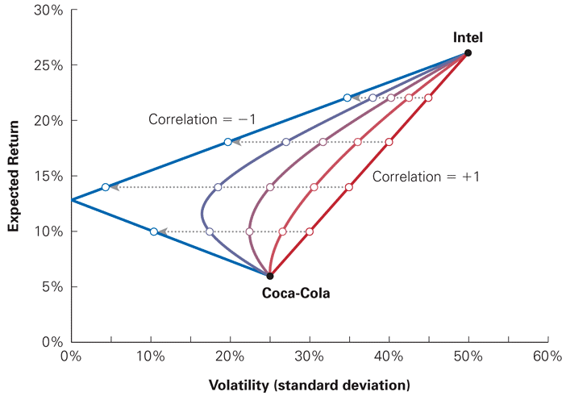
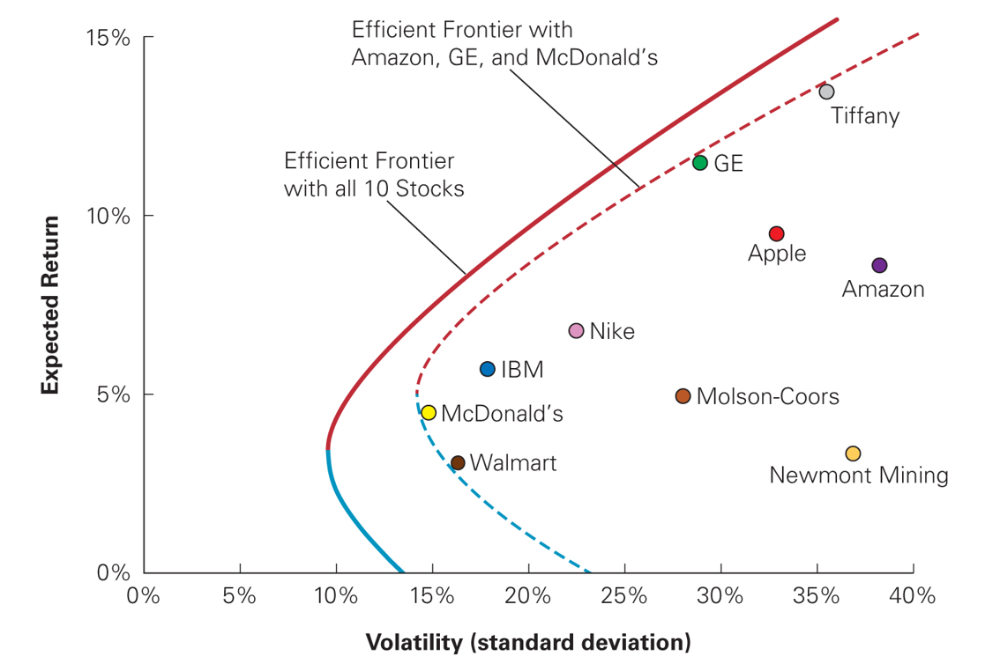
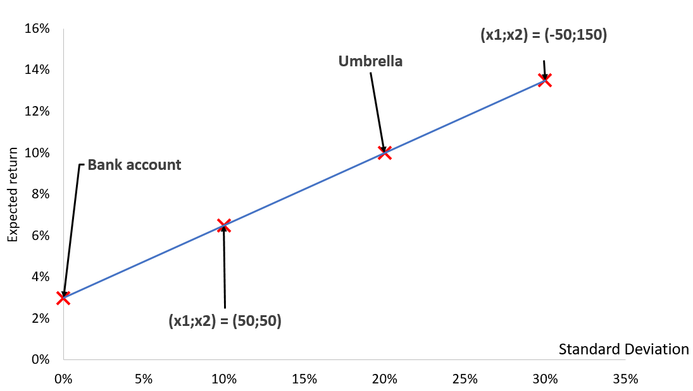
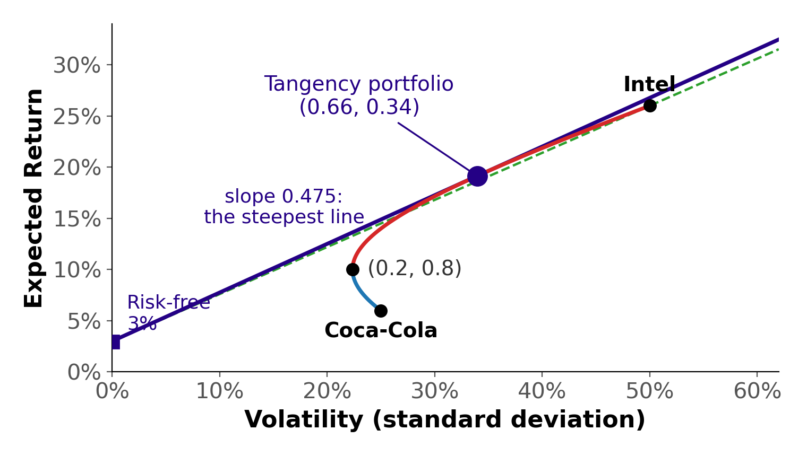
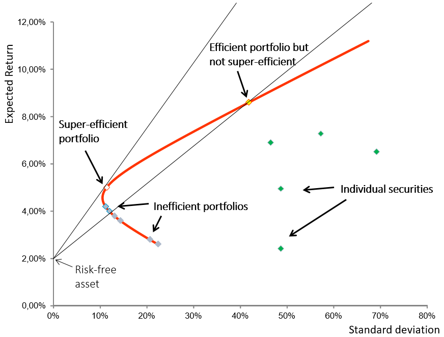
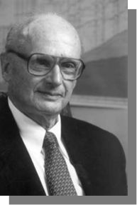
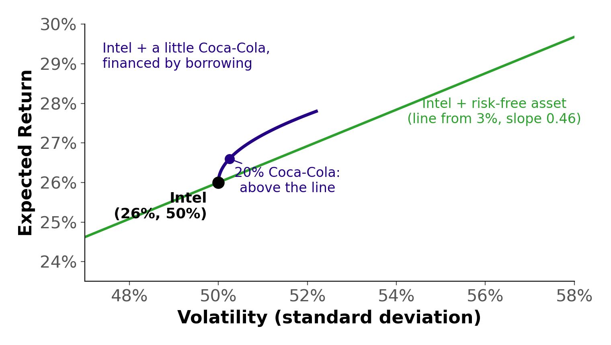
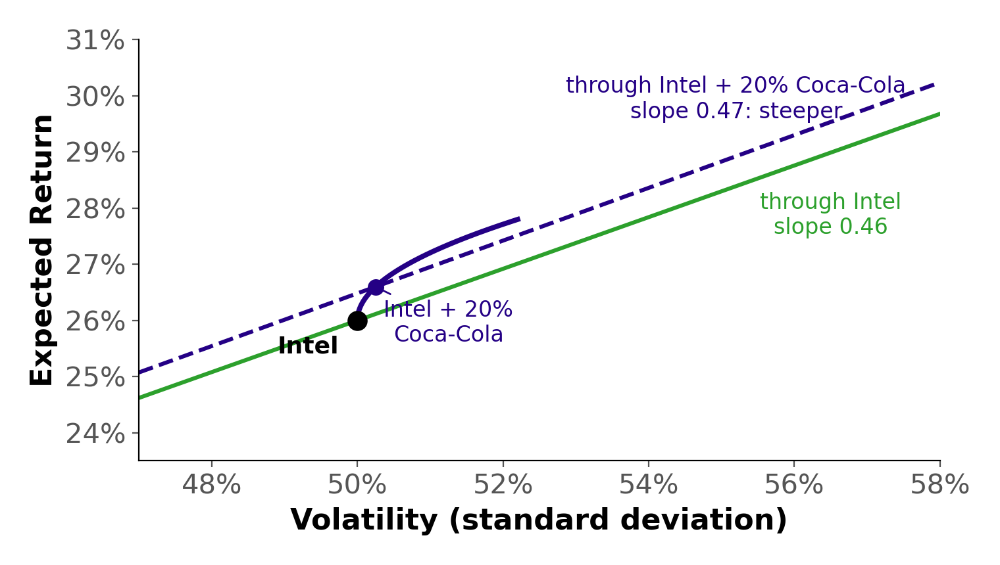
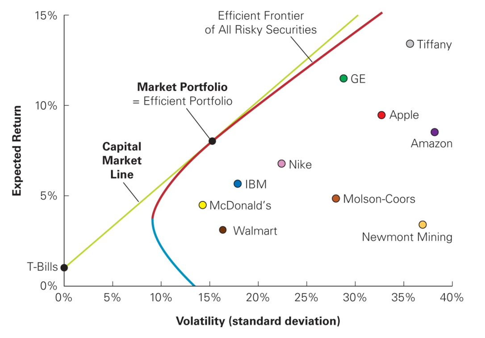
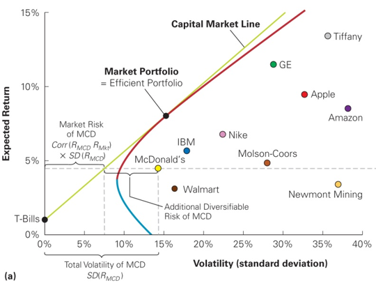

## Plan

- Recap from lecture 3

- Ask what return a stock must offer to be worth adding to a portfolio: the
  required return and the beta

- Meet the CAPM: when every investor holds the tangency portfolio, that
  portfolio is the market itself

- Use the CAPM to determine the risk premium of any stock

Mostly based on the BDM textbook Chap. 11.6-8.

## {.center}

::: {.content-visible when-format="revealjs"}
::: {.center .huge}
Recap lecture 3
:::
:::

```{=latex}
\vfill
\begin{center}
{\color{escpblue}\Huge\bfseries Recap lecture 3}
\end{center}
\vfill
```

## Recap of Lecture 3 {.smaller}

Let's do a recap:

- Combining two stocks: many portfolios, many risk-return pairs

- Efficient portfolios and the efficient frontier

- The shape of the frontier depends on the correlation

- The minimum-variance portfolio

- Short sales extend the frontier

- From two stocks to N: the frontier moves left

- Adding the risk-free asset

- Borrowing and leverage

- The Sharpe ratio, and how it picks the efficient frontier

- The super-efficient (tangency) portfolio

- Two types of risk

## Recap: combining two stocks {.smaller}

- Given two stocks, we choose the **weights** $x_{1}$ and $x_{2}$, with
  $x_{1} + x_{2} = 1$. Each choice is one portfolio, with its own expected
  return and its own risk.

- Plotted as points, risk across and return up, all the mixes of the two stocks
  trace a **curve** (Intel and Coca-Cola, zero correlation):

::: {.center}
{width="52%"}
:::

## Recap: efficient portfolios and the frontier {.smaller}

::: {.box .box-a}
A portfolio is **efficient** when, for its level of risk, no other portfolio
gives a higher return; equivalently, for its level of return, no other portfolio
has a lower risk.
:::

::: {.box .box-a}
The **efficient frontier** is the set of all efficient portfolios: the upper part
of the curve.
:::

- Example: (0, 1) and (0.4, 0.6) both have 25% volatility, but the second returns
  14% against 6%. Holding only Coca-Cola is dominated; the lower part of the curve
  is inefficient.

## Recap: the shape depends on correlation {.smaller}

:::: {.columns}
::: {.column width="42%"}
::: {style="text-align: left"}
- **Correlation +1**: no diversification. The curve is a straight line between
  the two stocks.

- **Lower correlation**: the curve bends to the left, the same returns at lower
  risk.

- **Correlation −1**: the risks can cancel completely; with the right weights the
  portfolio has zero risk.
:::
:::

::: {.column width="58%"}
{fig-align="center" width="100%" style="max-height: 470px"}
:::
::::

## Recap: the minimum-variance portfolio {.smaller}

::: {.center}
{width="48%"}
:::

- The mix with the **lowest risk** of all: the "nose" of the curve, where the
  efficient set begins. Here (0.2, 0.8), with 22.4% volatility, below either
  stock alone.

- Its weights depend only on the volatilities and the correlation, **not on the
  expected returns**.

## Recap: short sales extend the frontier {.smaller}

- A **short sale** is a negative weight: sell a stock you borrowed, and invest
  more than your own money in the other one.

- Shorting assets allows to extend the efficient frontier further.

::: {.center}
{width="40%"}
:::

## Recap: from two stocks to N {.smaller}

- A third stock turns the curve into a **region** of possible portfolios. The
  efficient frontier is its **upper-left edge**.

- Every stock we add, even a poor one on its own, moves the frontier further
  left: more diversification. The best frontier uses all available investments.

::: {.center}
{width="46%"}
:::

## Recap: adding the risk-free asset {.smaller}

- The risk-free rate $r_{f}$ is known in advance: zero volatility, zero
  correlation with every stock.

- A fraction $x$ in a risky portfolio and $1 - x$ at $r_{f}$ gives
  $E[R_{p}] = r_{f} + x\,(E[R_{U}] - r_{f})$ and $\sigma_{p} = x\,\sigma_{U}$:
  both grow with $x$, so every mix is on a **straight line** from the risk-free
  point. Umbrella (10%, 20%) and a 3% deposit, half and half: 6.5% and 10%.

::: {.center}
{width="54%"}
:::

## Recap: borrowing and leverage {.smaller}

- **Leverage** is investing with borrowed money. In the formulas it is a
  **negative weight on the risk-free asset**, $x_{f} < 0$, with more than 100% in
  the risky one.

- Borrow 50 at 3% and put 150 in Umbrella: $x_{U} = 1.5$, $x_{f} = -0.5$. Return
  13.5% instead of 10%, volatility 30% instead of 20%: leverage scales the risk
  premium and the risk by the **same factor**.

- It takes you beyond the risky portfolio on the same straight line. Gains and
  losses are both magnified, so **never judge a return without its risk**.

## Recap: the Sharpe ratio {.smaller}

- The slope of the line from the risk-free point is the **Sharpe ratio**: the
  extra return you get per unit of risk.

  $$\text{Sharpe ratio} = \frac{E[R] - r_{f}}{\sigma}$$

::: {.center}
| Portfolio        | Expected return | Volatility | Sharpe ratio |
|:-----------------|:---------------:|:----------:|:------------:|
| Coca-Cola (0, 1) | 6%              | 25%        | 0.12         |
| (0.2, 0.8)       | 10%             | 22.4%      | 0.31         |
| (0.5, 0.5)       | 16%             | 28%        | 0.46         |
| Intel (1, 0)     | 26%             | 50%        | 0.46         |
:::

- A steeper line pays more at every level of risk, whoever you are. With
  leverage any return is possible, so **compare Sharpe ratios, not returns**.

## Recap: the Sharpe ratio and the efficient frontier {.smaller}

::: {.center}
{width="48%"}
:::

- The steepest line from the risk-free point is the one **tangent** to the curve.
  Once a risk-free asset exists, the efficient frontier **is that straight line**:

  $$E(R_{p}) = r_{f} + \underbrace{\frac{E(R_{T}) - r_{f}}{\sigma_{T}}}_{\text{Sharpe ratio of } T} \times \sigma_{p}
  \qquad \text{here } 3\% + 0.475 \times \sigma_{p}$$

## Recap: the super-efficient portfolio {.smaller}

::: {.center}
{width="38%"}
:::

- The tangency point $T$ is the risky portfolio with the **highest Sharpe
  ratio**: the tangency, or **super-efficient**, portfolio.

- **Everyone holds it.** Risk aversion only sets where you sit on the line:
  cautious investors lend part of their money at $r_{f}$, bold ones borrow and
  put more than their own money in $T$ (two-fund separation).

## Recap: two types of risk {.smaller}

::: {.box .box-a}
**Systematic risk**: market-wide (economy, interest rates, inflation). It hits
every stock at once, so diversification **cannot** remove it.
:::

::: {.box .box-a}
**Idiosyncratic risk**: specific to one firm (its products, its management). It
averages out across many stocks, so diversification **does** remove it.
:::

::: {.center}
{width="36%"}
:::

Volatility falls as stocks are added and flattens at the systematic level.

## {.center}

::: {.content-visible when-format="revealjs"}
::: {.center .huge}
Beginning of lecture 4 content
:::

::: {.center .small}
Lecture 3 found the best portfolio of risky assets. Today we ask what that implies
for the return each stock has to offer: the CAPM.
:::
:::

```{=latex}
\vfill
\begin{center}
{\color{escpblue}\Huge\bfseries Beginning of lecture 4 content}

\vspace{1.5em}
\begin{minipage}{0.8\textwidth}
\small\centering
Lecture 3 found the best portfolio of risky assets. Today we ask what that implies
for the return each stock has to offer: the CAPM.
\end{minipage}
\end{center}
\vfill
```

## Introduction {.smaller}

- Today: how to determine the risk premium a stock must offer, with the
  **Capital Asset Pricing Model (CAPM)**: Tobin (1958), Treynor (1962), Sharpe
  (1964), Lintner (1965), Mossin (1966).

- **Why it matters.** The CAPM is the most widely used model linking risk and
  return. Most firms use it to measure the cost of capital: the discount rate for projects, valuations and regulated prices.

:::::: {.columns}
::: {.column width="25%"}
{fig-align="center" width="55%" style="max-height: 170px"}
:::

::: {.column width="25%"}
{fig-align="center" width="55%" style="max-height: 170px"}
:::

::: {.column width="25%"}
{fig-align="center" width="55%" style="max-height: 170px"}
:::
::::::

:::::: {.columns}
::: {.column width="25%"}
James Tobin
:::

::: {.column width="25%"}
William Sharpe
:::

::: {.column width="25%"}
Harry Markowitz
:::
::::::

## Outline

A.  Required returns: is a stock worth adding to a portfolio? (Chap. 11.6)

B.  From the tangency portfolio to the market portfolio (Chap. 11.7)

C.  The CAPM, and how to read it (Chap. 11.8)

## A. Required returns: the answer first {.smaller}

- Last class we met the **Sharpe ratio**: the extra return we get for every
  unit of risk we take. Today we use it to decide whether an asset is **worth
  adding to a portfolio**.

- You hold a portfolio $P$. Someone offers you a stock $A$. **Should you buy
  some?**

::: {.box .box-a}
**The answer, in one sentence.** A stock is worth adding only if its expected
return pays for the risk it adds to *your* portfolio. And the risk it adds
depends on how it **moves with what you already hold**, not on how risky it is
on its own.
:::

- The rest of this section unpacks that sentence in three steps:

  1. measure the risk $A$ adds to $P$;

  2. measure what that extra risk is worth;

  3. compare with what $A$ actually pays.

## Step 1: the risk a stock adds {.smaller}

- Add a small amount $\delta$ of $A$ to $P$, financed by borrowing at $r_{f}$.
  The extra return is easy: $\delta\,(E(R_{A}) - r_{f})$.

- The extra risk is not $\delta\,\sigma_{A}$. For a small $\delta$ the
  volatility of the portfolio rises by about

  $$\Delta\sigma \approx \delta \times \sigma_{A} \times \rho_{A,P}$$

  $\delta$: the fraction of the portfolio put into $A$; $\sigma_{A}$: the
  volatility of $A$ on its own; $\rho_{A,P}$: the correlation between $A$ and
  the portfolio $P$.

- The **correlation** is in the formula: a stock that moves with your portfolio
  adds its full risk, an uncorrelated one almost none, a negatively correlated
  one **reduces** risk. The same diversification story as Bore Industries.

- Where the formula comes from: the appendix at the end of the deck.

## Step 2: what is that extra risk worth? {.smaller}

- You could take the same extra risk another way: **leverage**, borrowing to
  buy more of $P$.

- Leverage on $P$ pays the Sharpe ratio of $P$ for each unit of risk (Lecture
  3). So extra risk $\Delta\sigma$ taken through $P$ would earn

  $$\Delta\sigma \times \frac{E(R_{P}) - r_{f}}{\sigma_{P}}$$

  $\Delta\sigma$: the extra risk from step 1; $E(R_{P}) - r_{f}$: the risk
  premium of $P$; $\sigma_{P}$: its volatility. The fraction is $P$'s Sharpe ratio.

- That is the **benchmark**. $A$ is worth adding when its extra return (step 1,
  left) is at least what the same risk earns through $P$ (right):

  $$\delta\,(E(R_{A}) - r_{f}) \;\geq\; \Delta\sigma \times \left(E(R_{P}) - r_{f}\right) / \sigma_{P}$$

## In a picture: Intel and Coca-Cola {.smaller}

::: {.center}
{width="56%"}
:::

- **Setting.** Your portfolio $P$ is Intel (26%, 50%); the stock $A$ on offer is
  Coca-Cola (6%, 25%), uncorrelated with Intel; the risk-free rate is 3%. The
  chart zooms in around Intel.

- **Green line**: Intel mixed with the risk-free asset, the line from Lecture 3
  (slope = Intel's Sharpe ratio, 0.46). Beyond Intel it is leverage on Intel.

## In a picture: Intel and Coca-Cola (con't) {.smaller}

::: {.center}
{width="56%"}
:::

- **Blue curve**: borrow a little at 3% and put it into Coca-Cola, on top of
  Intel. The dot is $\delta = 20\%$: return 26.6%, volatility 50.3%.

- **The new line**: draw the line from the risk-free rate through that dot. It
  is **steeper** than the line through Intel: Sharpe ratio 0.47 against 0.46.
  Adding a little Coca-Cola **raises the Sharpe ratio**, at every level of risk.

## Step 3: from the inequality to the rule {.smaller}

- Start from the inequality of step 2 and put in the extra risk from step 1,
  $\Delta\sigma = \delta\,\sigma_{A}\,\rho_{A,P}$:

  $$\delta\,(E(R_{A}) - r_{f}) \;\geq\; \delta\,\sigma_{A}\,\rho_{A,P} \times \frac{E(R_{P}) - r_{f}}{\sigma_{P}}$$

- $\delta$ appears on both sides, so the size of the purchase does not matter:
  **cancel it**.

  $$E(R_{A}) - r_{f} \;\geq\; \sigma_{A}\,\rho_{A,P} \times \frac{E(R_{P}) - r_{f}}{\sigma_{P}}$$

- Move the volatility of $P$ next to the other risk terms:

  $$E(R_{A}) - r_{f} \;\geq\; \underbrace{\rho_{A,P}\,\frac{\sigma_{A}}{\sigma_{P}}}_{\text{a single number}} \times \left(E(R_{P}) - r_{f}\right)$$

## Step 3: that single number is the beta {.smaller}

- **Remember the beta** from Lecture 2, the third monster: the covariance of
  two things divided by the variance of the one that moves. It tells you how
  much one moves when the other moves by 1%.

- Here the thing that moves is the portfolio $P$, and we ask how much $A$ moves
  with it. Using $\text{Cov}(R_{A},R_{P}) = \rho_{A,P}\,\sigma_{A}\,\sigma_{P}$:

  $$\beta_{A,P} = \frac{\text{Cov}(R_{A},R_{P})}{\text{Var}(R_{P})} = \frac{\rho_{A,P}\,\sigma_{A}\,\sigma_{P}}{\sigma_{P}^{2}} = \rho_{A,P}\,\frac{\sigma_{A}}{\sigma_{P}}$$

  Exactly the single number from the previous slide.

- So the rule reads: buy $A$ if $E(R_{A}) - r_{f} \geq \beta_{A,P}\,(E(R_{P}) - r_{f})$.
  The beta is how we will use comovement from now on: it scales $P$'s risk
  premium into the premium $A$ must offer.

## Step 3: the required return {.smaller}

- Move $r_{f}$ to the right-hand side. The rule becomes a **required return**
  $r_{A}$:

  $$E(R_{A}) \;\geq\; r_{A} = r_{f} + \beta_{A,P}\,\big(E(R_{P}) - r_{f}\big)$$

- Read it as: **risk-free rate, plus the portfolio's risk premium scaled by how
  much $A$ moves with the portfolio**.

  - $\beta_{A,P} = 1$: $A$ must pay the same premium as $P$.

  - $\beta_{A,P} = 0.5$: half the premium is enough, because $A$ adds only half
    as much risk.

  - $\beta_{A,P} < 0$: $A$ reduces risk, so it is worth holding even below
    $r_{f}$.

- Buy $A$ if it pays at least $r_{A}$; if it pays less, the best move is to
  short it.

## Example: should we add Coca-Cola to Intel? {.smaller}

- You hold Intel: expected return 26%, volatility 50%. Treasury bills: 3%.
  Coca-Cola: expected return 6%, volatility 25%, correlation with Intel 0.

- Beta of Coca-Cola with respect to Intel:
  $\beta = 0 \times 25\% / 50\% = 0$.

- Required return:
  $r_{\text{Coca-Cola}} = 3\% + 0 \times (26\% - 3\%) = 3\%$.

- Coca-Cola pays 6%, above 3%: **yes, buy some.** It looks poor next to Intel
  (a quarter of the return), but being uncorrelated it adds almost no risk, so
  any return above the risk-free rate is worth having. Lecture 3 agreed: the
  tangency portfolio holds 34% of Coca-Cola.

- **The twist.** With a correlation of 0.5 instead of 0: $\beta = 0.5 \times
  25\% / 50\% = 0.25$, required return $3\% + 0.25 \times 23\% = 8.75\%$, above the
  6% it pays: **no.** Same stock, same return, same risk; the correlation alone
  flips the decision.

## From the required return to the CAPM {.smaller}

- The rule holds for **any** portfolio $P$: the required return of a stock is
  the risk-free rate plus its beta with respect to $P$ times $P$'s risk premium.

- Lecture 3 showed that every investor holds the same risky portfolio, the
  tangency portfolio. Section B asks what that portfolio must be when everyone
  holds it, and finds the answer: **the market**.

- Replace $P$ by the market portfolio and the required return becomes the
  **CAPM**.

## B. From the tangency portfolio to the market {.smaller}

- Section A gave a rule that works for **any** portfolio $P$:

  $$r_{A} = r_{f} + \beta_{A,P}\,\big(E(R_{P}) - r_{f}\big)$$

- Two questions decide everything that follows:

  1. **Which $P$ does everyone hold?** Lecture 3 said: the tangency portfolio.
     But which portfolio is that, concretely?

  2. **What does that imply for each stock's return?**

- Where we are going, in four steps: the tangency portfolio turns out to be
  **the whole market**, and every stock must then pay

  $$E(R_{i}) = r_{f} + \beta_{i}\,\big(E(R_{M}) - r_{f}\big) \qquad \text{the CAPM}$$

## Step 1: three assumptions {.smaller}

::: {.box .box-a}
**1. Everyone can lend and borrow at the risk-free rate $r_{f}$.**
So the efficient set is the straight line from $r_{f}$ tangent to the frontier
(Lecture 3).
:::

::: {.box .box-a}
**2. Everyone shares the same estimates** of expected returns, volatilities and
correlations. So everyone computes the **same** frontier and the **same**
tangency portfolio.
:::

::: {.box .box-a}
**3. Everyone holds an efficient portfolio.** So everyone holds that one
tangency portfolio, mixed with the risk-free asset in their own proportion.
:::

Strong assumptions. We look at what they imply first, and at their realism at
the end.

## Step 2: from tangency portfolio to market portfolio {.smaller}

- Start with Lecture 3. If the world had only Intel and Coca-Cola, everyone
  would hold the tangency mix: **65.7% Intel, 34.3% Coca-Cola**. The only change between investors would be how they
  combine it with the risk free asset: the cautious
  investor holds less of it, the bold one borrows to hold more.

- **Now add up every investor.** Since each one keeps the 65.7 / 34.3 mix, the
  total money held in Intel is 65.7% of all the money invested in stocks.

- But every share of Intel is held by someone. So the total money held in Intel
  is also the **market value of Intel**: its price times the number of shares.

- Conclusion: Intel's market value must be 65.7% of the market, and Coca-Cola's
  34.3%. **The tangency weights are the market-value weights.**

- The same argument works when adding N stocks: the tangency portfolio
  holds all stocks, each in proportion to its market value.

## Step 2 (con't): what is the market portfolio? {.smaller}

::: {.box .box-a}
The **market portfolio** $M$ is the portfolio of **all** risky assets, each
with a weight equal to its market value divided by the total value of the
market.
:::

- **Example.** If all stocks together are worth EUR 1 000 billion and a company
  is worth EUR 60 billion, its weight in the market portfolio is 6%.

- A weight that depends on market value: this is exactly how the value-weighted
  indices of Lecture 1 are built (CAC 40, S&P 500, MSCI World). **Holding the
  market** means holding an index fund.

::: {.box .box-a}
In equilibrium, the tangency (super-efficient) portfolio is the market
portfolio.
:::

## Step 3: the Capital Market Line {.smaller}

- Everyone mixes the market and the risk-free asset.

- The line that contains all the combinations of the
risk free asset and the market portfolio is called the **Capital Market Line** (CML):

  $$E(R_{p}) = r_{f} + \frac{E(R_{M}) - r_{f}}{\sigma_{M}} \times \sigma_{p}$$


::: {.center}
{width="38%"}
:::

## Step 4: every stock pays its required return {.smaller}

- Take any stock $i$ and ask what happens if it did **not** pay its required
  return with respect to $M$.

- **Suppose it paid more.** By section A, adding a little of $i$ to $M$ would
  raise the Sharpe ratio. Then $M$ would not be the best portfolio, and
  everyone would be buying $i$. Its price would rise until the extra return
  disappears.

- **Suppose it paid less.** Shorting a little of $i$ would raise the Sharpe
  ratio. Everyone would sell, its price would fall until the gap closes.

- So in equilibrium **no stock can beat or trail its required return**: each pays
  exactly

  $$E(R_{i}) = r_{f} + \beta_{i}\,\big(E(R_{M}) - r_{f}\big)$$

- If every asset must comply this equation,
we can use it to evaluate the returns of assets. We say that it is a pricing model: because with today's price,
if we know the expected return, we know the expected price.

## C. The CAPM, and how to read it {.smaller}

::: {.box .box-a}
$$E(R_{i}) = r_{f} + \underbrace{\beta_{i}\,\big(E(R_{M}) - r_{f}\big)}_{\text{risk premium of stock } i}
\qquad\qquad
\beta_{i} = \frac{\text{Cov}(R_{i},R_{M})}{\text{Var}(R_{M})}$$
:::

- $\beta_{i}$ is the beta of stock $i$ **with respect to the market**: how much
  $i$ moves when the market moves by 1%.

- Only the part of $i$'s risk that **moves with the market** is paid for. Its
  idiosyncratic risk earns nothing: investors can diversify it away for free,
  so nobody needs to be compensated for it (the two types of risk).

- $\beta_{i} = 1$: the market's own premium. $\beta_{i} = 0$: just $r_{f}$.
  $\beta_{i} < 0$: below $r_{f}$, since the stock is insurance against market
  falls.

## The CAPM is a line: the Security Market Line {.smaller}

:::: {.columns}
::: {.column width="52%"}
::: {style="text-align: left"}
- Draw the CAPM with **beta** on the horizontal axis and expected return on
  the vertical one. The formula is a straight line, the **Security Market
  Line** (SML):

  - at $\beta = 0$ it gives $r_{f}$, the risk-free asset;
  - at $\beta = 1$ it gives $E(R_{M})$, the market;
  - its **slope** is the market risk premium $E(R_{M}) - r_{f}$.

- The CAPM holds for every asset, so **every stock and every portfolio sits
  on this line**: find its beta, read its expected return.
:::
:::

::: {.column width="48%"}
{width="100%" style="max-height: 420px"}
:::
::::

## Example 1: expected return of a stock {.smaller}

- Risk-free rate 4%. Market: expected return 10%, volatility 16%. Stock A:
  volatility 16%, correlation with the market 0.33.

- **Beta**: $\beta_{A} = 0.33 \times 16\% / 16\% = 0.33$.

- **Expected return under the CAPM**:
  $E(R_{A}) = 4\% + 0.33 \times (10\% - 4\%) = 6\%$.

- **The CML portfolio with the same risk.** A 16% volatility on the CML means
  100% in the market: expected return 10%.

- Same volatility, 10% against 6%. Stock A carries as much risk as the market,
  but only a third of it is market risk; the rest is idiosyncratic and earns
  nothing.

- **On the SML**, Stock A sits at beta 0.33, a third of the way from the
  risk-free asset to the market.

## Example 2: a negative beta {.smaller}

- Stock B has a beta of $-0.3$. Risk-free rate 4%, expected market return 10%.

- **Expected return under the CAPM**:
  $E(R_{B}) = 4\% + (-0.3) \times 6\% = 2.2\%$.

- Below the risk-free rate. Why would anyone hold it? Because B **rises when the
  market falls**: it is insurance for the rest of the portfolio, and investors
  pay for insurance by accepting a lower return.

- **On the SML**, Stock B sits to the left of the risk-free asset, at beta
  $-0.3$, below $r_{f}$.

## CML versus SML: what is different {.smaller}

|                          | Capital Market Line (CML)                         | Security Market Line (SML)                    |
|--------------------------|---------------------------------------------------|-----------------------------------------------|
| **Horizontal axis**      | Volatility (total risk)                           | Beta (market risk only)                       |
| **What sits on it**      | Only mixes of the market and the risk-free asset  | Every stock and every portfolio               |
| **Slope**                | Sharpe ratio of the market                        | Market risk premium $E(R_{M}) - r_{f}$        |
| **Question it answers**  | Best return for a given total risk                | Return a given asset must pay                 |

- **CML**: where you should invest. It comes from Lecture 3: the efficient
  frontier once the risk-free asset exists.

- **SML**: what each asset pays. It is the CAPM equation drawn.

## CML versus SML: one stock on both {.smaller}

:::: {.columns}
::: {.column width="50%"}
{width="92%"}
:::

::: {.column width="50%"}
{width="92%"}
:::
::::

- **Left**: McDonald's lies **below** the CML. Its total volatility is 15%,
  but only part of it moves with the market; the rest is diversifiable and
  earns nothing, so the stock pays less than a CML portfolio of the same risk.

- **Right**: the same stock sits **exactly on** the SML at its beta of 0.45.
  Only market risk is paid, and the SML pays it.

## How it all connects {.smaller}

1. **Lecture 3**: combining risky stocks traces the efficient frontier.

2. **Add the risk-free asset**: the best mixes lie on the steepest line from
   $r_{f}$, tangent to the frontier. Everyone holds the tangency portfolio.

3. **Add the three assumptions**: everyone holds the same tangency portfolio,
   so it must be **the market**.

4. **The CML** is that tangent line with the market as tangency point: where
   every investor sits, more or less far from $r_{f}$ depending on their taste
   for risk.

5. **The CAPM** is what each asset must pay for the market to be the best
   portfolio: $E(R_{i}) = r_{f} + \beta_{i}\,(E(R_{M}) - r_{f})$.

6. **The SML** is the CAPM drawn, with beta on the horizontal axis.

## The beta of a portfolio {.smaller}

- A portfolio with weights $x_{i}$ has return $R_{p} = x_{1}R_{1} + x_{2}R_{2} + \dots$.
  Covariance is linear, so its beta is the **weighted average of the betas**:

  $$\beta_{p} = \frac{\text{Cov}(R_{p},R_{M})}{\text{Var}(R_{M})} = x_{1}\beta_{1} + x_{2}\beta_{2} + \dots$$

- **Example.** Danone has a beta of 0.5, Ubisoft 1.8. Risk-free rate 4%,
  expected market return 10%. An equally weighted portfolio:

  $$\beta_{p} = 0.5 \times 0.5 + 0.5 \times 1.8 = 1.15$$

  $$E(R_{p}) = 4\% + 1.15 \times 6\% = 10.9\%$$

## Summary: the CAPM formula {.smaller}

::: {.box .box-a}
$$E(R_{i}) = r_{f} + \beta_{i}\,\big(E(R_{M}) - r_{f}\big)$$
:::

- $E(R_{i})$: the **expected return of stock $i$**, which in equilibrium is also
  the return investors require to hold it.

- $r_{f}$: the **risk-free rate**, what you earn with no risk at all.

- $E(R_{M}) - r_{f}$: the **market risk premium**, the extra return the market
  portfolio pays above the risk-free rate.

- $\beta_{i} = \text{Cov}(R_{i},R_{M}) / \text{Var}(R_{M})$: the **beta** of
  stock $i$, how much it moves when the market moves by 1%. It scales the
  market premium into the premium of stock $i$.

- In words: **the return of a stock is the risk-free rate plus its share of the
  market premium, and that share is its beta.**

## Summary: what to remember from the CAPM {.smaller}

- **The market portfolio is the only efficient portfolio of risky assets.** The
  best you can do at any level of risk is to mix it with the risk-free asset:
  the Capital Market Line.

- **Only market risk is paid.** A stock's premium depends on its beta, its
  comovement with the market; idiosyncratic risk earns nothing because it can
  be diversified away. This is the Security Market Line.

- **The assumptions are strong**: everyone shares the same estimates, and
  everyone can borrow freely at $r_{f}$. Neither is true in practice.

- **Yet the CAPM is the standard tool** for the expected return of a stock and
  the cost of capital of a project, as we saw in the introduction.

## Appendix: portfolio volatility approximation {.smaller}

In Section 1 of the slides, I claim that the approximation below holds:

$$\begin{aligned}
\Delta \sigma & = \sqrt{\sigma^{2}_{p}+\delta^{2}\sigma^{2}_{A}+2\delta \sigma_{P}\sigma_{A}\rho_{A,P}}-\sigma_{P} \\
& \approx \delta \frac{\sigma_{P}\sigma_{A}\rho_{A,P}}{\sigma_{P}}.
\end{aligned}$$

To prove this result, define the function $f$ as $$\begin{aligned}
f(\delta) := \sqrt{\sigma^{2}_{p}+\delta^{2}\sigma^{2}_{A}+2\delta \sigma_{P}\sigma_{A}\rho_{A,P}}.
\end{aligned}$$

From Taylor's theorem, it follows that for $\delta$ close to zero, we
have $$\begin{aligned}
f(\delta) \approx f(0) + f'(0) \delta.
\end{aligned}$$

## Appendix: portfolio volatility approximation (con't) {.smaller}

Moreover, it is easy to check that $$\begin{aligned}
f'(\delta) = \frac{\delta \sigma^{2}_{A}+\sigma_{P}\sigma_{A}\rho_{A,P}}{\sqrt{\sigma^{2}_{p}+\delta^{2}\sigma^{2}_{A}+2\delta \sigma_{P}\sigma_{A}\rho_{A,P}}},
\end{aligned}$$ and, at $\delta = 0,$ $f$ and its first derivative
simplify to $f(0) = \sigma_P$ and
$f'(0) = \frac{\sigma_{P}\sigma_{A}\rho_{A,P}}{\sigma_{P}}.$ Thus,
Taylor's theorem implies that $$\begin{aligned}
\sqrt{\sigma^{2}_{p}+\delta^{2}\sigma^{2}_{A}+2\delta \sigma_{P}\sigma_{A}\rho_{A,P}} \approx  \sigma_P + \frac{\sigma_{P}\sigma_{A}\rho_{A,P}}{\sigma_{P}}\delta.
\end{aligned}$$ The approximation on the previous slide then follows
almost immediately.
