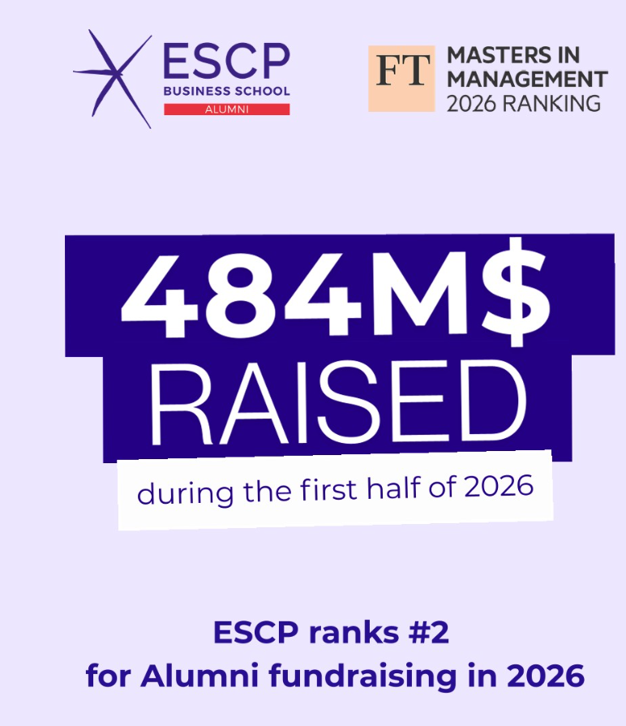
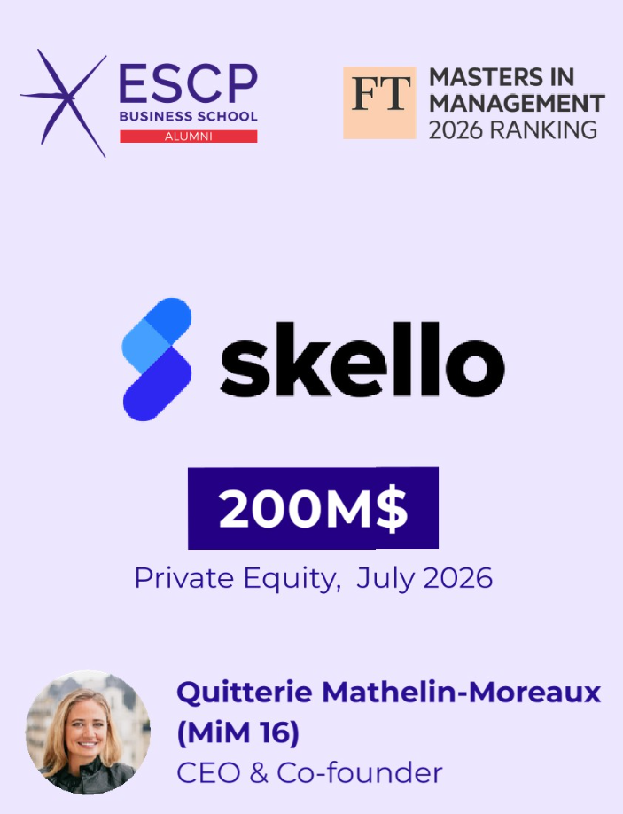
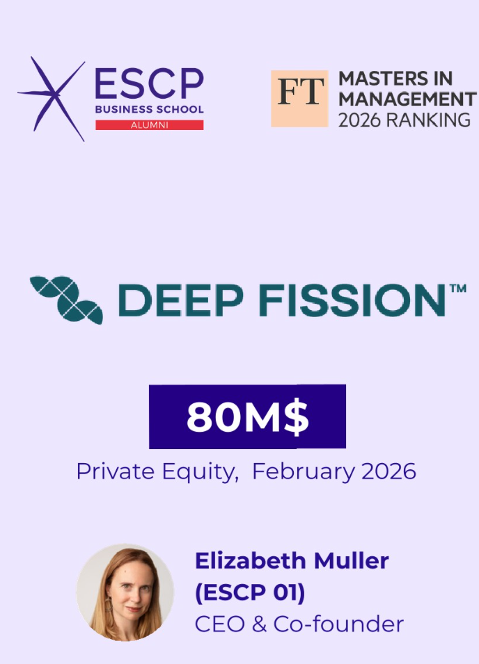
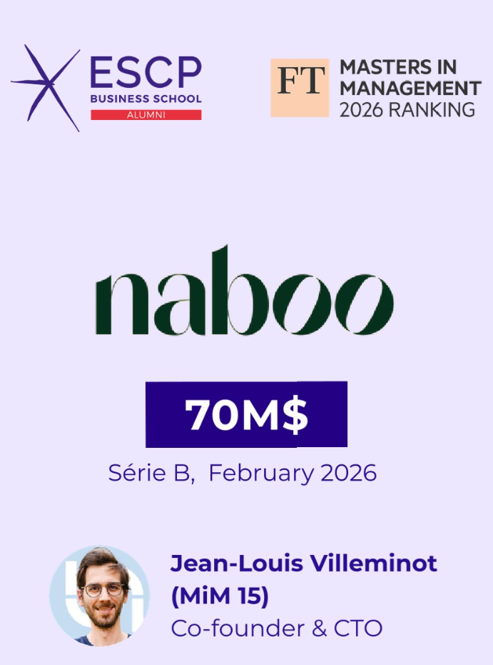

## ESCP is #2 for alumni fundraising {.smaller}

:::: {.columns}
::: {.column width="42%"}
{style="max-height: 500px"}
:::

::: {.column width="58%"}
- The **Financial Times Masters in Management 2026** ranking measures how much
  money the companies founded by each school's alumni have raised.

- Among the top 20 schools, **ESCP ranks second**.

- Companies founded by ESCP alumni raised **USD 484 million** between January
  and July 2026.

- Behind that number: entrepreneurs who convinced investors to put money into
  their firms. That is a **financing decision**, the subject we start next week.
:::
::::

## The top 3 rounds {.smaller}

:::::: {.columns}
::: {.column width="33%"}
{fig-align="center" width="75%" style="max-height: 250px"}

::: {.small}
**Skello**: staff scheduling and payroll software for shops, restaurants and care homes.
:::
:::

::: {.column width="33%"}
{fig-align="center" width="75%" style="max-height: 250px"}

::: {.small}
**Deep Fission** (US): small nuclear reactors buried 1.6 km underground.
:::
:::

::: {.column width="33%"}
{fig-align="center" width="75%" style="max-height: 250px"}

::: {.small}
**Naboo**: a platform to book company off-sites and seminars.
:::
:::
::::::

- Together USD 350 million, about **72%** of the USD 484 million. Three very
  different sectors, one common step: raising outside money to grow.

## Another way to raise money: Mistral AI borrows {.smaller}

- **Mistral AI**, the Paris start-up behind the Le Chat AI assistant, raised
  **USD 830 million of debt** in March 2026: a loan from seven banks, among
  them BNP Paribas, Crédit Agricole CIB, HSBC and MUFG.

- **What it pays for**: 13,800 Nvidia chips for a new data center at
  Bruyères-le-Châtel, south of Paris, about 44 megawatts of computing power.

- **Debt, not shares.** The banks do not become owners. Mistral must repay the
  loan with interest whatever happens; in exchange, its shareholders keep all
  of the ownership and of the future profits.

- **Why banks agree to lend**: the money buys physical assets that earn
  revenue from clients, and the chips themselves can be resold.

::: {.tiny}
Sources: CNBC, 30 March 2026; W.Media, "Mistral raises US$ 830 million in debt
financing to fund AI DC in France".
:::

## What these firms sold: a percentage of the ownership {.smaller}

- In each round, investors gave the firm cash and received a part of
  the ownership and of future profits. The firm raised **equity**.

- Two names on the slides:

  - **Series B**: a start-up's second large round from venture capital funds,
    once its product has shown it can sell.
  - **Private equity**: investment funds that buy shares in companies not
    listed on a stock exchange.

- The investors expect a return that pays for the risk they take. That
  required return, seen from the firm's side, is its **cost of capital**: the
  link with the CAPM of Lectures 4 and 5.

## Next week: capital structure {.smaller}

- A firm can finance itself with **equity** (selling shares) or with **debt**
  (borrowing from a bank or issuing bonds). The mix of the two is its **capital
  structure**.

- **Two cases, two choices**: Skello, Deep Fission and Naboo sold shares;
  Mistral AI borrowed USD 830 million from banks.

- Questions to keep in mind for next week:

  - Why did the alumni firms sell shares, while Mistral borrowed?
  - Does the mix of debt and equity change the value of a firm?
  - Who carries the risk when a firm borrows: the shareholders or the lenders?

::: {.box .box-a}
Fundraising news is capital structure in action. Read it with the questions
above in mind.
:::

## Follow ESCP Alumni on LinkedIn {.smaller}

- The **ESCP Alumni** page posts news like this: rankings, fundraising rounds,
  career stories of former students.

- **Why follow it:**

  - real examples of the decisions we study in class, with real numbers;
  - a network of alumni in every industry and country, useful for internships
    and jobs;
  - the **ESCP Blue Factory**, the school's start-up incubator, if you want to
    found a company yourself.

::: {.box .box-a}
Search for **ESCP Alumni** on LinkedIn and follow the page. The post on these
slides:
<https://www.linkedin.com/posts/escpalumni_escp-ranks-2-for-fundraising-by-its-alumni-activity-7506005446797729794-GQcX>
:::
