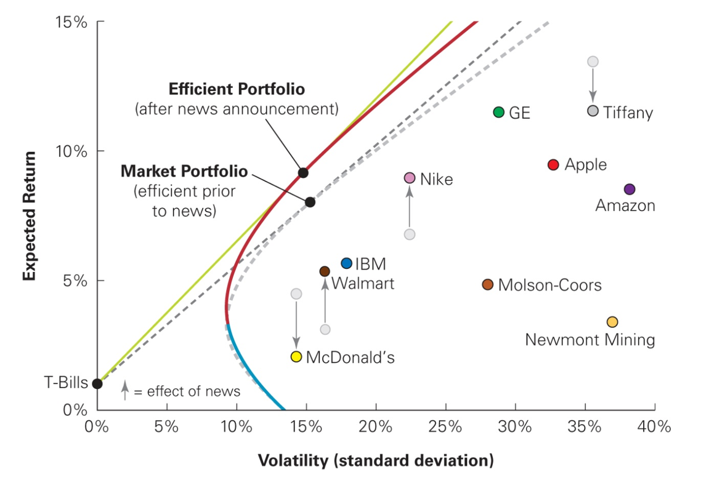
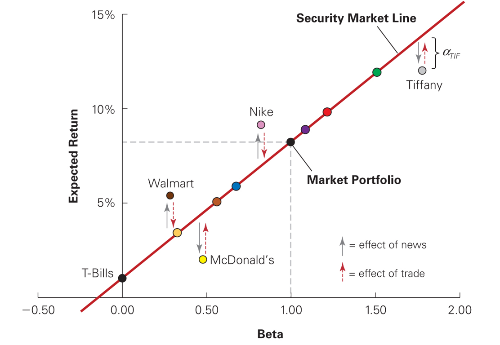
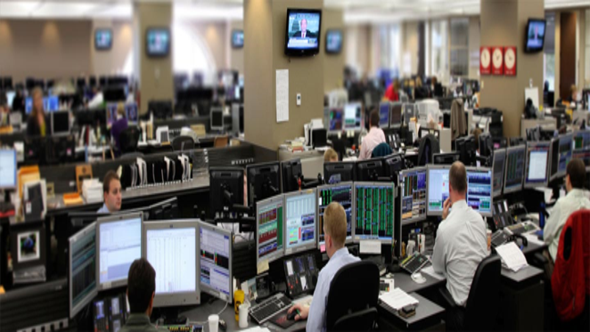
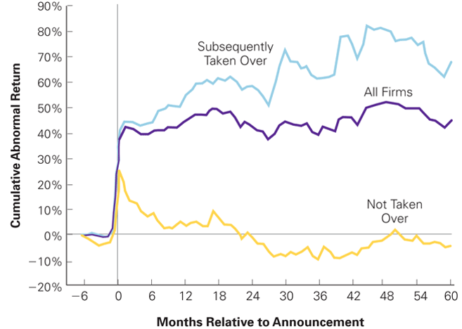
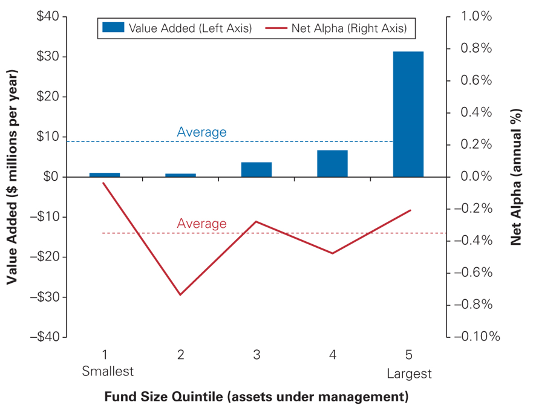
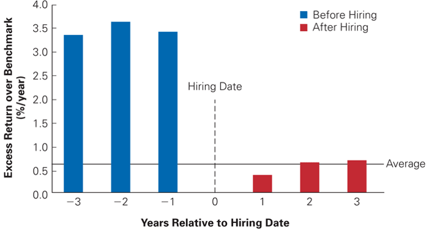
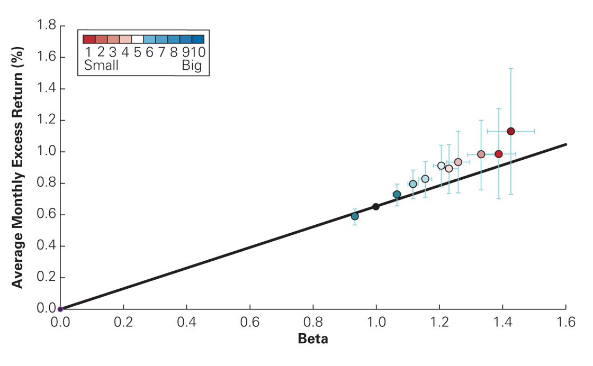
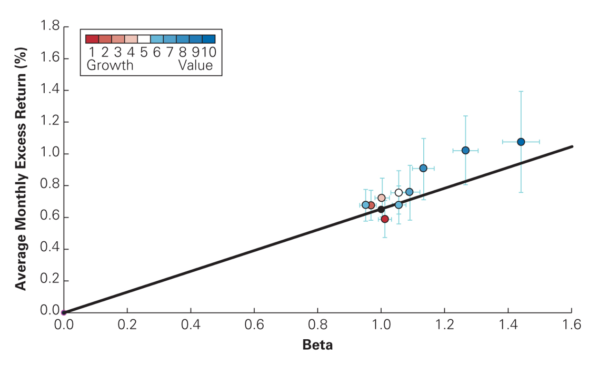

## Introduction

- Is it possible to systematically "beat" the market?

- Bill Miller, as a fund manager of Legg Mason Value Trust:

  - Outperformed the market each year between 1991 and 2005.

  - In 2007 and 2008, the fund lost almost 65% of its value.

- According to the CAPM, it should be impossible to achieve a
  performance (= Sharpe ratio) superior to the one of the market in a
  persistent manner!

## Outline

A.  Competition and capital markets (Chap 13.1)

B.  Information and rational expectations (Chap 13.2)

C.  The behavior of individual investors (Chap 13.3)

D.  Systematic trading biases (Chap 13.4)

E.  The efficiency of the market portfolio (Chap 13.5)

F.  Style-based techniques and the market efficiency debate (Chap. 13.6)

G.  Methods used in practice (Chap. 13.8)

## A. Competition and capital markets {.smaller}

- Necessary condition to beat the market?

  - The expected returns on some investments need to exceed their
    required returns.

- Difference between expected return and required return: alpha of an
  asset
  $$\alpha_{i} = E\left(R_{i}\right) - r_{i} = E\left(R_{i}\right) - \left(r_{f}+\beta_{i} \left(E\left(R_{M}\right)-r_{f}\right) \right).$$

- If the market portfolio is efficient, all the securities and all the
  portfolios are on the Security Market Line. $\Rightarrow$ Their alphas
  are zero.

## An inefficient market portfolio: example

::: {.center}
{fig-align="center"}
:::

::: {.footnotesize}

Market becomes inefficient after news announcement which lowers (raises)
expected returns of McDonald & Tiffany (Nike & Walmart).

:::

## Deviations from Security Market Line: example

::: {.center}
{fig-align="center"}
:::

::: {.footnotesize}

You can improve upon market portfolio by buying (selling) stocks with
positive (negative) alpha. As you do so, prices change and alphas shrink
toward zero.

:::

## B. Information and rational expectations

- Hypothesis of the CAPM $\Rightarrow$ all investors have access to the
  same information set

- Unrealistic in practice!

:::::: {.columns}
::: {.column width="45%"}
{fig-align="center"}
:::

::: {.column width="10%"}

::: {.large}

VS.

:::
:::

::: {.column width="45%"}
{fig-align="center"}
:::
::::::

- But "naïve" investors do not necessarily lose out:

## Example: how to avoid to be beaten by informed investors? {.smaller}

- Jérôme does not have access to any information regarding stocks.
  Nevertheless, he knows that the other investors have a great deal of
  information and use that information when they construct their
  portfolio.

- This information asymmetry is a concern to Jérôme, because he thinks
  it will cause his portfolio to underperform the portfolio of the other
  investors.

  $\Rightarrow$ How can he guarantee that his portfolio will do as well
  as that of the average investors?

## Rational expectations and the inefficiency of the market portfolio {.smaller}

The market portfolio can be inefficient (so it is possible to beat the
market) only if a significant number of investors either

- Do not have **rational expectations** so that they misinterpret
  information and believe they are earning a positive alpha when they
  are actually earning a negative alpha,

  ::: {.center}
  OR
  :::

- Care about aspects of their portfolios other than expected returns and
  volatility, and so are willing to hold inefficient portfolios of
  securities.

## C. The behavior of individual investors {.smaller}

- Underdiversification

  - In 2001, for households that held stocks, median number of stocks
    held was 4, and 9 out of 10 held less then 10 stocks. Possible
    explanations:

    - Familiarity bias

    - "Keeping up with the Joneses" (relative wealth concerns)

- Overconfidence

  - Leads to excessive trading $\Rightarrow$ Reduces the performance due
    to transaction costs.

  . . .

- Underdiversification and excessive trading violate key predictions of
  CAPM, but does this imply that remaining conclusions of CAPM are also
  invalid?

  . . .

- Not necessarily, if departures from CAPM are random. $\Rightarrow$ To
  have an impact, biases need to lead to systematic deviations from
  rational behavior.

## D. Systematic trading biases {.smaller}

- Disposition effect

  - Tendency to sell winners too early and hang on to losers too long.

- Investor attention, mood, and experience

- Herd behavior (imitate each other's actions)

  - Informational cascade effect: ignore own information and hope to
    profit from information of others.

  - Relative wealth and performance concerns.

  . . .

$\Rightarrow$ Consequences: Biases will affect prices if:

- Biases are sufficiently pervasive and persistent.

- Competition to exploit these arbitrage opportunities is limited.

## E. The efficiency of the market portfolio {.smaller}

Example for trading on news: Takeover offers

- If you could predict whether firm would ultimately be acquired or not,
  you could earn trading profits.

:::::: {.center}
::::: {.columns}
::: {.column width="70%"}
{fig-align="center"}
:::

::: {.column width="30%"}

::: {.scriptsize}

Source: Adapted from M. Bradley, A. Desai, and E. H. Kim, "The Rationale
Behind Interfirm Tender Offers: Information or Synergy?" Journal of
Financial Economics 11 (1983) 183-206.

:::
:::
:::::

::: {.small}

Returns to holding target stocks subsequent to takeover announcements

:::
::::::

## Performance of fund managers {.smaller}

- Fund Manager Value-Added

  - Before fees and adjusting for assets under management, the average
    mutual fund adds value.

  - However, the median mutual fund destroys value.

  - Most fund managers appear to trade so much that their trading costs
    exceed the profits from any trading opportunities they may find.

- Return to Investors

  - Numerous studies report that the actual alpha (net of fees) to
    investors of the average mutual fund is negative.

  - Superior past performance is not a good predictor of a fund's future
    ability to outperform the market.

## Performance of fund managers (con't) {.smaller .dense}

::::: {.columns}
::: {.column width="49%"}

::: {.small}

Manager Value Added and Investor Returns for U.S. Mutual Funds

:::
:::

::: {.column width="49%"}

::: {.small}

Before and After Hiring Returns of Investment Managers

:::
:::
:::::

::::: {.columns}
::: {.column width="49%"}
{fig-align="center"}
:::

::: {.column width="49%"}
{fig-align="center"}
:::
:::::

::::: {.columns}
::: {.column width="49%"}

::: {.tiny}

Source: J. Berk and J. van Binsbergen, "Measuring Managerial Skill in
the Mutual Fund Industry," Journal of Financial Economics 118 (2015):
1-20.

:::
:::

::: {.column width="49%"}

::: {.tiny}

Sources: A. Goyal and S. Wahal, "The Selection and Termination of
Investment Management Firms by Plan Sponsors," Journal of Finance 63
(2008): 1805-1847 and with J. Busse, "Performance and Persistence in
Institutional Investment Management," Journal of Finance 63 (2008):
1805-1847.

:::
:::
:::::

## The winners and the losers

- The average investor earns an alpha of zero, before including trading
  costs.

- Beating the market should require special skills or lower trading
  costs.

  - Because individual investors are likely to be at a disadvantage on
    both counts, the CAPM wisdom that investors should "hold the market"
    is probably the best advice for most people.

## F. Style-based techniques and the market efficiency debate {.smaller .dense}

- Excess return and market capitalizations (Size effect)

  - Small market capitalization stocks have historically earned higher
    average returns than the market portfolio, even after accounting for
    their higher betas.

- Excess return and book-to-market ratio (B/M effect)

  - High book-to-market (value) stocks have historically earned higher
    average returns than low book-to-market (growth) stocks.

- Momentum

  - Strategy: buy stocks that have had past high returns and (short)
    sell stocks that have had past low returns.

- Empirical evidence:

  - Possibility of a data snooping bias: given enough characteristics,
    it will always be possible to find some characteristic that by pure
    chance happens to be correlated with the estimation error of average
    returns.

  - But Size, B/M and Momentum effects seem to be robust.

## Empirical evidence (con't) {.smaller}

::::: {.columns}
::: {.column width="50%"}
{fig-align="center"}
:::

::: {.column width="50%"}
{fig-align="center"}
:::
:::::

::::: {.columns}
::: {.column width="42%"}
Excess Return of Size Portfolios, 1926-2015
:::

::: {.column width="42%"}
Excess Return of Book-to-Market Portfolios, 1926-2015
:::
:::::

::: {.center}
::: {.small}

Data is from Ken French's datalibrary:
<http://mba.tuck.dartmouth.edu/pages/faculty/ken.french/data_library.html>.

:::
:::

## Implications of positive-alpha trading strategies {.smaller}

- The only way positive-alpha strategies can persist in a market is if
  some barrier to entry restricts competition.

  - However, the existence of these trading strategies has been widely
    known for more than 20 yrs.

- Another possibility is that the market portfolio is not efficient, and
  therefore a stock's beta with the market is not an adequate measure of
  its systematic risk.

- Proxy error: true market portfolio may be efficient, but our proxy may
  be inaccurate.

- Behavioral biases: may induce investors to hold inefficient
  portfolios.

- Alternative risk preferences and non-tradable wealth: may induce
  investors to choose inefficient portfolios (in the mean-variance
  sense).

## G. Methods used in practice {.smaller}

- There is no clear answer to the question of which technique is used in
  practice---it very much depends on the organization and the sector.

- In addition, all the techniques covered are imprecise.

- A survey of CFOs found that

  - 73.5% of the firms used the CAPM to calculate the cost of capital.

  - 40% used historical average returns.

  - 16% used the dividend discount model.

  - Larger firms were more likely to use the CAPM than were smaller
    firms.

## Quiz

- If investors buy a stock with a positive alpha, what is the likely
  effect on its price and expected return?

- How can uninformed investors guarantee themselves a non-negative
  alpha?

- Why is the high trading volume observed in markets inconsistent with
  the CAPM equilibrium?

- What are some of the systematic trading biases to which individual
  investors fall prey?
