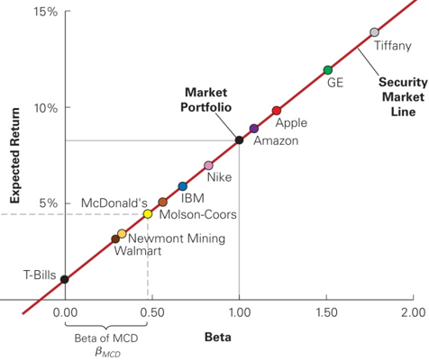
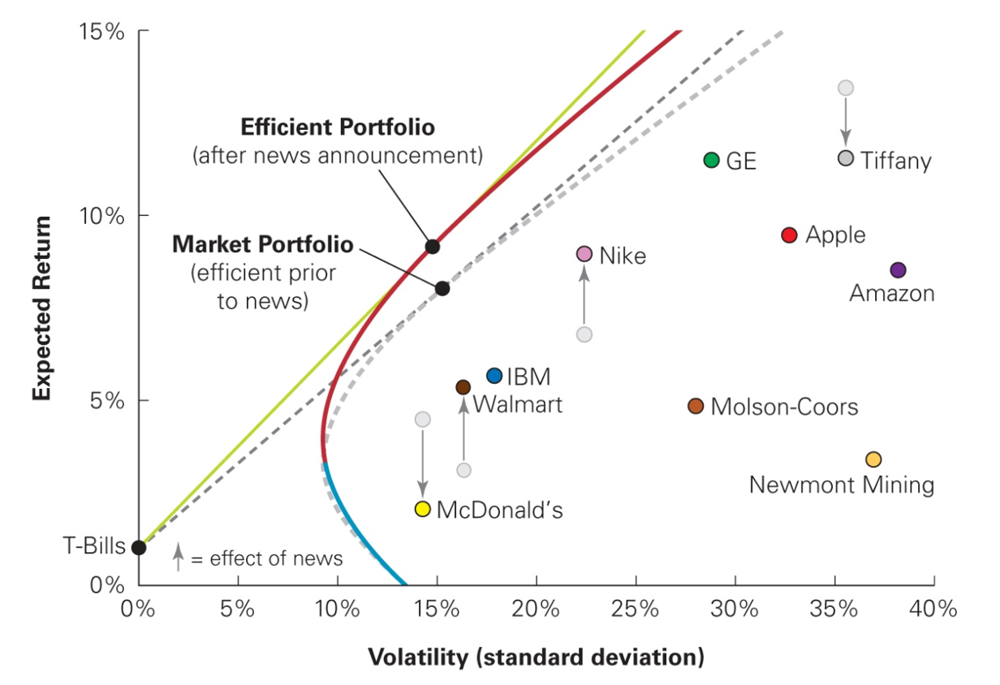
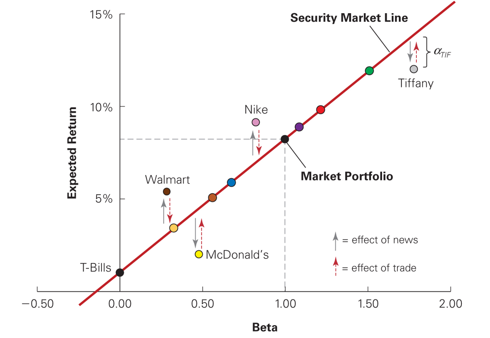
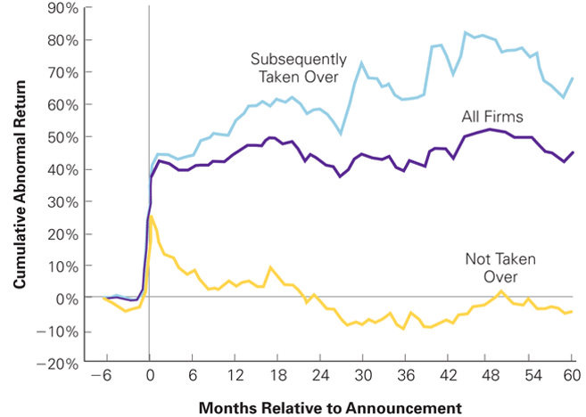
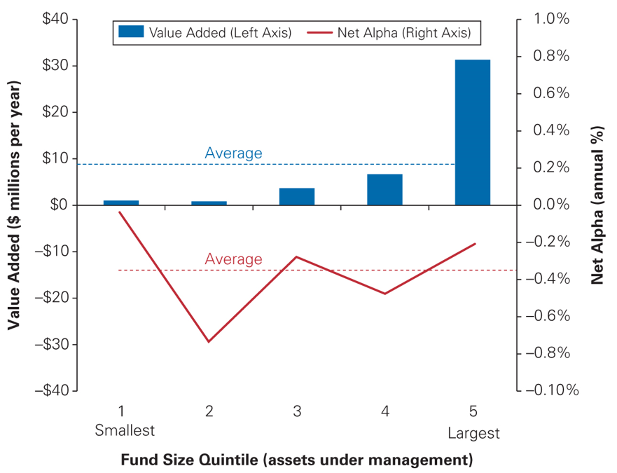
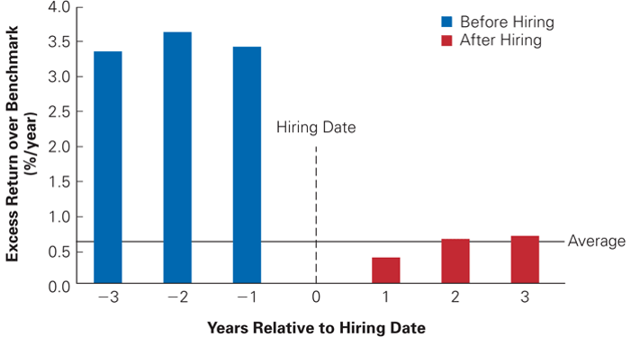
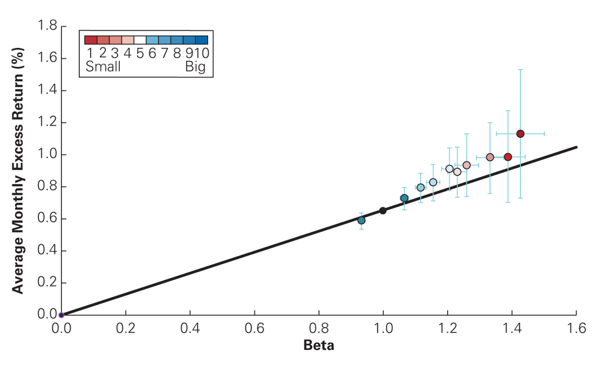
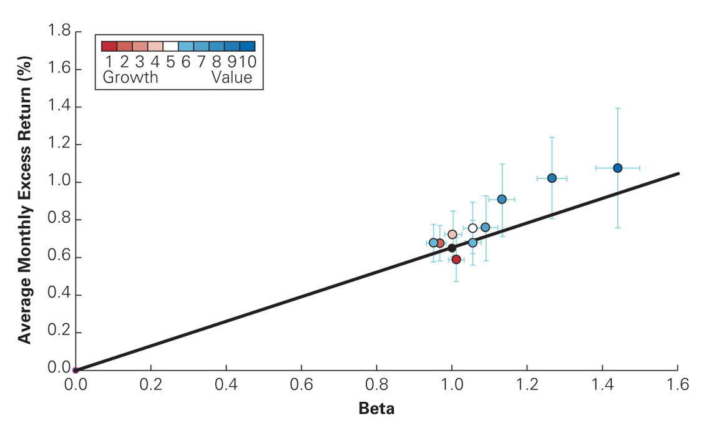

## Plan

- Recap from lecture 4

- Ask what it takes to beat the market: the alpha of a stock

- See why competition makes it hard, and who loses when someone wins

- Look at how investors and fund managers actually behave and perform

- Meet the strategies that seem to beat the CAPM, and ask whether the CAPM still holds

Mostly based on the BDM textbook Chap. 13.

## {.center}

::: {.content-visible when-format="revealjs"}
::: {.center .huge}
Recap lecture 4
:::
:::

```{=latex}
\vfill
\begin{center}
{\color{escpblue}\Huge\bfseries Recap lecture 4}
\end{center}
\vfill
```

## Recap of Lecture 4 {.smaller}

Let's do a recap:

- The capital market line

- Is a stock worth adding to the portfolio?

- The CAPM assumptions

- How the assumptions take us from the tangency portfolio to the market
  portfolio

- From the required return to the CAPM

- The CAPM and how to read it

- The security market line

## Recap: the capital market line {.smaller .shrink}

:::: {.columns}
::: {.column width="50%"}
::: {style="text-align: left"}
- Everyone mixes the risk-free asset with the same risky portfolio, the
  tangency portfolio. These mixes lie on one straight line, the **Capital
  Market Line** (CML) (Chap. 11.7):

  $$E(R_{p}) = r_{f} + \frac{E(R_{M}) - r_{f}}{\sigma_{M}} \times \sigma_{p}$$

- Its slope is the Sharpe ratio of the tangency portfolio: the best return
  for each unit of risk.

- **Which portfolio sits at the tangency point?** The market, $M$.
:::
:::

::: {.column width="50%"}
{width="100%" style="max-height: 420px"}
:::
::::

## Recap: is a stock worth adding? {.smaller .shrink}

::: {.box .box-a}
A stock $A$ is worth adding to your portfolio $P$ only if its expected return
pays for the risk it adds to *your* portfolio. That risk depends on how $A$
**moves with what you already hold**.
:::

- The return $A$ must offer is its **required return** (Chap. 11.6):

  $$r_{A} = r_{f} + \beta_{A,P}\,\big(E(R_{P}) - r_{f}\big)$$

  $$\beta_{A,P} = \frac{Cov(R_{A}, R_{P})}{Var(R_{P})} = \rho_{A,P}\,\frac{\sigma_{A}}{\sigma_{P}}$$

  The beta says how much $A$ moves when your portfolio $P$ moves by 1%: the covariance
  of the two divided by the variance of $P$, or equivalently the correlation times the
  ratio of their volatilities.

- **Example.** You hold only Intel: expected return 26%, volatility 50%. The risk-free rate is 3%. Coca-Cola
  pays 6% with 25% volatility. Correlation 0: beta 0, required return 3%,
  **buy**. Correlation 0.5: beta 0.25, required return 8.75%, **do not**.

## Recap: the CAPM assumptions {.smaller}

::: {.box .box-a}
**1. Everyone can lend and borrow at the risk-free rate $r_{f}$.**
So the efficient set is the straight line from $r_{f}$ tangent to the frontier.
:::

::: {.box .box-a}
**2. Everyone shares the same estimates** of expected returns, volatilities and
correlations. So everyone computes the **same** tangency portfolio.
:::

::: {.box .box-a}
**3. Everyone holds an efficient portfolio.** So everyone holds that one
tangency portfolio, mixed with the risk-free asset in their own proportion.
:::

Strong assumptions.

## Recap: from the tangency portfolio to the market {.smaller}

- With only Intel and Coca-Cola, every investor holds the same tangency mix:
  **65.7% Intel, 34.3% Coca-Cola**. Add up all investors: 65.7% of all the
  money invested in stocks is in Intel.

- The market is the sum of all individual portfolios. If everyone holds the
  same efficient portfolio, the market has the same weights: if everyone has
  65.7% Intel, Intel is 65.7% of the market.

::: {.box .box-a}
The **market portfolio** $M$ holds **all** risky assets, each with a weight
equal to its market value divided by the total value of the market.
:::

::: {.box .box-a}
In equilibrium, the tangency portfolio is the market portfolio: $M$ is the
tangency point of the CML (Chap. 11.7).
:::

## Recap: from the required return to the CAPM {.smaller}

- The required return rule works for any portfolio $P$. Everyone holds the
  market, so replace $P$ by $M$.

  $$\begin{aligned}
  &r_{A} = r_{f} + \beta_{A,P}\,\big(E(R_{P}) - r_{f}\big)\\
  \longrightarrow\quad &r_{A} = r_{f} + \beta_{A,M}\,\big(E(R_{M}) - r_{f}\big)
  \end{aligned}$$

- **A stock that paid more** than its required return would raise the Sharpe
  ratio of $M$. Everyone would buy it, and its price would rise until the extra
  return disappears.

- **A stock that paid less** would be sold by everyone, and its price would fall
  until the gap closes.

- So in equilibrium every stock pays exactly its required return with respect
  to the market. That is the **CAPM** (Chap. 11.8):

  $$E(R_{i}) = r_{f} + \beta_{i}\,\big(E(R_{M}) - r_{f}\big)$$

## Recap: the CAPM and how to read it {.smaller}

::: {.box .box-a}
$$E(R_{i}) = r_{f} + \underbrace{\beta_{i}\,\big(E(R_{M}) - r_{f}\big)}_{\text{risk premium of stock } i}
\qquad\qquad
\beta_{i} = \frac{\text{Cov}(R_{i},R_{M})}{\text{Var}(R_{M})}$$
:::

- $r_{f}$: the risk-free rate. $E(R_{M}) - r_{f}$: the **market risk premium**.
  $\beta_{i}$: how much stock $i$ moves when the market moves by 1%.

- **Only market risk is paid.** Idiosyncratic risk can be diversified away for
  free, so it earns nothing.

- $\beta_{i} = 1$: the market's own premium. $\beta_{i} = 0$: just $r_{f}$.
  $\beta_{i} < 0$: below $r_{f}$, the stock is insurance against market falls.

- **Example.** Risk-free rate 4%, expected market return 10%, beta 0.33:
  $E(R_{A}) = 4\% + 0.33 \times 6\% = 6\%$.

## Recap: the security market line {.smaller}

:::: {.columns}
::: {.column width="52%"}
::: {style="text-align: left"}
- Draw the CAPM with **beta** on the horizontal axis and expected return on
  the vertical one: a straight line, the **Security Market Line** (SML)
  (Chap. 11.8).

  - at $\beta = 0$ it gives $r_{f}$;
  - at $\beta = 1$ it gives $E(R_{M})$, the market;
  - its **slope** is the market risk premium.

- **Every stock and every portfolio sits on this line.** On the CML, with
  total risk on the axis, only mixes of the market and the risk-free asset do.
:::
:::

::: {.column width="48%"}
{width="100%" style="max-height: 420px"}
:::
::::

## {.center}

::: {.content-visible when-format="revealjs"}
::: {.center .huge}
Beginning of lecture 5 content
:::

::: {.center .small}
Lecture 4 said every stock sits on the Security Market Line, so nobody can beat
the market. Today we ask whether that holds in practice.
:::
:::

```{=latex}
\vfill
\begin{center}
{\color{escpblue}\Huge\bfseries Beginning of lecture 5 content}

\vspace{1.5em}
\begin{minipage}{0.8\textwidth}
\small\centering
Lecture 4 said every stock sits on the Security Market Line, so nobody can beat
the market. Today we ask whether that holds in practice.
\end{minipage}
\end{center}
\vfill
```

## Introduction {.smaller}

- **Can anyone beat the market?** That is: earn more than the market year after
  year, without taking more risk.

- Bill Miller, manager of the Legg Mason Value Trust fund, did it **every year
  from 1991 to 2005**. Investors followed: the fund grew from USD 0.7 billion
  to USD 28 billion.

- In 2007 and 2008 the fund lost almost **65%** of its value, and with it all
  its lead over the market. At the end of 2008 it held USD 1.2 billion.

- **Skill, or fifteen years of luck?**

::: {.box .box-a}
The CAPM says nobody should beat the market persistently. Today we check that
claim against how investors behave and what the data show.
:::

## Outline

A.  What does "beating the market" mean? (Chap. 13.1)

B.  Who is on the other side of the trade? (Chap. 13.2)

C.  Do investors behave as the CAPM says? (Chap. 13.3-4)

D.  Does anyone actually win? (Chap. 13.5)

E.  Strategies that seem to beat the CAPM (Chap. 13.6-7)

F.  So, do we keep the CAPM? (Chap. 13.8)

## A. Beating the market: the alpha {.smaller}

::: {.box .box-a}
**The answer first.** To beat the market you need stocks that pay more than the
CAPM says they must. Competition between investors leaves few of them, and not
for long.
:::

- The **alpha** of a stock is what it is expected to pay minus what the CAPM
  requires it to pay:

  $$\alpha_{i} = \underbrace{E(R_{i})}_{\text{expected return}} - \underbrace{\big(r_{f} + \beta_{i}\,(E(R_{M}) - r_{f})\big)}_{\text{required return (Lecture 4)}}$$

- **Positive alpha**: the stock pays more than its risk requires. It sits
  **above** the Security Market Line. **Negative alpha**: it sits below.

- **Alpha of zero for every stock**: that is the CAPM, every stock on the line.

## Example: computing an alpha {.smaller}

- Risk-free rate 4%, expected market return 10%: a market risk premium of 6%.

- **Stock X**: beta 1.2, expected return 13%.

  - Required return: $4\% + 1.2 \times 6\% = 11.2\%$.
  - Alpha: $13\% - 11.2\% = +1.8\%$. It pays more than its risk requires: **buy**.

- **Stock Y**: beta 0.5, expected return 6%.

  - Required return: $4\% + 0.5 \times 6\% = 7\%$.
  - Alpha: $6\% - 7\% = -1\%$. It pays less than its risk requires: **sell**.

- Each stock is judged against **its own** required return, not against the
  other stock.

- Holding more of X and less of Y than the market does gives a higher Sharpe
  ratio than the market. That is what "beating the market" means.

## When news arrives {.smaller}

::: {.center}
{width="50%"}
:::

- Start in the CAPM world: all alphas are zero, the market is the tangency
  portfolio.

- **News arrives**: good for Walmart and Nike (expected returns up 2%), bad for
  McDonald's and Tiffany (down 2%). Until prices move, alphas are not zero and
  the market portfolio is no longer the best one.

## Competition pushes alphas to zero {.smaller}

:::: {.columns}
::: {.column width="50%"}
::: {style="text-align: left"}
- Investors who see the news buy the positive-alpha stocks and sell the
  negative-alpha ones.

- **Buying raises the price, which lowers the return.** Stock X costs EUR 100
  and should be worth 113 in a year: 13%. Buyers push the price to about 101.6.
  From there, 113 is a return of 11.2%: the alpha is gone.
:::
:::

::: {.column width="50%"}
{width="100%" style="max-height: 300px"}
:::
::::

::: {.box .box-a}
Competition between investors keeps alphas close to zero, and so keeps the
market portfolio close to efficient.
:::

## B. Every buyer needs a seller {.smaller}

- Somebody sold stock X at EUR 100. **The buyer's gain is the seller's loss.**

- All investors together hold the whole market. So the **average** investor
  earns the market return: an alpha of zero. For one investor to earn a positive
  alpha, another must earn a negative one.

- Is the investor with no information bound to be the loser? No, as the next
  example shows.

## Example: Jérôme, the uninformed investor {.smaller}

- Jérôme has no information about any stock.

- He knows that other investors have a great deal of information and use it
  when they build their portfolios.

- He worries that his portfolio will do worse than theirs.

::: {.box .box-a}
How can Jérôme guarantee that his portfolio does as well as that of the average
investor?
:::

## Example: Jérôme (con't) {.smaller}

- **He holds the market portfolio**: every stock in proportion to its market
  value, as an index fund does.

- **Why it works.** All investors together hold the market, so the market
  return is the return of the average investor. Jérôme earns it whatever the
  others know.

- **How he would lose.** By moving away from the market. If he holds less of a
  stock than the market does, informed investors hold more of it. When they are
  right about good news, they gain at his expense.

::: {.box .box-a}
Holding the market guarantees an alpha of zero. It needs no information and no
skill.
:::

## Holding the market in practice {.smaller}

- Nobody can buy every risky asset in the world. In practice we **approximate
  the market portfolio with a stock index**: the S&P 500 (500 largest US firms),
  the CAC 40 (40 largest French firms), the Euro Stoxx 50, the MSCI World…

- The simplest way to hold an index is to buy an **ETF** (exchange-traded fund):
  one share that holds all the stocks of the index, in its weights, at a low fee.

::: {.box .box-a}
**Passive asset management:** hold the index (e.g. through an ETF) and do not
try to pick stocks. You earn the market return, minus a small fee.
:::

::: {.box .box-b}
**Active asset management:** pick stocks or time the market, trying to beat the
index. You aim for a positive alpha, but pay higher fees and trading costs.
:::

## When can the market be beaten? {.smaller}

- If every uninformed investor held the market, informed investors would have
  nobody to gain from. Beating the market needs **many investors who do not
  hold the market**. Why would they not? (Chap. 13.2)

::: {.box .box-a}
**1. They misread information.** They believe they are earning a positive alpha
when they are earning a negative one. Economists say they do not have
**rational expectations**.
:::

::: {.box .box-a}
**2. They care about something other than expected return and volatility**, and
are willing to hold an inefficient portfolio for it.
:::

- Either way, we need to look at how investors actually behave.

## Who is on the other side? {.smaller}

Follow the argument step by step (Chap. 13.2):

1. **Anyone can get an alpha of zero for free**: just hold the market, like
   Jérôme. No information or skill needed.

2. **On average, investors earn an alpha of zero**: together they hold the market.

3. So if you earn **+2%** of alpha, someone else earns **−2%**. When you buy the
   underpriced stock, someone sold it to you.

4. **Who accepts −2% when 0% is free?** Not an investor who behaves as the
   theory assumes.

::: {.box .box-a}
To beat the market, you need a counterpart who behaves **differently from what
the theory predicts**.
:::

## Behavioral biases {.smaller}

::: {.box .box-a}
A **behavioral bias** is a predictable mistake that many investors make: it
pushes them away from holding the market, and costs them return.
:::

- These biases are what put losers on the other side of the trade. We look at
  them in two steps:

  - **What individual investors do** (Chap. 13.3): they hold too few stocks
    (**familiarity**, **keeping up with the Joneses**) and trade too much
    (**overconfidence**, **sensation seeking**).
  - **Do the mistakes move prices?** (Chap. 13.4) Only if many investors make
    the **same** mistake at the same time: **disposition effect**, **attention
    and mood**, **herd behavior**.

- If prices move, better informed investors can profit. Do they? We then look at
  the professionals.

## C. Mistake 1: too little diversification {.smaller}

- **The CAPM says**: everyone holds the market, thousands of stocks.

- **In reality** (US households that own stocks):

  - the median household holds **4 stocks**, and 9 out of 10 hold fewer than 10;
  - employees keep about a third of their retirement savings in the stock of
    their own employer.

- They carry idiosyncratic risk, which earns nothing (Lecture 4).

- **Why?**

  - **Familiarity bias**: people buy the companies they know.
  - **Keeping up with the Joneses**: people care about doing as well as their
    neighbours, so they hold what their neighbours hold.

## Mistake 2: too much trading {.smaller}

- **The CAPM says**: buy the market and hold it. There is little reason to
  trade. **In reality**, trading volume is enormous.

- **Why?** **Overconfidence**: investors believe they know more than the others.
  **Sensation seeking**: trading is exciting.

- Clients of a US discount broker, 1991-1997, sorted by how much they trade:

::: {.center}
| Investors                  | Return per year, after costs |
|:---------------------------|:----------------------------:|
| The least active fifth     | about 18.5%                  |
| The most active fifth      | about 11.5%                  |
| The market index (S&P 500) | about 18%                    |
:::

- The more they trade, the less they keep: trading costs eat the return.

## Do these mistakes move prices? {.smaller}

- Too little diversification and too much trading both contradict the CAPM.
  Does the rest of the CAPM fall with them?

- **Not necessarily.** If the mistakes are random, they cancel out. One investor
  holds too much Danone, another too little. Together they still hold the
  market, and prices do not move.

::: {.box .box-a}
Individual mistakes change prices only if many investors make the **same
mistake at the same time**: a systematic bias.
:::

- Are there such biases? (Chap. 13.4)

## Mistakes in the same direction {.smaller}

- **Disposition effect**: selling winners too early and holding on to losers
  too long.

  - Investors are about twice as likely to sell a stock at a gain as at a loss.
  - The losers they kept then did 3.4% worse over the next year than the
    winners they sold.

- **Attention and mood**: investors buy the stocks that are in the news, and
  buy more when they feel good.

  - In New York, the market's annualised return was about 24.8% on sunny days
    against 8.7% on cloudy days.

- **Herd behavior**: investors imitate each other, because they think the
  others know something, or because they fear being left behind.

## What the biases imply {.smaller}

- These biases push many investors the same way, so they can push prices away
  from what the CAPM says.

- They change prices only if:

  - they are widespread and they last;
  - better informed investors cannot fully trade against them.

::: {.box .box-a}
If ordinary investors make systematic mistakes, better informed investors
should be able to profit from them.
:::

- Do they? We now look at the evidence on professionals.

## D. Trading on news: takeover offers {.smaller}

- Can informed investors profit from others' mistakes? The simplest test:
  trade on **public news**, hoping others are slow to react (Chap. 13.5).

- **Takeover offer**: firm A offers to buy all the shares of firm B, usually
  well above B's current price. Big news for B's shareholders.

- **Example (illustrative).** B trades at EUR 40. A offers EUR 60. The same day,
  B jumps to EUR 55, not EUR 60. Why not? **The deal may fail.**

  - It succeeds (say 75% chance): you get EUR 60, a gain of EUR 5.
  - It fails (25% chance): B falls back to EUR 40, a loss of EUR 15.
  - Expected price: 0.75 × 60 + 0.25 × 40 = **EUR 55**, today's price.

::: {.box .box-a}
The EUR 5 gap is no free gain: it pays you for the risk that the deal fails.
:::

## D. Trading on news: takeover offers (con't) {.smaller .shrink}

::::: {.columns}
::: {.column width="58%"}
{fig-align="center" style="max-height: 340px"}

::: {.tiny}
Returns to holding target stocks after takeover announcements. Source: adapted
from M. Bradley, A. Desai, and E. H. Kim, "The Rationale Behind Interfirm
Tender Offers: Information or Synergy?" Journal of Financial Economics 11
(1983) 183-206.
:::
:::

::: {.column width="42%"}
- The chart averages many takeovers. It shows B's **abnormal return**: its
  return above what its beta predicts, added up month after month.

- **All firms**: a jump at month 0, then flat. Buying after the news earns
  no alpha.

- **Taken over**: keeps rising. **Not taken over**: falls back.
:::
:::::

::: {.box .box-a}
**Main idea:** public news is in the price the same day. To earn alpha you must
know more than others: here, predict whether the deal will succeed.
:::

## Do fund managers have skill? {.smaller}

- Fund managers are the best informed investors. Two separate questions:

::: {.box .box-a}
**Do managers find extra value? Some do.** Before fees, the average fund adds
about USD 3 million a year. But the median fund destroys value: most managers
trade so much that their costs exceed what they find.
:::

::: {.box .box-a}
**Do their investors receive it? No.** After fees, the alpha of the average
fund is about $-0.3\%$ a year for its investors.
:::

- Before fees is the fund's **gross alpha**; after fees, its **net alpha**. The
  investor only earns the net alpha.

## The evidence in two pictures {.smaller .dense}

::::: {.columns}
::: {.column width="49%"}
{fig-align="center" style="max-height: 300px"}

Larger funds add more value (bars), yet their investors earn no more (line).
:::

::: {.column width="49%"}
{fig-align="center" style="max-height: 300px"}

Managers beat the market before pension funds hire them, and are average after.
:::
:::::

::: {.tiny}
Sources: J. Berk and J. van Binsbergen, Journal of Financial Economics 118
(2015); A. Goyal and S. Wahal, Journal of Finance 63 (2008).
:::

## Why investors do not capture the skill {.smaller}

- **Money chases performance.** When a manager does well, investors pour money
  into the fund: Bill Miller's went from USD 0.7 billion to USD 28 billion.

- **A bigger fund is harder to run.** Good ideas are limited and get spread over
  more money, and fees take the rest. Money keeps coming until investors can
  expect no more than the market return.

- **So past winners do not keep winning.**

  - Buying each year the funds on the Forbes "honor roll", for 19 years:
    11.2% a year, against 13.1% for an index fund.
  - Pension funds hire managers who beat the market by about 3.5% a year over
    the three years before. After hiring, they are average.

- Back to Bill Miller: the investors who arrived after fifteen good years got
  the two bad ones.

## The winners and the losers {.smaller}

- The average investor earns an alpha of zero **before** trading costs. Doing
  better needs special skill or lower costs.

- Individual investors usually have neither. In Taiwan, individuals lose 3.8% a
  year through their trading; institutions gain 1.5%.

- Skilled managers exist, but they keep the gain through their fees.

::: {.box .box-a}
For most people the CAPM's advice is the best one: **hold the market** (an
index fund), mixed with the risk-free asset.
:::

- One loose end: some simple strategies seem to beat the CAPM.

## E. Three patterns the CAPM misses {.smaller}

Three strategies that use only public information have earned positive alphas
over long periods (Chap. 13.6):

- **Size.** Small firms (low market value) have earned more than their beta
  justifies.

- **Value.** The **book-to-market ratio** is the accounting value of a firm's
  equity divided by its market value. Stocks with a high ratio ("value" stocks)
  have earned more than stocks with a low ratio ("growth" stocks).

- **Momentum.** Stocks that rose the most over the last 6 to 12 months keep
  doing better, for a few months, than those that fell the most. Buying the
  winners and selling the losers earned an alpha above 12% a year (US,
  1965-1989).

## The evidence: size and book-to-market {.smaller}

::::: {.columns}
::: {.column width="50%"}
{fig-align="center" style="max-height: 300px"}

::: {.small}
Excess Return of Size Portfolios, 1926-2015
:::
:::

::: {.column width="50%"}
{fig-align="center" style="max-height: 300px"}

::: {.small}
Excess Return of Book-to-Market Portfolios, 1926-2015
:::
:::
:::::

- Each dot is a group of stocks sorted by size (left) or by book-to-market
  (right). Under the CAPM every dot would be on the line. Most are above it.

::: {.tiny}
Data from Ken French's data library:
<http://mba.tuck.dartmouth.edu/pages/faculty/ken.french/data_library.html>.
:::

## Real, or found by chance? {.smaller}

- **Data snooping.** Test enough characteristics and one of them will match
  past returns by pure luck. A famous joke result: butter production in
  Bangladesh "predicted" the US stock market.

- Size, value and momentum are harder to dismiss: they show up in other
  periods and in other countries.

- There is also a logic to size and value. If a stock has a positive alpha,
  **for whatever reason**, its price is low compared with what it pays. A low
  price means a low market value and a high book-to-market ratio.

::: {.box .box-a}
So if the CAPM misses something, small stocks and value stocks are exactly
where the positive alphas should appear.
:::

## What could explain the patterns? {.smaller}

- A positive-alpha strategy that everyone knows should be competed away. These
  have been known for decades and are still there. The likelier explanation:

::: {.box .box-a}
The market portfolio we use is not exactly efficient, so a stock's beta with it
misses part of the stock's risk.
:::

- **Proxy error.** The true market portfolio holds every asset: property,
  private firms, bonds. A stock index is only a stand-in for it.

- **Behavioral biases.** The mistakes of section C lead investors to hold
  inefficient portfolios.

- **Other risks investors care about.** Someone who works in a bank already
  depends on banks for a salary, and may avoid bank stocks on purpose.

## If beta is not enough: more factors {.smaller}

- If the beta with the market misses part of the risk, measure risk against
  **several portfolios** instead of one (Chap. 13.7).

- The best-known version uses four, built from the patterns of section E:

  1. the market;
  2. small firms minus big firms;
  3. value stocks minus growth stocks;
  4. past winners minus past losers.

- A stock gets one beta for each. Its required return is the risk-free rate
  plus each beta times the premium of that portfolio: the CAPM logic, with
  four terms instead of one.

- **Example.** McDonald's cost of capital: about 7.1% with the CAPM, about 8.2%
  with the four factors.

## F. What firms use in practice {.smaller}

- A survey of 392 chief financial officers asked how they estimate the cost of
  capital (several answers allowed):

::: {.center}
| Method                         | Share of firms  |
|:-------------------------------|:---------------:|
| CAPM                           | 73.5%           |
| Historical average returns     | 40%             |
| A model with several factors   | about one third |
| Dividend discount model        | 16%             |
:::

- **Why the CAPM stays.** It is simple and well founded, and the discount rate
  is only one imprecise input: errors in the cash flows often matter more.

::: {.box .box-a}
The CAPM is imperfect, and still the standard. We use it for the cost of
capital in Lecture 6.
:::

## How it all connects {.smaller}

1. **Beating the market** means holding stocks with a positive alpha: stocks
   that pay more than the CAPM requires.

2. **Competition** erases alphas, and every buyer needs a seller: the average
   investor earns an alpha of zero.

3. **Ordinary investors make mistakes** (too few stocks, too much trading), and
   some mistakes are shared by many: systematic biases.

4. **Professionals** find some extra value, but fees and inflows of money take
   it. Their investors do not beat the market.

5. **Size, value and momentum** have beaten the CAPM: the market portfolio is
   probably not exactly efficient.

6. **The CAPM stays the standard**: simple, well founded, and close enough.

## What to remember {.smaller}

- **Alpha** is expected return minus required return. Under the CAPM it is zero
  for every stock.

- **Holding the market guarantees an alpha of zero**, with no information and no
  skill. Every positive alpha is someone else's negative alpha.

- **Beating the market is hard.** It needs skill or low costs. Individual
  investors lose by trading; fund managers keep what they find.

- **For most people: hold the market.**

- **The CAPM is not perfect** (size, value, momentum), but it remains the
  standard tool for the cost of capital.

## Quiz

- If investors buy a stock with a positive alpha, what is the likely
  effect on its price and expected return?

- How can uninformed investors guarantee themselves a non-negative
  alpha?

- Why is the high trading volume observed in markets inconsistent with
  the CAPM equilibrium?

- What are some of the systematic trading biases to which individual
  investors fall prey?

## Quiz: answers {.smaller}

- **Positive alpha.** The buying pushes the price up. A higher price today
  means a lower expected return, until the alpha is back to zero.

- **Uninformed investors.** By holding the market portfolio. It earns the
  return of the average investor, an alpha of zero, whatever the others know.

- **Trading volume.** In the CAPM everyone holds the market and only adjusts
  the mix with the risk-free asset, so there is little reason to trade. Heavy
  trading means investors disagree, and many believe they know better
  (overconfidence).

- **Systematic biases.** The disposition effect (selling winners, keeping
  losers), attention and mood, and herd behavior.
