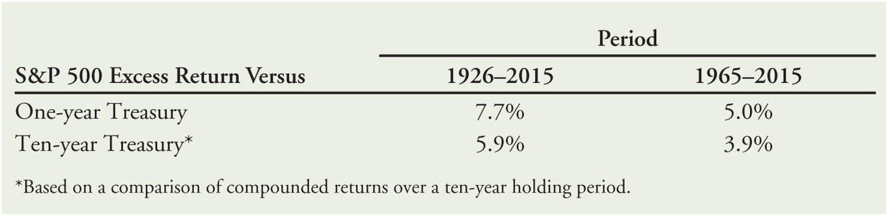
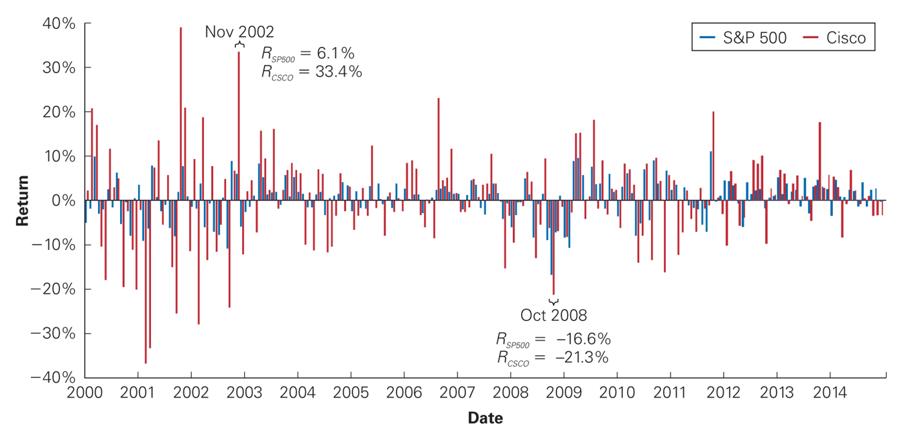
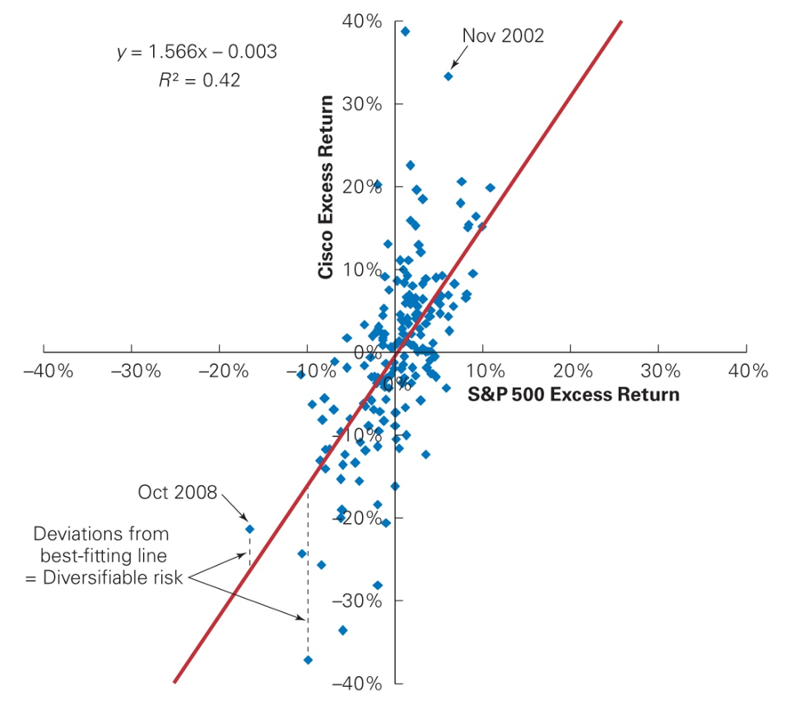
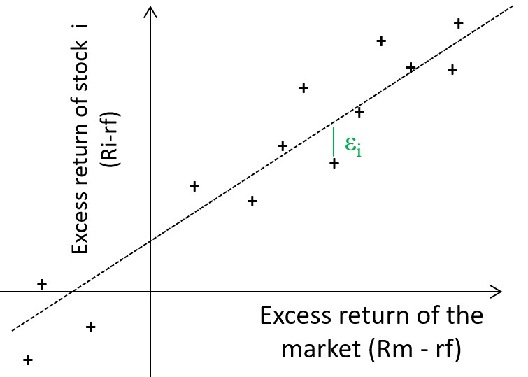
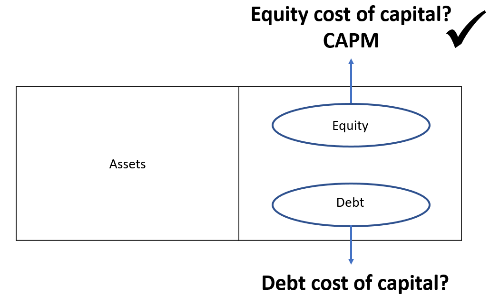
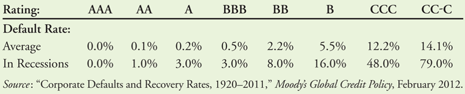
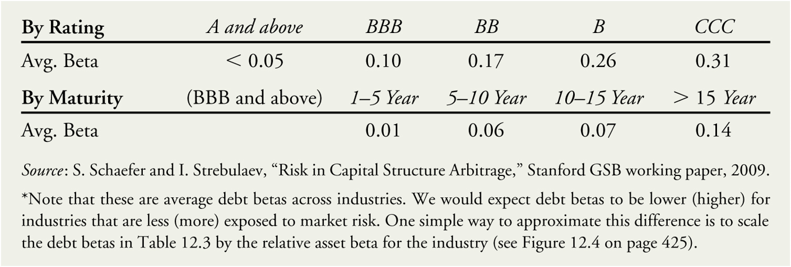
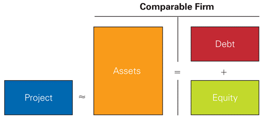
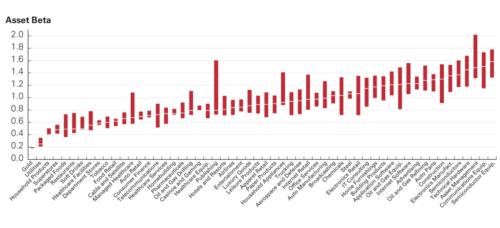

## Plan

A.  The equity cost of capital (Chap. 12.1)

B.  The market portfolio (Chap. 12.2)

C.  Beta estimation (Chap. 12.3)

D.  The debt cost of capital (Chap. 12.4)

E.  A project's cost of capital (Chap. 12.5 and 12.6)

F.  Conclusion about the use of the CAPM (Chap. 12.7)

## Some questions to start

-   What is an investment project?

-   What makes it different from ordinary spending?

-   You are the manager of a big company, and you want to execute a big
    investment project, how can you get the money?

## Example 1

::: {.center}
{height="70"}
:::

::: {.center}
{height="250"}
:::

:::: {.columns}
::: {.column width="55%"}
{height="55"}
:::

::: {.column width="45%"}
{height="105"}
:::
::::

## Example 2

:::: {.columns}
::: {.column width="50%"}
{height="290"}
:::

::: {.column width="50%"}
{height="235"}
:::
::::

## What this lecture is about

- There are two ways to raise that money, and today we study how to measure
  the cost of each one:

  - **Equity**: sell a share of the company to investors.

  - **Debt**: borrow the money and pay it back with interest.

- Why measure it at all? Because the money is not free. Whoever provides it
  expects a return, and that expected return is your cost of capital.

- You then compare the cost of capital with the return your project is
  expected to earn: if the project earns less than the money costs, it is not
  worth doing.

## A. The equity cost of capital

- Cost of capital of any investment opportunity = expected return of
  available investments with the same beta.

- This cost of capital takes into account the risk borne by the equity
  holders.

  - Risk premium

## Example: computing the equity cost of capital

- SGO (Saint-Gobain): volatility = 30%; beta = 1.45

- ENGI (ENGIE) : volatility = 38%; beta = 0.82

- Which of these stocks carries more total risk?

- Which has more market risk?

- Assume that the risk-free rate is 3% and that the expected return of
  the market portfolio is 8%. Calculate and compare the equity cost of
  capital for Saint-Gobain and ENGIE.

## B. The market portfolio {.smaller}

- The portfolio weight of each security in the market portfolio is
  $$\begin{aligned}
  x_{i} & = \frac{\operatorname{Market \ value \ of \ } i}{\operatorname{Market \ value \ of \ all \ securities \ in \ the \ portfolio}} \\
  & = \frac{MV_{i}}{\sum_{j} MV_{j}},
  \end{aligned}$$ where $$\begin{aligned}
  MV_{i}  = & \left(\text{Number of shares of firm \ }i\text{ outstanding}\right) \\
  & \quad \quad \quad \quad \quad \quad \quad \quad \quad \quad \ \ \ \ \times \left(\text{price of firm \ } i \text{ \ per share}\right), \\
  = & N_{i} \times P_{i}.
  \end{aligned}$$

- Passive portfolio.

- How to invest in the market portfolio?

  - Identify an index that captures the performance of the overall stock
    market.

  - Buy the index via an index fund or an exchange-traded fund (ETF).

## The market risk premium {.smaller}

- Key component of the CAPM $\Rightarrow$ market risk premium

  - Expected excess return of the market portfolio over the risk-free
    rate

  - $E[R_m] - r_f$

- Which risk-free rate?

  - Interest rates on government bonds? Corporate bonds rated AAA? (See
    Chap. 8)

  - Which maturity? $\Rightarrow$ Between 10 and 30 years (Remark: in
    investment analysis it is more common to use the short-term interest
    rate.)

## Two ways to estimate the premium {.smaller}

- The premium cannot be observed directly, so it has to be estimated:

1.  **The historical approach**: what the market actually paid over the
    risk-free rate in the past.

2.  **The fundamental approach**: the return that justifies today's index
    level, given what firms are expected to pay out.

- Same number seen from two ends: past realised returns, or expected future
  cash flows.

## Determining the market risk premium: historical approach

{fig-align="center"}

- Drawbacks:

  - Data intensive but not necessarily precise.

  - Backward looking, so may not represent current expectations.

## Determining the market risk premium: fundamental approach {.smaller}

- Given an assessment of firms' future cash flows, estimate the expected
  return of the market by solving for the discount rate that is
  consistent with the current level of the index.

- Example: via the constant expected growth model (see Chap. 9)
  $$\begin{aligned}
  r_{\text{Mkt}} = \underbrace{\frac{\text{Div}_{1}}{P_{0}}}_{\text{Dividend yield}} + \underbrace{g}_{\operatorname{Expected \ dividend \ growth \ rate}}
  \end{aligned}$$

- Remark: this method assumes that the future expected dividends grow at
  a constant rate---a reasonable hypothesis for the overall market.

## The constant expected growth model {.smaller .dense}

- The price of an asset is the present value of the dividends it pays:
  $$P_{0} = \frac{\text{Div}_{1}}{1+r} + \frac{\text{Div}_{2}}{(1+r)^{2}} + \frac{\text{Div}_{3}}{(1+r)^{3}} + \dots$$

- Assume the dividends grow at a constant rate $g$, so that each dividend is
  $(1+g)$ times the one before. As long as growth is below the discount rate,
  the whole sum collapses to $$P_{0} = \frac{\text{Div}_{1}}{r-g}.$$

- Read the other way round, the expected return is the dividend yield
  ($\text{Div}_{1}/P_{0}$, next year's dividend as a share of today's price)
  plus the growth rate:

::: {.box .box-a}
$$r = \frac{\text{Div}_{1}}{P_{0}} + g$$
:::

## The constant expected growth model (con't) {.smaller}

- Starting from $$P_{0} = \frac{\text{Div}_{1}}{r-g},$$ solving for the
  expected return gives
  $$r = \underbrace{\frac{\text{Div}_{1}}{P_{0}}}_{\text{Dividend yield}} + \underbrace{g}_{\text{Growth}}$$

- Intuition: investors earn what the asset pays out today, plus the rate at
  which that payout grows.

- Where does $P_{0} = \text{Div}_{1}/(r-g)$ itself come from? The step-by-step
  derivation is in the Appendix at the end of this deck.

## C. Beta estimation {.smaller}

- Once you have the historical market returns and the historical returns of
  your stock, you can compute the beta.

- Other key parameter to implement the CAPM: beta

  - Determine the sensitivity of the security's returns to those of the
    market $$\begin{aligned}
    \beta^{m}_{i} \equiv \beta_{i} = \frac{\sigma_{R_{i}}\times \text{Corr}\left( R_{i}, R_{m}\right)}{\sigma_{R_{m}}} = \frac{\text{Cov}\left(R_{i},R_{m}\right)}{\text{Var}\left(R_{m}\right)}.
    \end{aligned}$$

- Example: $\beta = 2$ $\Rightarrow$ an increase of the market risk
  premium of 1% leads to an increase of 2% of the required return.

## Estimate beta from historical data

{fig-align="center"}

## Monthly excess return on Cisco versus the S\&P500

::: {.center}
{fig-align="center"}
:::

## Estimation of beta: minimum least squared method / linear regression {.smaller}

For a sample of returns indexed with $t=1,\dots, T;$ run a linear
regression $$\begin{aligned}
R_{it}-r_{f} = \alpha_{i}+\beta_{i} \left( R_{mt}-r_{f}\right)+\epsilon_{it}
\end{aligned}$$

::::: {.columns}
::: {.column width="40%"}
$\hat{\beta}_{i} =$slope of the best-fitting line in the plot of the
security $i$'s excess returns versus the market excess returns.
:::

::: {.column width="60%"}
{fig-align="center"}
:::
:::::

## Example: Estimation of the beta of LVMH from monthly data (2000-2013)

- Estimated beta of = 1.13

  - With a 95% confidence interval of \[0.98; 1.27\]

- The risk-free rate is 3% and the market risk premium is 5%.

  - What range for LVMH's equity cost of capital is consistent with the
    95% confidence interval for its beta?

## D. The debt cost of capital

::: {.center}
{fig-align="center"}
:::

## Debt yields {.smaller}

- The yield to maturity of a bond (YTM) = IRR an investor will earn from
  holding the bond to maturity.

- If there is no default risk: YTM = expected return for investors.

- Otherwise two more things matter:

  - $p$ = the probability that the borrower defaults.

  - $L$ = the expected loss rate, the share of the promised return lost when
    it does default.

- The expected return on the debt is then $$\begin{aligned}
  r_{D} & = \left(1-p\right)\text{YTM} + p \left( \text{YTM} - L\right), \\
  & = \text{YTM} - p L.
  \end{aligned}$$

## Annual default rates by debt rating

{fig-align="center"}

## Debt betas

- Estimate the debt cost of capital via the CAPM $\Rightarrow$
  $\beta_{D}$?

{fig-align="center"}

## Estimating the debt cost of capital: example

- In January 2014, the bond of Lafarge (coupon rate of 4.75%) with
  maturity 30/09/2020, rated BB, had a yield to maturity of 3.7%. The
  expected loss rate is 60%.

- The risk-free rate was 0.6%. The market risk premium was 3.1%.

- Estimate the expected return of Lafarge debt.

## E. A project's cost of capital {.smaller}

- Only the cost of capital of a company listed on a stock exchange can
  be directly identified.

- For privately held companies or companies which invest outside of
  their usual line of business, it is necessary to find a comparable
  listed firm

  - Comparable (Levered or all-equity)

  - The unlevered cost of capital

  - Industry asset betas

- Remark: we assume for now that a project is only financed by equity.

## A simple example: estimating the beta of a project from a single-product firm

- You wish to launch a data marketing firm using as reference the company
  1000mercis.com (ALMIL).

- ALMIL has no debt and its beta is 0.59.

- The risk-free rate is 3% and the market risk premium is 5%.

- To construct your business plan, you need to estimate the cost of
  capital of the project.

## Using a levered firm as a comparable for a project's risk

{fig-align="center"}

## The unlevered cost of capital {.smaller .dense}

$$
\substack{\operatorname{Assets \ or} \\ 
\operatorname{Unlevered} \\
\operatorname{Cost \ of} \\ 
\operatorname{Capital}} = \left(\substack{\operatorname{Fraction \ of} \\ 
\operatorname{Firm \ Value} \\
\operatorname{Financed} \\ 
\operatorname{by \ Equity}} \right) \times \left(\substack{\operatorname{Equity} \\ \operatorname{Cost} \\ \operatorname{of}\\ \operatorname{Capital}} \right) +\left(\substack{\operatorname{Fraction\ of} \\ 
\operatorname{Firm \ value} \\
\operatorname{Financed} \\ 
\operatorname{by \ Debt}} \right) \times \left(\substack{\operatorname{Debt} \\ \operatorname{Cost} \\ \operatorname{of} \\ \operatorname{Capital}} \right)
$$ Asset or unlevered cost of capital $$
r_{U} = \frac{E}{E+D} r_{E} + \frac{D}{E+D} r_{D}.
$$ Asset or unlevered beta $$
\beta_{U} = \frac{E}{E+D} \beta_{E} + \frac{D}{E+D} \beta_{D}.
$$

## The unlevered cost of capital: intuition {.smaller}

- The firm's assets are owned by two groups: the shareholders, who hold $E$ of
  firm value, and the lenders, who hold $D$. Between them they own the whole
  business.

- Whatever the assets earn is shared out between those two groups. So the
  return on the assets is simply the average of what each group gets, weighted
  by the share of the firm each one holds.

- The same is true of risk, which is why the betas combine in exactly the same
  way.

- Borrowing does not make the business itself any riskier: it only decides who
  carries that risk. Lenders take the safer part (low $\beta_{D}$), so the
  shareholders are left holding the riskier part (high $\beta_{E}$).

- To find the risk of the underlying business, we therefore have to put the two
  pieces back together, i.e. **unlever** the comparable firm.

## Unlevering the cost of capital: example {.smaller}

- A company wants to launch a new biscuit. It has identified Danone (BN)
  as the most representative company for its project.

- The market capitalisation of Danone is 30 billion EUR with a beta of
  0.4. The debt of Danone amounts to 10 billion EUR with an average YTM
  of 3.5%. The default risk on the bond is assumed to be negligible.

- Estimate the cost of capital of your firm's investment assuming that
  the risk-free rate is 3% and the market risk premium is 5%.

## Cash, net debt, and beta

- Under some conditions, the cash balances can be considered as
  "negative debt."

  - Cash available "instantly" to reduce the debt

  - We speak then of net debt = debt -- cash.

- Example: at the end of 2010, Accenture (ACN) had a market
  capitalisation of 25 billion EUR, no debt and 4 billion EUR in cash.

- If its equity beta was 1, estimate the beta of its assets.

## Industry asset betas: example

{fig-align="center"}

## Industry asset betas  (con't) {.smaller}

- Companies which are very sensitive to the market and economic
  conditions have high betas, more stable or counter-cyclical companies
  have low betas.

  - Cyclical companies: construction, car manufacturing, technology

  - Stable companies: utilities, household products.

  - Counter-cyclical companies: gold mines, education

- Attention: cyclical does not mean volatile.

  - Example: film producers have very risky cash-flows but these
    cash-flows have a low correlation with market returns.

## Differences in project risk {.smaller}

- The case of conglomerates

  - Firm asset betas reflect the market risk of the average project in a
    firm.

  - Identify a set of "pure play" comparables for each division to
    estimate appropriate divisional or project specific costs of
    capital.

- Operating leverage: reflects the proportions of fixed costs relative
  to the variable costs.

  - A higher proportion of fixed costs will increase a project's beta
    (ceteris paribus).

## Operating leverage and beta {.smaller}

- Consider a project with expected annual revenues of 120 EUR and costs
  of 50 EUR in perpetuity (the operating margin is constant).

- The project beta is 1. The risk-free rate and the expected return on
  the market are 5% and 10%, respectively.

- What is the value of this project?

- What would its value and beta be if the revenues continued to vary
  with a beta of 1, but the costs were instead completely fixed at 50
  EUR per year?

## Financing and the weighted average cost of capital {.smaller}

- How might the project's cost of capital change if the firm does use
  leverage to finance the project?

- Perfect capital markets (no taxes, transaction costs, or other
  frictions):

  - Choice of financing does not affect the cost of capital or NPV of a
    project.

  - Project's cost of capital and NPV are solely determined by its free
    cash flows.

  - Intuition: all financing transactions are zero-NPV transactions that
    do not affect value.

- Let us now consider a big imperfection: taxes.

  - Once tax deduction is accounted for, the net cost of debt to the
    firm is:
    $$\text{Effective after-tax interest rate} = r \left(1 - \tau_{C} \right),$$
    where $\tau_{C}$ is the firm's corporate tax rate.

## The Weighted Average Cost of Capital {.smaller}

- **Weighted Average Cost of Capital (WACC)** $$\begin{aligned}
  r_{WACC} = \frac{E}{E+D} r_{E} + \frac{D}{E+D} r_{D}\left(1- \tau_{C} \right),
  \end{aligned}$$ $\Rightarrow$ effective after tax-cost of the capital
  to the firm.

  $$\begin{aligned}
  r_{WACC} = r_{U} - \frac{D}{E+D} \tau_{C} r_{D}.
  \end{aligned}$$

- Remark 1: the unlevered cost of capital is also referred to as the
  **pre-tax WACC** (for all-equity financed projects).

- Remark 2: WACC is less than the expected return of the firm's asset
  and should be used to evaluate a project with the same risk and
  financing as the firm itself.

## Estimating the WACC: example

- Michelon has a market capitalisation of 100 million EUR and a debt of
  25 million EUR.

- The equity cost of capital of the firm is 10%, whereas the cost of its
  debt is 6%.

- The corporate tax rate is 33%.

- What is the unlevered cost of capital of Michelon?

- What is its WACC?

## F. Conclusion about the use of the CAPM {.smaller}

- Limitations

  - Betas are unobservable.

  - Expected returns are unobservable.

  - The market index is not representative of the true market portfolio.

- Advantages

  - Revenue and other cash flow projections are far more speculative
    than the cost of capital estimation.

  - Practical and straightforward to implement.

  - Discipline and rigor.

## Appendix: why the constant growth formula works {.smaller}

- Write the dividends out, each one $(1+g)$ times the one before:
  $$P_{0} = \frac{\text{Div}_{1}}{1+r} + \frac{\text{Div}_{1}(1+g)}{(1+r)^{2}} + \frac{\text{Div}_{1}(1+g)^{2}}{(1+r)^{3}} + \dots$$

- Every term is the previous one multiplied by the same fraction. Give that
  fraction a name, $x = \frac{1+g}{1+r}$, and take the first term out:
  $$P_{0} = \frac{\text{Div}_{1}}{1+r} \times \left(1 + x + x^{2} + x^{3} + \dots\right)$$

- So the whole question is: what does $1 + x + x^{2} + x^{3} + \dots$ add up to?

## Appendix: why the constant growth formula works (con't) {.smaller}

- Call that sum $S = 1 + x + x^{2} + x^{3} + \dots$ Multiplying it by $x$ just
  shifts it along by one term:
  $$x \, S = x + x^{2} + x^{3} + x^{4} + \dots$$

- Subtracting the second line from the first, everything cancels except the
  leading 1, so $S - x\,S = 1$ and
  $$S = \frac{1}{1-x}.$$

- This only works if the terms keep shrinking, i.e. as long as growth is below
  the discount rate.

- Putting $x = \frac{1+g}{1+r}$ back and simplifying gives the formula:
  $$P_{0} = \frac{\text{Div}_{1}}{1+r} \times \frac{1}{1-\frac{1+g}{1+r}} = \frac{\text{Div}_{1}}{r-g}$$
