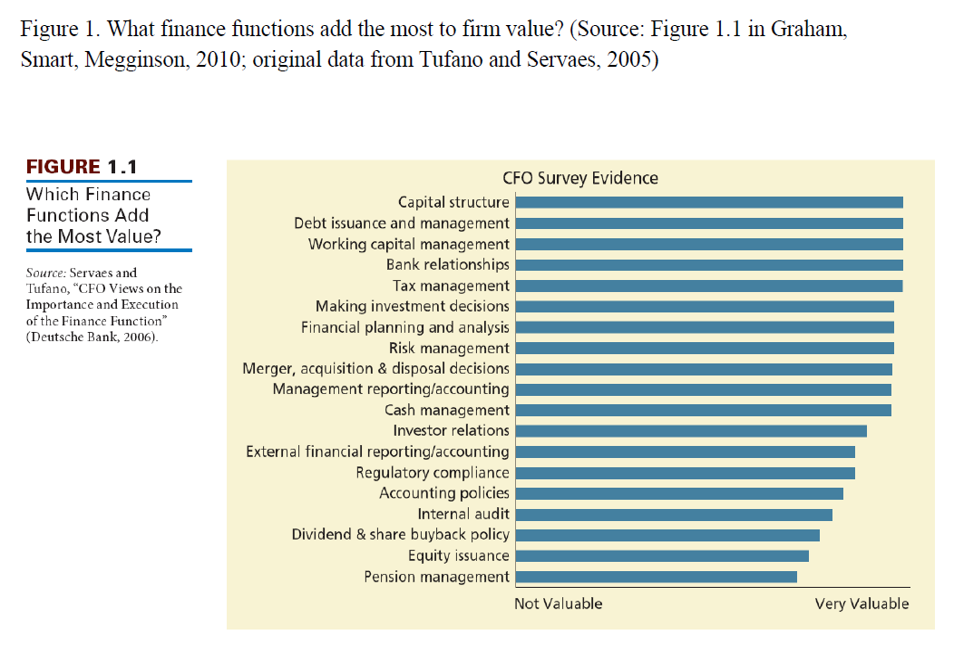
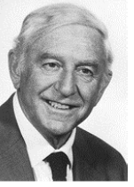
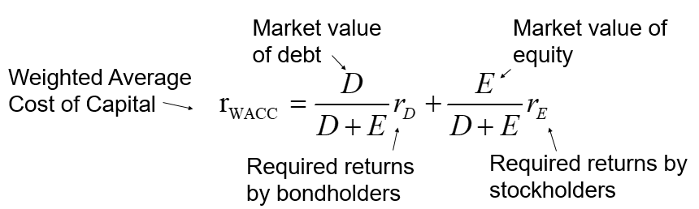
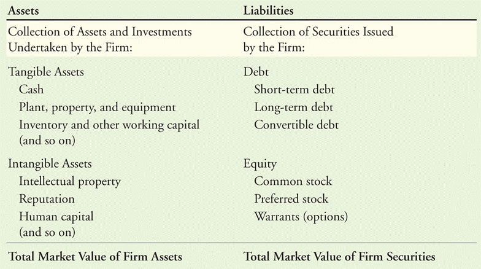

##

{fig-align="center"}

## Introduction

- Should you finance new projects with debt or equity?

- What is the optimal capital structure for a company?

- We will begin by assuming that there are no taxes and no transaction
  costs (and that markets are perfect).

  $\Rightarrow$ According to the law of one price, the choice between
  debt and equity has no effect on the value of the company, the stock
  price or the cost of capital!

## What this lecture is about

- We are going to study how the mix between equity and debt affects:

  - **The cost of capital**

  - **The firm's value**

- For that we are going to use three theorems by Modigliani and Miller.

## Not this Modigliani...

::: {.center}
{height="400"}

[Amedeo Modigliani, *Jeanne Hébuterne*, 1919]{.tiny}
:::

## Leverage and cost of capital: Modigliani-Miller theorems {.smaller}

::: {.tagline}
This Modigliani!!
:::

- Franco Modigliani (Nobel prize in 1985) and Merton Miller (Nobel prize
  in 1990)

  - "The Cost of Capital, Corporation Finance and the Theory of
    Investment," 1958, American Economic Review

::::::: {.columns}
:::: {.column width="50%"}

::: {.center}
{fig-align="center"}
:::
::::

:::: {.column width="50%"}

::: {.center}
{fig-align="center"}
:::
::::
:::::::

::::::: {.columns}
:::: {.column width="50%"}

::: {.center}
Merton H. Miller, 1923-2000
:::
::::

:::: {.column width="50%"}

::: {.center}
Franco Modigliani, 1918-2003
:::
::::
:::::::

## Outline

A.  Equity versus debt financing (Chap. 14.1)

B.  Modigliani-Miller I: leverage, arbitrage, and firm value (Chap.
    14.2)

C.  Modigliani-Miller II: leverage, risk, and the cost of capital (Chap
    14.3)

D.  Capital structure fallacies (Chap 14.4)

E.  Summary: the theorems of Modigliani and Miller (Chap. 14.5)

## A. Equity versus debt financing

- Reminder: WACC, cost of debt, cost of equity:
  {fig-align="center"}

- The cost of debt is lower than the cost of equity, but leverage
  increases risk for stockholders and thus the cost of equity.

## Debt vs. equity financing: example {.smaller}

- Financing a risky project (perfect markets, no tax) $\Rightarrow$
  Tour moche SA

  +------------+-----------------------------+
  | Year 0     | Year 1: Cash-Flow           |
  +:==========:+:============:+:============:+
  | Investment | Expansion    | Recession    |
  +------------+--------------+--------------+
  |            | (Prob = 0.5) | (Prob = 0.5) |
  +------------+--------------+--------------+
  | -800 EUR   | 1400 EUR     | 900 EUR      |
  +------------+--------------+--------------+

- Expected future cash flow: $0.5 \times 1400+0.5 \times 900 = 1150$.

- NPV of the project with a discount rate of 15%:
  $\text{NPV}= -800+\frac{1150}{1.15}=200$.

- Value of the project after financing:
  $\text{PV}=\frac{1150}{1.15}=1000$.

## Leverage and cost of capital: Modigliani-Miller theorems (con't) {.smaller}

- The theorems of Modigliani and Miller (MM) identify the effect of
  leverage on

  - the value of the firm,

  - the cost of equity,

  - the cost of capital.

- We will use MM to

  - optimize the capital structure,

  - take investment decisions,

  - understand how financing decisions can change the value of the firm.

## Debt vs. equity financing: example (con't) {.smaller}

- Returns for unlevered equity (equity in a firm with no debt)

  +---------------+-----------------------------+
  | Year 0        | Year 1: Returns             |
  +:=============:+:============:+:============:+
  | Initial value | Expansion    | Recession    |
  +---------------+--------------+--------------+
  |               | (Prob = 0.5) | (Prob = 0.5) |
  +---------------+--------------+--------------+
  | 1000 EUR      | 40%          | -10%         |
  +---------------+--------------+--------------+

- Expected return on unlevered equity:
  $0.5 \times 40\%+ 0.5 \times (-10\%)=15\%$.

- Because the risk of unlevered equity equals the risk of the project,
  shareholders are earning an appropriate return for the risk they are
  taking.

## Financing with equity and 500  EUR debt with interest of 5\% $\Rightarrow$ Firm L (leveraged) {.smaller .dense}

- Cash flows

  |                |               |              |              |
  |:---------------|:--------------|:-------------|:-------------|
  |                | Initial value | Expansion    | Recession    |
  |                |               | (Prob = 0.5) | (Prob = 0.5) |
  | Debt           | 500 EUR       | 525 EUR      | 525 EUR      |
  | Levered equity | 300 EUR       | 875 EUR      | 375 EUR      |
  | Firm           | 800 EUR       | 1400 EUR     | 900 EUR      |

- Market values

  |                |               |              |              |
  |:---------------|:--------------|:-------------|:-------------|
  |                | Initial value | Expansion    | Recession    |
  |                |               | (Prob = 0.5) | (Prob = 0.5) |
  | Debt           | 500 EUR       | 525 EUR      | 525 EUR      |
  | Levered equity | ?             | 875 EUR      | 375 EUR      |
  | Firm           | ?             | 1400 EUR     | 900 EUR      |

## Financing with equity and 500  EUR debt {.smaller}

- Questions:

  - What price should the levered equity sell for, and what is the best
    capital structure choice?

- Response of Modigliani and Miller (perfect markets, no tax):

  - If you buy the debt and equity of the levered firm, you obtain the
    same cash flows as if you bought the unlevered firm.

  - Therefore, the law of one price implies that the value of the firm
    is always 1000, hence the value of the equity has to be
    1000-500=500.

- Remark: equity holders realize the same capital gain as previously,
  i.e., 200 (a value of 500 for an investment of 300).

## Common fallacy {.smaller .dense}

- Cash flow for equity holders of the levered firm =
  $0.5 \times 875 + 0.5 \times 375=625$.

- PV of these cash flows with $15\%$: $625/1.15=543>500$ ?!

- Problem: risk for equity holders and thus the discount rate increases!

+----------------+---------------+-----------------------------+
|                | Year 0        | Year 1: Returns             |
+:===============+:=============:+:============:+:============:+
|                | Initial value | Expansion    | Recession    |
+----------------+---------------+--------------+--------------+
|                |               | (Prob = 0.5) | (Prob = 0.5) |
+----------------+---------------+--------------+--------------+
| Debt           | 500 EUR       | 5%           | 5%           |
+----------------+---------------+--------------+--------------+
| Levered equity | 500 EUR       | 75%          | -25%         |
+----------------+---------------+--------------+--------------+
| Firm           | 1000 EUR      | 40%          | -10%         |
+----------------+---------------+--------------+--------------+

## To summarize

- In perfect capital markets, the NPV for the entrepreneur will not
  change with the financing of the project.

- Debt financing is less costly than equity financing but leverage
  increases the risk of equity and thus the cost of equity financing.

## B. MM I: leverage, arbitrage, and firm value {.smaller}

- MM1 hypotheses (Modigliani and Miller, 1958) $\Rightarrow$ perfect capital
  markets

  - No taxes, transaction costs or issuance costs on trading securities.

  - No bankruptcy costs.

  - All investors can borrow and lend freely at the risk-free rate.

  - Law of one price holds.

  - Financing decisions do not change the cash flows the investments
    generate.

::: proposition
In a perfect capital market, the total value of a firm's securities is
equal to the market value of the total cash flows generated by its
assets and is not affected by its choice of capital structure.
:::

::: {.result}
**The value of the company is not affected by the capital composition.**
:::

## MM1: intuition and discussion {.smaller}

- The capital structure can be understood as a distribution of the cash
  flows generated by the assets of a firm:

  - These cash flows have different characteristics in terms of risk and
    return.

  - However, the sum of all cash flows received by the different types
    of investors is always equal to the cash flows generated by the
    assets.

- Miller has illustrated this idea with a pizza: if you cut the pizza
  into more slices, you will not have more pizza.

## Arbitrage according to MM {.smaller}

- Consider two firms, $U$ and $L$, which differ only by their capital
  structure: $U$ is financed only with $E$ (equity), $L$ is financed
  with both $E$ and $D$ (debt) (at the risk-free rate $r$)

  - Remark: the two firms generate the same operating income, denoted by
    $\Pi$

- Assume that $V^{U} > V^{L}$.

- Consider an investor who holds $b E^{U}$, where $b\in ]0,1]$.

  - Cash flow $= b\Pi$.

- This investor sells his shares in $U$ $\dots$

  - Cash flow $= b E^{U}$.

- $\dots$ and buys equity for $b E^{L}$ and debt for $bD^{L}$

  - Value of the investment $= b (E^{L} + D^{L})$.

  - Remark: $b E^{U} -   b (E^{L} + D^{L}) > 0$ (because we assumed that
    $V^{U} > V^{L}$).

## Arbitrage according to MM (con't) {.smaller}

- The cash flow received by the investor is then:
  $$b (\Pi - r D^{L}) + b (r D^{L}) = b \Pi.$$

- Investing directly in U (A) generates the same profit than investing
  in L and replicate its capital structure (B).

  - AND the two strategies have the same risk!

- But the strategy (B) requires a lower investment

- IMPOSSIBLE in perfect capital markets $\Rightarrow$ Arbitrage

- The absence of arbitrage opportunities implies that $V^{U} = V^{L}$.

## Homemade leverage {.smaller}

- The MM arbitrage is possible because investors can choose the leverage
  they wish.

  - They can change the risk and return of their investments themselves.

  - Example: preference for risky cash flows $\Rightarrow$ hold firm U +
    personal leverage, which replaces the leverage of the firm.

- Example:

  |                     | Year 0: initial cost | Year 1: expansion | Year 1: recession |
  |:--------------------|---------------------:|------------------:|------------------:|
  | Firm U              |            $1000$ EUR |         $1400$ EUR |          $900$ EUR |
  | Margin loan         |            $-500$ EUR |         $-525$ EUR |         $-525$ EUR |
  | **Portfolio total** |         $\mathbf{500}$ EUR |      $\mathbf{875}$ EUR |     $\mathbf{375}$ EUR |

  - Which is equivalent to holding the stocks of L!

## Market value balance sheet of the firm {.smaller}

- According to MM1, the market value of the firm's assets is equal to
  the market value of the securities issued by the firm.

- Hence, we can construct a balance sheet with market values
  {fig-align="center" height="270"}

- ATTENTION: it is often hard, or even impossible, to define the market
  value of an item of the assets!

## C. MM II: leverage, risk, and the cost of capital {.smaller}

- (Almost immediate) consequence of Proposition 1 of MM1:

  - The return of a portfolio of the securities of the levered firm is
    equal to the return of the asset of an equivalent unlevered firm:
    $$\begin{aligned}
    \text{r}^{L}_{WACC} = \frac{D}{D+E} r_{D} + \frac{E}{D+E}r^{L}_{E} = \text{r}^{U}_{WACC} = r^{U}_{E}.
    \end{aligned}$$

- This return can be used as a discount rate for investments with a
  similar risk than the assets in place.

  - For any capital structure!

## MM1 - leverage and cost of capital

- Reminder (from 10 seconds ago) $$\begin{aligned}
  \text{r}^{U}_{Assets} = r^{U}_{E}=\frac{D}{D+E^{L}} r_{D} + \frac{E^{L}}{D+E^{L}}r^{L}_{E}.
  \end{aligned}$$

::: proposition
The cost of capital of levered equity increases with the firm's
debt-to-equity ratio: $$\begin{aligned}
r^{L}_{E} = r^{U}_{E}+\frac{D}{E^{L}} \left(r^{U}_{E}-r_{D}\right).
\end{aligned}$$
:::

## Levered and unlevered betas

- The effect of leverage on the risk of a firm's securities can also be
  expressed in terms of beta:

  - Unlevered beta: measures risk of a firm as if it did not have
    leverage, which is equivalent to the beta of the firm's assets.

  - Levered betas (or stock betas): reflect the economic risk of the
    firm **and** the risk due to leverage.

## Beta and leverage {.smaller}

- A portfolio of the debt and stocks of a leveraged firm has the same
  beta than a portfolio of stocks of an unlevered firm: $$\begin{aligned}
  \beta^{Unlevered}_{E} = \beta_{D+E}^{Portfolio} = \frac{D}{D+E}\beta_{D}+\frac{E}{D+E}\beta^{Levered}_{E}.
  \end{aligned}$$

- We obtain for the beta of the levered stock (levered beta) and the
  beta of the unlevered firm (unlevered beta) $$\begin{aligned}
  \beta^{Levered}_{E} = \frac{\left(D+E\right) \beta^{Unlevered}_{E}-D\beta_{D}}{E}.
  \end{aligned}$$

- If the debt is risk-free: $$\begin{aligned}
  \beta_{D} = 0 \quad \Rightarrow \quad \beta^{Levered}_{E} = \frac{D+E}{E}\beta^{U}_{E}.
  \end{aligned}$$

## Example: beta and leverage

- The stock of a firm with a debt-to-equity ratio of 2 has a beta of
  1.7. What would the beta of the firm be if the firm was debt free?
  (The debt is risk-free.)

- What would the beta of a firm's stock in the same industry but with a
  debt ratio (D/(E+D)) of = 0.5 be?

## Financing cost of an industry {.smaller}

- The average betas of industries are often used either because a given
  firm is not listed or because the average beta of a sample is a better
  estimate.

- **Attention:** to take the average you need to first calculate the
  "unlevered betas."

- Steps:

  - Identify a sample.

  - Find the cost of equity, debt ratio and if possible the cost of debt
    for each of these firms.

  - Compute the "unlevered betas" for these firms.

  - Compute the average.

  - Determine the "levered beta" corresponding to the "unlevered beta."

## Beta of an industry: example {.smaller}

- Consider the following firms, all belonging to the same industry
  (Remark: debt is risk-free)

  | Firm    | Beta E |  D/E   | Beta assets |
  |:--------|:------:|:------:|:-----------:|
  | A       |  1.1   | 23.31% |    0.892    |
  | B       |  1.3   | 44.35% |    0.901    |
  | C       |  1.3   | 2.15%  |    1.273    |
  | D       |  0.8   | 3.03%  |    0.776    |
  | Average |        |        |    0.960    |

- What is the equity beta of firm P, not listed, operating in the same
  industry considering that its D/E ratio is 0.2?

## Beta and leverage: summary {.smaller}

- In the MM1 framework, it can be shown that : $$\begin{aligned}
  \beta^{L}_{E} = \beta^{U}_{Asset}+\frac{D}{E^{L}} \beta^{U}_{Asset},
  \end{aligned}$$ where, if debt is considered risky: $$\begin{aligned}
  \beta^{L}_{E} = \beta^{U}_{Asset}+\frac{D}{E^{L}} \left(\beta^{U}_{Asset}-\beta_{D}\right).
  \end{aligned}$$

- See Hamada, "Portfolio analysis, market equilibrium and corporate
  finance" Journal of Finance, 1969

## D. Capital structure fallacies

- MM1 framework: the capital structure does not affect the value of the
  firm.

- But, even in this framework, wrong arguments are used to argue in
  favor of using leverage

  1.  Leverage and Earnings per Share

  2.  Equity issuance and dilution

## Leverage and EPS

- Leverage can increase expected Earnings per Share (EPS).

  - Some stockholders therefore conclude that leverage should increase
    the stock price.

- However, the risk of earnings also changes and the average increase of
  EPS is necessary to compensate shareholders.

- In perfect capital markets, the price should not change!

## Equity issuance and dilution {.smaller}

- Dilution: an increase in the total of shares that will divide a fixed
  amount of earnings.

- An increase in capital usually dilutes the EPS.

- It is sometimes (incorrectly) argued that issuing equity will dilute
  existing shareholders' ownership, so debt financing should be used
  instead.

- In fact: no dilution of value if the stocks are sold at their market
  value.

  - Any gain or loss associated with the transaction will result from
    the NPV of the investments the firm makes with the funds raised.

  - The decrease in stock price which is often observed at the
    announcement of an increase in capital corresponds to an information
    effect (thus: it is related to market frictions)

## E. Summary: Modigliani-Miller theorems {.smaller}

- Perfect capital markets $\Rightarrow$ Conservation of value

  - Financial transactions neither add nor destroy value, but instead
    represent a repackaging of risk (and therefore return).

  - **The cost of capital depends on the assets of the firm and their
    risk.**

- Modigliani-Miller for dummies:

  - The total amount of pizza does not change if you slice it up
    differently!

- Practical implications:

  - Investment decisions are more important than financing decisions.

  - It is easier to create or destroy value with investment decisions
    than with financing decisions.

## Exercise: cost of capital and leverage {.smaller .dense}

- Amalgamated Products (Am.Pr.) owns three activities:

  - Food 40% of the value of the firm.

  - Electronics 30% of the value of the firm.

  - Chemicals 30% of the value of the firm.

- Amalgamated Products doesn't pay tax. To estimate its cost of capital
  Amalgamated has identified three competitors:

  |                      |                   |                    |
  |---------------------:|:-----------------:|:------------------:|
  |                      | Beta of the stock | Debt/(Debt+Equity) |
  |         United Foods |        0.8        |        0.4         |
  |  General Electronics |        1.6        |        0.2         |
  | Associated Chemicals |        1.2        |        0.3         |

- We assume that the debt of the firm is risk-free.

  (a) What are the asset betas of each division of Amalgamated?

  (b) The debt ratio of Amalgamated is D/(D+E)=0.4. What is the beta of
      the stock of Amalgamated?

  (c) With $r_f=7\%$ and $r_M= 15\%$, what is the cost of capital of
      each division?

  (d) What is the WACC of Amalgamated?

## Exercise: reducing leverage {.smaller}

- Infonian AG is a very leveraged firm with a debt to equity ratio of
  150%. The bank does not consider the debt as risky and asks for an
  interest rate of 5% ($\approx r_f$). The equity holders require a
  return of 20%. The company does not pay tax.

  - What is the WACC of the firm?

  - What is the cost of equity if Infonian issues equity and reduces its
    debt to achieve a debt to equity ratio of 50%?

## Exercise: increasing leverage {.smaller .dense}

- Mr. Goodman the CFO of Perkscom comes back thoughtful from the
  shareholder meeting of his firm. The investment fund who owns 10% of
  the capital of Perkscom has announced to the CFO Mr. Goodman at the
  annual shareholder meeting that it expects an earnings yield of at
  least 20% for the current year, otherwise it would take away the stock
  options for the managers of the firm. Because Mr. Goodman counts on
  his stock options to repay the mortgage for his villa, he is a bit
  worried and thinks about what he can do.

- The cash flow of Perkscom is equal to the EBIT of 10 million for this
  year with annual growth rate of 10% per year. The firm has no
  leverage. The accounting value of its equity is 80 million and its
  stock market capitalisation is 100 million.

- The firm could easily raise debt at an interest rate of 5%. Perkscom
  does not pay tax (tax rate = 0) and distributes all its cash flows as
  dividends to shareholders.

## Exercise: increasing leverage (con't) {.smaller .dense}

1.  If the market anticipates the perpetual growth rate of the EBIT of
    10%, what should be the cost of capital of Perkscom?

2.  Suppose that with a more efficient reorganisation of its production,
    Perkscom can increase its cash flows by 50% from 10 million to 15
    million at the end of the year with the same perpetual growth rate
    as previously. What is now the value of the firm and the return on
    equity and earnings yield?

3.  Mr. Goodman understands that with operational measures, he cannot
    achieve the earnings yield required by the investment fund. He
    decides to increase the leverage to the debt-to-equity ratio of 3:1
    without changing the assets of the company (e.g., we are in the
    initial setting and not the one of 2.) and without increasing the
    cashflows of the company. Compute the amount of debt to be raised
    and describe briefly the necessary transactions.

## Exercise: increasing leverage (con't 2)

4.  What will be the WACC after the transaction and what will be the
    cost of equity?

5.  What will the earnings yield and return on equity be?

6.  What is the lowest level of leverage that can achieve the earnings
    yield required by the investment fund?

7.  Has the investment fund chosen a good performance measure? Should it
    be satisfied by the measures taken by Mr. Goodman?

## Quiz

- Why is debt cheaper than equity?

- Why is the WACC without taxes not decreasing in the amount of leverage
  used?

- A firm without debt has a beta 1. What is the equity beta of the firm
  if the firm takes on debt for a total of 50% of the value of its
  assets? (Assume that the beta of the firm's debt is zero.)
