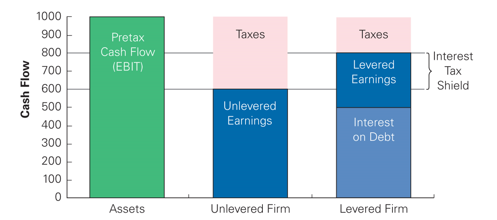
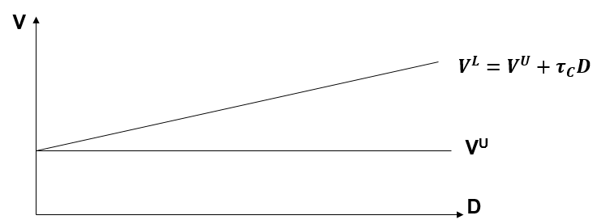
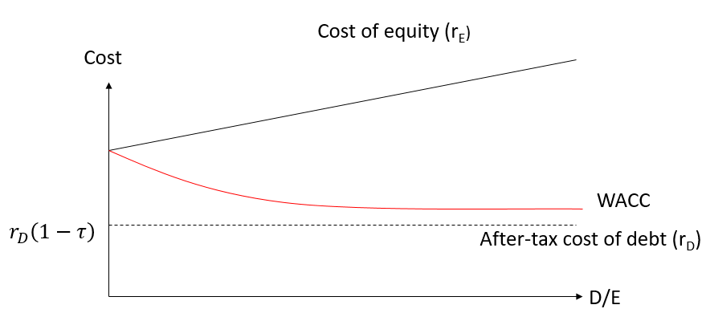
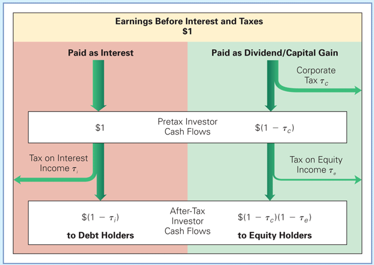
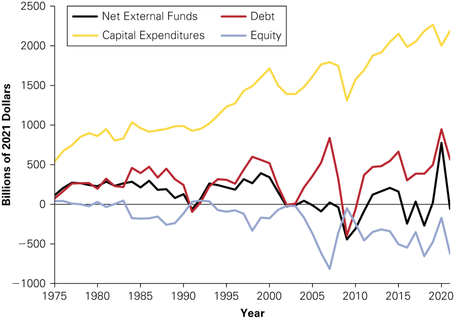
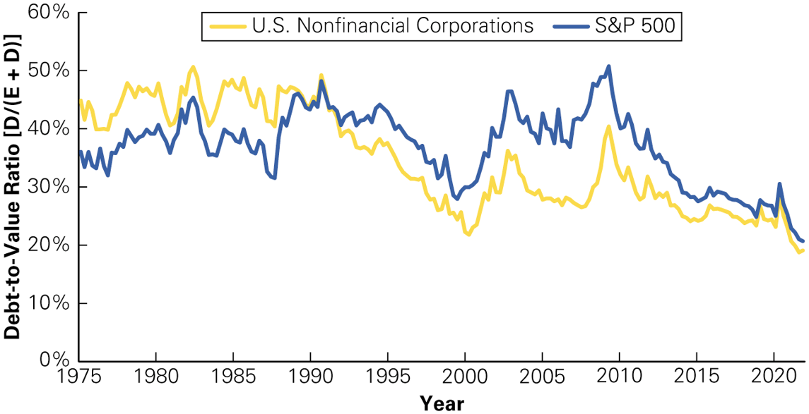
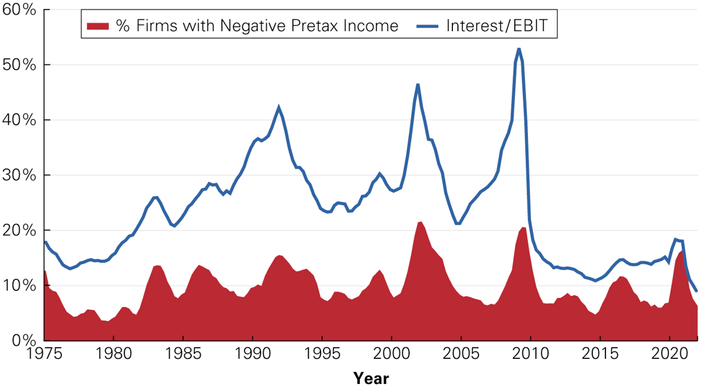
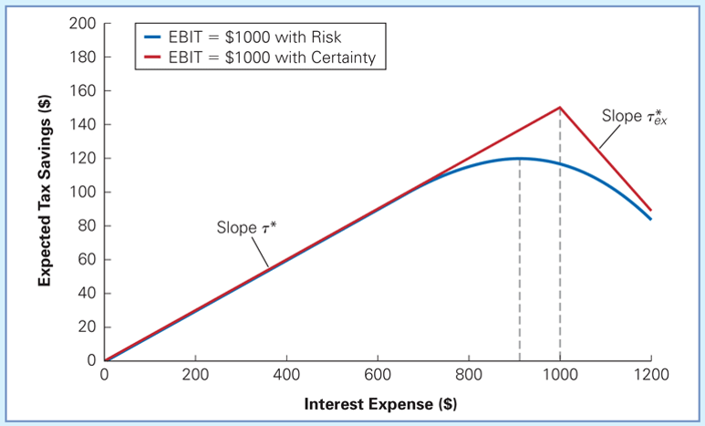
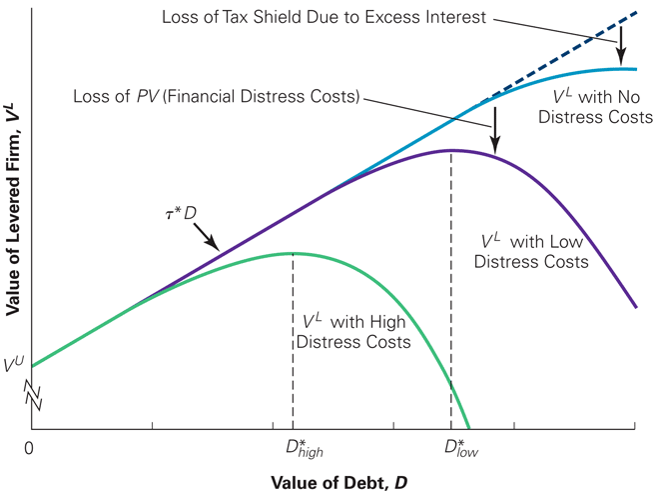

## Outline

A.  The interest tax deduction (Chap. 15.1, 15.2)

B.  Modigliani and Miller 2: debt, tax, and firm value (Chap. 15.2)

C.  Modigliani and Miller 2: debt, tax and the cost of capital (Chap.
    15.2)

D.  Personal taxes (Chap 15.4)

E.  Optimal capital structure with taxes (Chap. 15.5; elements of Chap.
    16)

## A. The interest tax deduction {.smaller}

- In most countries: interests = expenses

  - Interest expenses are thus (fully or partially) deductible

  - Remark: the dividends are paid from after-tax profits!

- Example:

  - France in 2023: marginal corporate tax rate = 25% $\Rightarrow$
    interest expenses are deductible up to the higher of EUR 3 million
    and 30% of EBITDA.

  - US in 2023: marginal corporate tax rate (federal rate) = 21%
    $\Rightarrow$ interest expenses are deductible up to 30% of EBIT.

  $\Rightarrow$ We will assume for simplicity that interest expenses are
  fully deductible.

## Interest tax deduction: example {.smaller .dense}

A company has no leverage and pays 34% tax on its profits of 10. The CEO
decides to take on a loan of 80 with an interest of 5% and to reduce its
equity by the same amount:

::::: {.columns}
::: {.column width="48%"}
Without leverage:

+--------+-----------------+
| Assets | Liabilities     |
+:=======+=======:+=======:+
| 100    | 100    | Equity |
+--------+--------+--------+
|        | 0      | Debt   |
+--------+--------+--------+
:::

::: {.column width="48%"}
With leverage:

+--------+-----------------+
| Assets | Liabilities     |
+:=======+=======:+=======:+
| 100    | 20     | Equity |
+--------+--------+--------+
|        | 80     | Debt   |
+--------+--------+--------+
:::
:::::

|                               | Without leverage | With leverage       |
|:------------------------------|:-----------------|:--------------------|
| Income before tax             | 10               | 10 - 4 = 6          |
| Taxes                         | 3.4              | 2.04                |
| Net income                    | 6.6              | 3.96                |
| Interest paid to debt holders | 0                | 4                   |
| Total available to investors  | 6.6              | 3.96+4 = 7.96       |
| Interest tax shield           | 0                | 80\*0.05\*0.34=1.36 |

## Interest tax deduction: a 1st summary {.smaller}

- Leverage permits to reduce the tax payable: $$\begin{aligned}
  \operatorname{Interest \ tax \ shield} = \operatorname{Corporate \ tax \ rate} \times \operatorname{Interest \ payments}
  \end{aligned}$$

- Consequences $\Rightarrow$ increases revenues available for stock- and
  debtholders$$\begin{aligned}
  \left(\substack{\operatorname{Cash \ Flows \ to \ Investors} \\ 
  \operatorname{with \ Leverage}}\right)
   = \left(\substack{\operatorname{Cash \ Flows \ to \ Investors} \\ \operatorname{without \ Leverage}} \right) +\left(\substack{\operatorname{Interest \ Tax} \\ \operatorname{Shield}}\right)
  \end{aligned}$$

- Thus: the total value of the company (V = E + D) increases.

## Cash Flows of the unlevered and levered firm

{fig-align="center"}

- "You must pay taxes. But there is no law that says you gotta leave a
  tip." (Morgan Stanley)

## B. MM2: debt, tax, and firm value

- Reminder: MM1 framework $\Rightarrow$ Perfect capital markets + no
  taxes

- MM2 $\Rightarrow$ introduction of corporate taxes

::: proposition
The total value of the levered firm exceeds the value of the firm
without leverage due to the present value of the tax savings from debt:
$$V^{L} = V^{U} + PV(\operatorname{Interest \ Tax \ Shield}).$$
:::

## MM2 and the value of the interest tax shield {.smaller}

- Hypothesis: the company has a perpetual and constant debt at the
  constant risk-free rate of $r$. Then:
  $$\operatorname{Annual \ tax \ shield} = \tau_{C} r D.$$

- Present value of the tax shield is:
  $$PV\left(\operatorname{Tax \ shield}\right) = \sum_{i = 1}^{\infty} \frac{\tau_{C}r D}{\left(1+r\right)^{i}} =  \frac{\tau_{C}r D}{r} = \tau_{C} D.$$

  - Remark: valid as long as the perpetuity has the same risk as the
    debt.

- The Proposition 1 of MM2 becomes then: $V^{L} = V^{U} + \tau_{C} D$.

## MM2: a simple example

- Firm U is financed with 500 EUR of equity and has no leverage. The
  marginal corporate tax rate is 30%.

- What is the value of firm, L, which has 250 EUR debt and is otherwise
  identical?

::: {.center}
{fig-align="center"}
:::

## C. MM2: debt, tax, and the cost of capital {.smaller .dense}

Let us establish the relation between the cost of equity of the levered
firm and the cost of equity of the unlevered firm: $$\begin{aligned}
r^{L}_{E} = \frac{\left(\Pi-r_{D} D\right) \left(1-\tau_{C}\right)}{E^{L}} = \frac{\Pi\left(1-\tau_{C}\right) - r_{D} D \left(1-\tau_{C}\right)}{E^{L}},
\end{aligned}$$ where $\Pi$ is the operating income (EBIT). We know that
$$\begin{aligned}
\Pi \left(1-\tau_{C}\right) & = r_{WACC}^{U} V^{U} = r^{U}_{E} V^{U},
\end{aligned}$$ and that $$\begin{aligned}
V^{U} & = V^{L} - \tau_{C} D = \left(E^{L} + D \right) - \tau_{C} D.
\end{aligned}$$ Thus: $$\begin{aligned}
r^{L}_{E} & = \frac{r^{U}_{E} \left(\left(E^{L} + D \right) - \tau_{C} D\right) - r_{D} D \left(1-\tau_{C}\right)}{E^{L}} \nonumber \\
& = r^{U}_{E} + \frac{D}{E^{L}} \left(1-\tau_{C} \right)\left(r^{U}_{E}-r_{D} \right). \label{eq:1}
\end{aligned}$$

## Tax and the effective cost of debt {.smaller}

- Because debt creates tax savings, its effective cost is lower than the
  interest payments $$\begin{aligned}
  \operatorname{Effective \ cost \ of \ debt} = r_{D} \left(1-\tau_{C}\right) D.
  \end{aligned}$$

- Example:

  - Debt of 100 000 EUR at the interest rate of 10%, with corporate tax
    rate of 34%.

  - Tax savings = 0.34\*(0.1\*100000) = 3400

  - Effective cost of debt = 0.1\*100000 - 3400 = 6600

## MM2: WACC with taxes {.smaller}

- The WACC of a levered firm is: $$\begin{aligned}
  r_{WACC}^{L} & = \frac{D}{D+E^{L}}r_{D}\left(1-\tau_{C}\right) + \frac{E^{L}}{D+E^{L}}  r^{L}_{E}, \\
  & = \frac{D}{D+E^{L}} r_{D} + \frac{E^{L}}{D+E^{L}} r_{E}^{L}  - \frac{D}{D+E^{L}} \tau_{C} r_{D}.
  \end{aligned}$$

- By using the expression in Equation
  [\[eq:1\]](#eq:1){reference-type="eqref" reference="eq:1"} for
  $r^{L}_{E}$, we obtain: $$\begin{aligned}
  r_{WACC}^{L}=\underbrace{r_{WACC}^{U}}_{\substack{\operatorname{WACC \ without} \\ \operatorname{leverage}}} \underbrace{\left(1-\tau_{C} \frac{D}{D+E^{L}}\right)}_{\substack{\operatorname{Reduction \ due} \\ \operatorname{to \ Interest \ Tax \ Shield}}}
  \end{aligned}$$

## MM2: Summary in a graph

{fig-align="center"}

- Remark: In MM2, we have (this can be derived using the expression in
  Equation [\[eq:1\]](#eq:1){reference-type="eqref" reference="eq:1"}):
  $$\begin{aligned}
  \beta^{L}_{E} = \beta^{U}_{E} \left(1+\left(1-\tau_{C} \right)\frac{D}{E^{L}} \right).
  \end{aligned}$$

## Beyond MM2: Tax shield and ``uncertain'' debt levels {.smaller}

- MM2 $\Rightarrow$ perpetual, constant debt

  - Discounting the tax shield at the risk-free rate

- If the future level of leverage is unknown, a higher discount rate has
  to be used.

  - Remark: "general" case $\Rightarrow$
    $V^{L} = V^{U} + PV(\operatorname{Interest \ Tax \ Shield}).$

- "Special" case: target debt-equity ratio

  - We can then evaluate the company of the levered company, $V^{L}$, by
    discounting the FCF "to the Firm" at the after-tax WACC.

  - The value of the interest tax shield is then the difference between
    $V^{L}$ and the unlevered value of the company, $V^{U}$, that can be
    found by discounting the FCF at the pre-tax WACC.

## Recapitalizing to capture the tax shield: example

- Micron SA has no debt and 20 million shares outstanding with a market
  price of 15 EUR per share. The company pays a 33% marginal tax rate.

- The CEO has decided to borrow 100 million EUR on a permanent basis
  through a leveraged recap in which borrowed funds would be used to
  repurchase outstanding shares.

  - What is the impact on firm value?

## Recapitalizing to capture the tax shield: example (con't) {.smaller}

|  |  | Step 1 | Step 2 | Step 3 |
|:---|:---|:---|:---|:---|
|  | Initial | Recap Announced | Debt Issuance | Share Repurchase |
| Assets (in M EUR) |  |  |  |  |
| V(unlevered firm) | 300 | 300 | 300 | 300 |
| Interest tax shield | 0 | 33 | 33 | 33 |
| Cash | 0 | 0 | 100 | 0 |
|  |  |  |  |  |
| Total assets | 300 | 333 | 433 | 333 |
|  |  |  |  |  |
| Liabilities (in M EUR) |  |  |  |  |
| Equity | 300 | 333 | 333 | 233 |
| Debt | 0 | 0 | 100 | 100 |
|  |  |  |  |  |
| Total liabilities | 300 | 333 | 433 | 333 |
| Shares outstanding (M) | 20 | 20 | 20 | 13.994 |
| Price per share (EUR) | 15 | 16.65 | 16.65 | 16.65 |

## D. Personal taxes {.smaller}

- See: Merton MILLER "Debt and taxes", Journal of Finance, 1977

- Simple observation: between 1930 and 1950, the marginal company tax
  rate has increased from 10% to 52% in the US $\dots$ but the
  liabilities of US companies have not changed significantly.

- Explanation: MM2 overstates the tax savings due to leverage

  - Personal tax rates need to be taken into account!

  - Reminder: investors also need to pay income taxes (dividends,
    capital gains, and interest income).

## After-Tax Investor Cash Flows Resulting from \$1 in EBIT

::: {.center}
{fig-align="center"}
:::

## E. Optimal capital structure with taxes

- Question(s):

  - What leverage maximizes firm value?

  - What leverage minimizes the WACC?

- Reminder: firm value is the sum of all FCF "to the Firm" (which do not
  depend on leverage) discounted at the WACC.

- Thus, the leverage which minimizes the WACC also maximizes firm value.

## Do firms prefer debt?

Net External Financing and Capital Expenditures by U.S. Corporations,
1980-2021

::: {.center}
{fig-align="center"}
:::

::: {.small}

Source: Federal Reserve, Flow of Funds Accounts of the United States,
2021.

:::

## Do firms prefer debt? (con't 2)

Debt-to-Value Ratio \[$D / (E + D)$\] of U.S. Firms, 1975-2021

::: {.center}
{fig-align="center"}
:::

::: {.small}

- Source: Compustat and Federal Reserve, Flow of Funds Accounts of the
  United States, 2021.

- Remark: large companies only

:::

## Limits to the tax benefit of debt

- In 2020, debt represented on average "only" 20% of the liabilities of
  large U.S. companies.

  - Remark: large variations by industry.

  - Average leverage of for French firms similar.

- Why does debt make up less than half of the capital structure of most
  firms?

- Why does the leverage choice vary so much across industries?

## The low leverage puzzle

Interest Payments as a Percentage of EBIT and Percentage of Firms with
Negative Pre-tax Income, S&P 500 1975-2021

::: {.center}
{fig-align="center"}
:::

## Tax savings for different levels of interest

::: {.center}
{fig-align="center"}
:::

## How to explain the ``low'' leverage? {.smaller}

- A number of factors not taken into account in Modigliani and Miller
  explain the low observed levels of leverage:

  - Bankruptcy costs: the possibility of bankruptcy doesn't change MM's
    arguments but if there are costs associated to bankruptcy (direct or
    indirect), the value of cash flows available for investors
    decreases.

  - Agency costs: the capital structure changes the way the company is
    managed and thus the FCF (contradicting MM's hypotheses). This
    effect can be positive or negative.

## Optimal leverage with taxes and financial distress costs

::: {.center}
{fig-align="center"}
:::

## Other theories of optimal capital structure

- Trade-off theory

  - Optimal capital structure weighs the benefits of debt that result
    from shielding cash flows from taxes against the costs of financial
    distress associated with leverage.

- "Pecking order theory" (linked to signalling)

  - Managers prefer to use retained earnings first, then debt and will
    issue equity only as a last resort.
